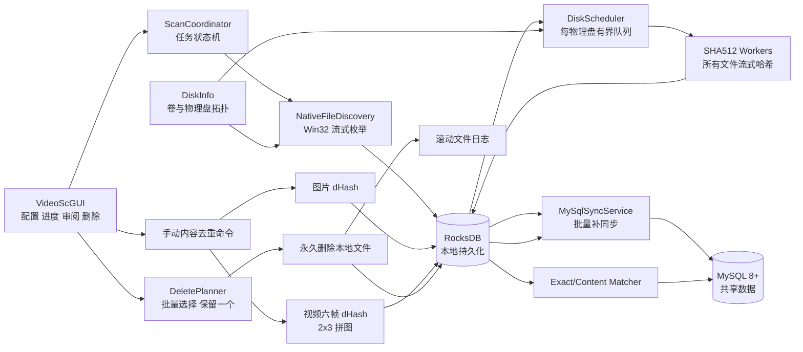

# 多磁盘媒体文件去重工具总体技术方案

## 1. 方案摘要

在现有 `VideoSc.sln` 中新增 `DedupCore` 静态库和 `DedupTests` 测试项目。`NativeFileDiscovery` 使用 Win32 API 流式发现所有文件，`DiskInfo` 把路径映射到物理存储目标，调度器为每个物理磁盘建立独立有界读取队列，`VideoSc` 提供流式 SHA-512、图片 dHash、视频六帧 dHash 和 2×3 拼图生成，RocksDB 保存本地持久化任务状态与待同步数据，MySQL 8.0+ 保存共享路径映射和内容元数据，`VideoScGUI` 负责配置、进度、内容审阅和批量永久删除。

所有文件都计算完整 SHA-512。系统不再通过大小唯一或快速采样指纹跳过文件。SHA-512 相同的路径自动形成精确重复组；图片和视频内容相似计算由用户在 GUI 手动触发。音频只参与 SHA-512 精确去重。

并发原则为“跨物理盘并行、盘内按配置限流、计算线程全局受控、内存和队列有界”。目标环境约 10 块 HDD/SSD；每个物理盘的读取线程数和全局计算线程数均可配置。

HDD 额外采用 NTFS 文件物理区间排序和有界电梯调度，减少磁头往返。坏块或无读取进展只使当前文件失败：有限重试、缩小读取块、超时取消、记录偏移并继续，不暂停整盘、不产生部分哈希。

千万级比较使用持久化 RocksDB 二级索引和流式聚合：SHA-512 按二进制摘要顺序扫描；图片 dHash 使用六段的 15 个两段联合候选键；视频使用时长桶和六帧共 90 个候选键。完整视觉签名作为索引键后缀，相同签名只保留一组索引项。所有索引按 SHA-512 唯一内容增量维护，禁止全量两两比较。

## 2. 当前项目评估

| 项目/模块 | 当前能力 | 需要演进的内容 |
| --- | --- | --- |
| `VideoSc` | FFmpeg 截图、图片 dHash、SHA-512、汉明距离 | SHA-512 改为流式；视频固定六帧；六帧合成 2×3 拼图；输出媒体元数据 |
| `DiskInfo` | 盘符到物理盘编号 | 卷 GUID、挂载目录、介质类型、缓存和稳定的调度键 |
| `EverythingFileListQuery` | 后台分页检索、取消、按磁盘写文本 | 仅保留诊断窗口；生产扫描改用 `NativeFileDiscovery` 流式投递 |
| `VideoScGUI` | Win32、D3D11、ImGui、截图和查询演示 | 去重任务、路径列表、线程设置、MySQL/RocksDB、缩略图缓存和永久删除界面 |

当前主要问题：

1. `ComputeFileSHA512` 会把整个文件读入内存，无法安全批量处理大媒体。
2. Everything 结果在多个容器间复制，文件量大时内存增长明显。
3. 没有物理磁盘级工作队列，无法同时利用多盘又避免 HDD 过度寻道。
4. 没有本地任务状态、远端共享数据和可靠补同步。
5. 当前视频截图是多个独立文件，不符合单个 2×3 拼图要求。
6. 没有精确组、dHash 相似组、保留策略和批量永久删除事务。

## 3. 目标架构



## 4. 端到端扫描流程

### 4.1 路径和文件发现

GUI 管理扫描路径列表，支持浏览、添加、移除和拖动排序。任务开始时冻结路径快照。每个根目录由原生发现线程流式枚举，路径规范化并读取文件身份、大小、扩展名、时间和物理磁盘信息后写入 RocksDB，并投递对应物理盘有界队列。

所有普通文件都进入 SHA-512 队列；媒体扩展名只用于决定是否继续提取图片或视频元数据，不用于跳过 SHA-512。

### 4.2 所有文件流式 SHA-512

调度器根据 `StorageTargetKey` 把文件分发到对应物理磁盘队列。每个文件使用固定缓冲区循环读取并增量调用 BCrypt。读取前后检查文件 ID、大小和修改时间；变化时当前摘要失效并进入重试状态。

SHA-512 完成后先写 RocksDB。MySQL 连接可用时异步批量写入；不可用时 RocksDB 保留待同步消息，扫描继续。

读取采用可取消的异步块 I/O。坏块类错误先按配置重试当前块，再用 64 KiB 小块重试；仍失败或连续无进展达到默认 60 秒超时时，取消当前读取、标记 `Unreadable/ReadTimeout`、写日志并继续下一个文件。任何缺字节文件都不提交 SHA-512。

### 4.3 内容数据复用

每次出现新路径都计算 SHA-512。若 MySQL `sha512_file_data` 已存在该摘要：

- 新增或更新 `file_path_sha512` 路径映射；
- 复用既有媒体元数据、图片 dHash、视频六个 dHash和拼图路径；
- 不重新解码媒体；
- 若缩略图文件缺失，则以独立修复任务重建，不改变 SHA-512 内容身份。

若摘要不存在，则创建新的内容任务，提取适用于该媒体类型的数据并增量写入 `sha512_file_data`。

### 4.4 自动精确去重

MySQL 按 SHA-512 查询路径数量大于 1 的记录，自动形成精确重复组。精确组中的文件内容字节相同，文件大小也必然相同。删除前仍重新核对路径、SHA-512 或文件身份，防止扫描后文件被替换。

### 4.5 手动内容相似去重

用户在 GUI 点击“计算内容相似”后才启动：

- 图片：读取或计算 dHash，通过汉明距离 `< 5` 查找相似候选；不旋转归一。
- 视频：只比较时长差不超过 2 秒的候选；六组对应帧汉明距离的平均值 `< 5` 时判为相似。
- 音频：跳过内容相似阶段。

为避免全量两两比较，图片使用适合 64 位汉明距离查询的索引；视频先按时长区间建立候选桶，再比较六元 dHash 序列。内部索引不改变最终判定语义。

千万级内容匹配只为 `sha512_file_data` 中的唯一内容建立索引。图片将 64 位 dHash 拆成 6 段并为任意两段组合建立 15 个键；距离不超过 4 时至少有两段相同。视频在六个帧位分别建立同类 15 键索引，并叠加 2 秒时长范围。完整视觉签名压缩热门相同 dHash，候选对使用规范内容 ID 顺序去重后才进入真实距离计算。

## 5. 视频指纹和拼图规范

1. 采样点固定为 `t/7` 至 `6t/7`。
2. 每个采样帧直接缩放到 9×8 灰度计算一个 64 位 dHash。
3. 预览图按相同六帧生成，布局固定为 2 行 × 3 列。
4. 拼图是每个视频唯一的缩略图文件，路径写入内容数据表。
5. 缩略图根目录、文件格式和每格尺寸在配置页面设置；默认 JPEG、每格长边 256 像素。
6. 单视频六帧形成 15 个两两组合；其汉明距离平均值 `< 5` 时标记 `StaticVisual`。
7. `StaticVisual` 视频不进入视频 dHash 相似匹配，只通过 SHA-512 精确去重。
8. 两个非静态视频比较时，六个对应帧距离取算术平均；严格小于 5 才匹配。

## 6. 双层持久化方案

### 6.1 RocksDB

使用一个持久化 RocksDB 目录，通过 `scan_id` 和键前缀区分任务。保存：

- 扫描任务、阶段、配置快照和进度。
- 文件发现记录和每盘待处理队列。
- SHA-512、媒体提取和错误结果。
- MySQL 待插入、更新或删除的操作。
- 暂停、取消、中断和重试状态。

RocksDB 是本机扫描事实和恢复来源，不是多台客户端共享主库。

### 6.2 MySQL 8.0+

MySQL 保存共享数据：

- `file_path_sha512`：路径到 SHA-512 的映射和路径级信息。
- `sha512_file_data`：SHA-512 到媒体内容数据，只增量、不因路径删除而删除。
- 扫描摘要、算法版本、精确组、内容相似组和成员。
- 可共享的配置版本，不保存 GUI 瞬时状态。

配置页面提供连接测试和“初始化数据库表”，只执行幂等建表/迁移；不提供清空或重建按钮。

### 6.3 同步

- 扫描热路径只要求 RocksDB 成功。
- 后台同步服务使用幂等 upsert 和批量事务写 MySQL。
- MySQL 断开时指数退避，RocksDB 中待同步项保持顺序和状态。
- GUI 显示本地完成量、待同步量、最后同步时间和错误。
- 删除映射采用“先永久删除本地文件，后批次删除映射”；MySQL 失败时 RocksDB 保留 tombstone 并持续重试。

## 7. 多磁盘与线程模型

### 7.1 物理盘调度

同一物理磁盘的多个分区共享一个 `DiskChannel`。不同物理磁盘的通道同时运行。每个通道的读取线程数由配置页面设置：

- HDD 默认 1。
- SSD 默认 2。
- Unknown 默认 1。
- 用户可对每个物理盘覆盖。

### 7.2 全局计算线程

全局计算线程数独立配置，用于 SHA-512 状态处理、图片解码、视频解码、拼图编码和相似计算。读取线程取得文件数据后仍受计算令牌约束，防止 10 块磁盘同时把 CPU、内存或 FFmpeg 线程压满。

### 7.3 背压

- 原生发现到 RocksDB/物理盘调度器使用有界队列背压。
- 每个物理盘使用有界文件队列。
- SHA-512 工作者使用固定容量缓冲区池。
- 媒体任务使用全局计算令牌和缩略图内存预算。
- MySQL 同步队列持久化在 RocksDB，不用无界内存容器。
- GUI 只加载当前可见结果页和有界缩略图缓存。

### 7.4 HDD 物理顺序和坏块

- NTFS 通过 `FSCTL_GET_RETRIEVAL_POINTERS` 获取 LCN，通过卷磁盘区间和簇大小换算近似物理起始字节。
- 每个 HDD 通道只在有界候选窗口内排序，采用电梯方向读取，窗口结束后继续下一批。
- 非 NTFS、复杂卷或查询失败退化为路径顺序；SSD 跳过该步骤。
- 坏块和读超时只跳过当前文件；无整盘自动熔断。
- Windows 驱动若不能立即响应 `CancelIoEx`，不得用 `TerminateThread` 强杀；该工作者保持取消等待，其他物理盘通道继续。

## 8. 删除与保留方案

### 8.1 选择和执行分离

下列动作只修改当前 UI 选择集，不立即删除：

- 选择较大文件。
- 选择较低质量文件。
- 选择指定物理磁盘中的重复文件。
- 按最新、最旧、最小、最大或路径优先级选择保留成员。
- 用户逐项勾选或取消。

只有独立的“永久删除选中文件”按钮会执行删除。

### 8.2 质量和保留规则

- 视频质量排序：分辨率像素数 → 视频码率 → 文件大小。
- 图片质量排序：分辨率像素数 → 文件大小。
- 最新/最旧使用最后修改时间。
- 路径优先级来自 GUI 可拖动的扫描路径顺序。
- 指定磁盘选择时，若组外有副本可选中该磁盘全部成员；若组内全部位于该磁盘，仍强制保留一个。

### 8.3 永久删除事务

1. 根据当前数据库和文件系统重新生成预览。
2. 每组撤销一个最高保留优先级成员的选中，保证至少保留一个。
3. 用户二次确认永久删除。
4. 日志文件可写后冻结删除批次。
5. 逐个重新核对路径、文件身份和组证据。
6. 永久删除本地文件并写文件日志。
7. 全批次文件操作结束后，批量删除成功成员的 `file_path_sha512` 行。
8. 映射删除失败时把 tombstone 留在 RocksDB 重试。
9. `sha512_file_data` 永不因路径删除自动删除。

dHash 相似组允许进入同一流程，但 UI 必须显示图片缩略图或视频 2×3 拼图、距离证据和保留成员。

## 9. 配置页面与生效规则

### 9.1 JSON 配置文件

- 唯一配置文件固定为程序安装目录下的 `config.json`，使用 UTF-8 编码和标准 JSON，不依赖注册表保存页面配置。
- 根对象包含 `schema_version`，并按 `paths`、`storage`、`compute`、`io`、`database`、`thumbnails`、`rocksdb` 和 `logging` 分区。
- MySQL 密码通过 Windows DPAPI `CurrentUser` 范围加密，密文 Base64 后保存在 `database.password_protected`，同时保存保护方式标识；配置文件和 RocksDB 快照都不保存明文密码。
- DPAPI 解密失败时仍加载其他配置，把数据库凭据标记为“需要重新输入”，禁止连接和初始化操作；在用户成功保存新密码前不自动覆盖原密文。
- 保存流程为：完整反序列化模型校验 → 写 `config.json.tmp` → flush 文件 → 原子替换 `config.json` → 保留上一有效版本为 `config.json.bak`。
- 安装目录不可写、空间不足、序列化失败或替换失败时保留原文件并向 GUI 返回明确错误，不静默改用 `%LOCALAPPDATA%`、注册表或其他目录。
- 文件缺失时使用内置默认值；主文件损坏时告警并尝试加载备份；备份也无效时使用未保存默认值，等待用户修正或确认保存。
- 支持已知旧版本的显式迁移；未知高版本只读拒绝，防止旧程序丢弃新字段后覆盖文件。
- JSON 只保存用户配置。扫描状态、队列、结果、断点和 MySQL 待同步操作仍保存到 RocksDB。

### 9.2 运行与性能

- 线程：每物理盘读取线程、全局计算线程、FFmpeg 单任务内部线程。
- I/O：读取块大小、每盘队列容量、HDD 物理区间优化开关和排序窗口大小。
- 坏块：原块重试次数、小块重试次数、小块尺寸和无读取进展超时。
- 同步：MySQL 连接池、连接/命令超时、重试间隔和同步批量大小。
- 缩略图：输出目录、格式、视频拼图单格长边、图片预览长边、缓存条目数、内存与显存上限。

配置控件显示单位、范围、推荐值、预计总线程和内存预算。非法值禁止保存或启动任务。默认 HDD 读取线程为 1、SSD 为 2、坏块小块为 64 KiB、无进展超时为 60 秒、视频拼图单格长边为 256 像素；其余默认值由十盘性能基准确定。

任务开始时把完整配置冻结为 `ScanOptions` 快照并写入 RocksDB。运行中修改只影响下一任务；中断恢复必须使用原任务快照，不能被当前配置覆盖。缩略图规格变化只使对应缩略图进入按需重建，不使 SHA-512、dHash 或媒体元数据失效。

### 9.3 MySQL 初始化

- 主机、端口、数据库名、用户名、密码。
- TLS 模式和证书路径。
- `mysqldump` 可执行文件和备份目录。
- “测试连接”和“初始化数据库表”按钮。

初始化按钮只创建缺失表和执行向前兼容迁移，不删除既有数据。若实现初始化前备份，调用 `mysqldump`；备份失败时不得执行可能改变现有结构的迁移。

### 9.4 固定算法边界

dHash 距离 `< 5`、视频 `t/7` 至 `6t/7` 六帧、时长差不超过 2 秒和静态画面判定不作为普通运行配置开放修改。算法升级必须使用新的算法版本命名空间和显式迁移流程，避免历史索引与新规则混用。

## 10. 核心数据契约

### 10.1 `ScanOptions`

包含扫描路径顺序、RocksDB 路径、MySQL 配置引用、缩略图目录与尺寸规格、每物理盘读取线程数、全局计算线程数、FFmpeg 单任务线程数、读取块大小、每盘队列容量、HDD 排序窗口、坏块重试、读取超时、MySQL 同步批量、缓存预算和日志配置。任务开始后冻结。算法阈值通过独立只读版本标识关联，不由普通配置页面修改。

### 10.2 `FilePathRecord`

包含路径、规范化键、SHA-512、卷、文件 ID、物理盘、大小、扩展名、时间、根目录、在线状态、同步状态和扫描 ID。

### 10.3 `ShaFileData`

包含 SHA-512、内容大小、媒体类型、MIME、容器；图片宽高和 dHash；视频时长、宽高、帧率、编码、码率、像素格式、六个 dHash、静态标记和拼图路径。不包含音轨字段。

### 10.4 `DuplicateGroup`

包含精确或内容相似类型、算法版本、成员、距离证据、质量排序、保留成员、待删除选择和预计空间。UI 临时选择不写 `sha512_file_data`。

### 10.5 `ProgressSnapshot`

包含任务阶段、发现数、SHA-512 数、媒体处理数、逐盘吞吐、逐盘队列、全局计算线程、RocksDB 状态、MySQL 待同步量、重复组、删除批次和错误。

## 11. 故障处理

| 故障 | 处理 |
| --- | --- |
| MySQL 不可用 | 扫描继续写 RocksDB，后台重连补同步 |
| RocksDB 不可写 | 停止新任务并安全收敛，不能只保存在内存 |
| 磁盘离线 | 暂停该物理盘通道，其他磁盘继续 |
| 文件读取中变化 | 当前 SHA-512 作废并重试或标记失败 |
| HDD 坏块/CRC/I/O 错误 | 有限重试和 64 KiB 小块复试，失败文件写日志并跳过 |
| 读取 60 秒无进展 | `CancelIoEx` 取消当前文件；不熔断整盘，不强杀线程 |
| 媒体解码失败 | SHA-512 结果保留，媒体数据标记失败 |
| 缩略图目录不可写 | 媒体数据保留，拼图任务可重试 |
| 删除日志不可写 | 禁止开始永久删除批次 |
| 本地删除成功、MySQL 删除失败 | RocksDB tombstone 持久化重试 |
| GUI 关闭 | 请求协调器安全停止；RocksDB 保存断点 |
| 安装目录不可写 | 配置保存失败并显示绝对路径和 Win32 错误；安装包应选择可写目录或配置明确 ACL，不静默改存其他位置 |
| DPAPI 身份不匹配或密文损坏 | 其他配置继续加载，数据库功能等待用户重新输入密码，旧密文不自动覆盖 |

## 12. 建议项目结构

```text
VideoSc.sln
├─ VideoSc                    FFmpeg、流式 SHA-512、dHash、2×3 拼图
├─ DiskInfo                   卷与物理存储拓扑
├─ DedupCore                  新增静态库
│  ├─ discovery               Win32 原生流式发现和路径清单
│  ├─ scheduling              每物理盘队列与线程预算
│  ├─ persistence             RocksDB、本地状态、MySQL 同步
│  ├─ matching                精确和内容相似分组
│  ├─ deletion                选择、保留、永久删除和日志
│  └─ orchestration           状态机、断点、进度和恢复
├─ VideoScGUI                 配置、监控、审阅和删除
└─ DedupTests                 算法、并发、数据库、删除和性能测试
```

## 13. 性能目标

- 约 10 块独立磁盘可同时产生读取吞吐。
- 单 HDD 默认一个读取线程，不因并发寻道显著低于顺序读取基线。
- 所有文件都计算 SHA-512，内存仍与文件大小无关。
- RocksDB 承担高频本地写入，MySQL 网络延迟不阻塞磁盘读取热路径。
- 文件数扩大时，内存只随有界队列、线程缓冲和当前 GUI 页增长。
- GUI 只加载可见拼图/图片，纹理及时从内存和显存卸载。
- 断点恢复不重新计算已完成且文件未变化的 SHA-512。
- 千万级哈希比较通过索引接近线性或候选规模执行，不出现 O(N²) 全表两两循环。

详细验收见 `08-测试性能与交付计划.md`，实施顺序见 `09-分阶段实施路线图.md`。
