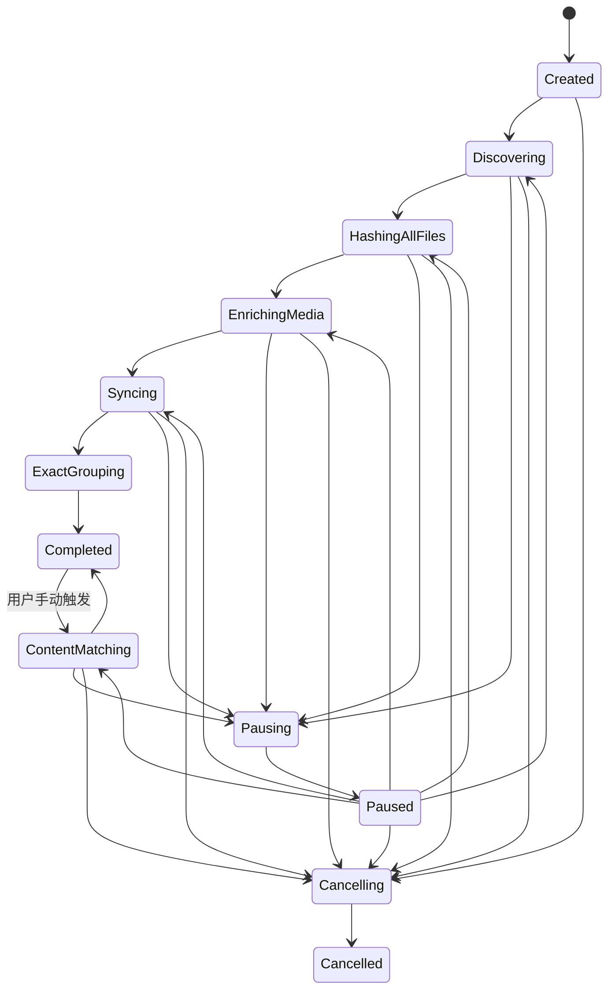

# 任务编排、RocksDB 与 MySQL 模块计划

## 1. 模块目标

用 RocksDB 持久化本地扫描状态、断点、结果和 MySQL 待同步操作；用 MySQL 8.0+ 保存共享路径映射、SHA-512 内容数据和重复组；协调文件发现、全部文件 SHA-512、媒体提取、相似匹配、同步和删除批次。MySQL 故障不得阻塞本地扫描，RocksDB 故障必须停止继续产生无法恢复的工作。

## 2. 任务状态机



永久删除使用独立 `DeleteBatch` 状态机：`Prepared → Confirmed → DeletingFiles → DeletingMappings → Completed/PartialFailed`，不复用扫描阶段布尔值。

进程异常终止后，活动扫描或删除批次在下次启动时标记 `Interrupted`，从 RocksDB 检查点恢复。

## 3. `ScanCoordinator`

### 3.1 职责

- 冻结扫描路径、每盘/全局/FFmpeg 线程、读取块、队列、HDD 排序、坏块重试、超时、MySQL 同步、缩略图尺寸、缓存预算和算法版本。
- 启动发现、物理盘队列、计算线程、RocksDB 和 MySQL 同步服务。
- 控制暂停、继续、取消和恢复。
- 区分本地阶段完成与 MySQL 同步完成。
- 汇总逐盘和全局进度。
- 致命错误时按顺序关闭生产者和工作线程。

### 3.2 线程组成

- 1 个协调线程。
- 每个扫描根目录 1 个 Win32 原生流式发现线程。
- 每物理盘配置数量的读取线程。
- 配置数量的全局计算线程。
- 1 个 RocksDB 批处理写入器或受控写入门面。
- 1 个 MySQL 同步线程组，大小由连接池限制。
- 1 个 GUI 线程。

## 4. RocksDB 本地持久化

### 4.1 生命周期

使用一个持久化数据库目录，不为每次扫描创建独立实例。所有任务通过 `scan_id` 和键前缀隔离。配置页面可设置 RocksDB 路径，但已有活动任务时禁止切换。

### 4.2 Column Family 建议

| Column Family | 内容 |
| --- | --- |
| `meta` | 模式版本、应用版本、序列号 |
| `scan` | 任务、配置、阶段和进度 |
| `file` | 本地文件身份、路径状态、SHA-512 和媒体状态 |
| `work` | 待发现、哈希、媒体、匹配和删除工作 |
| `sync` | MySQL 待同步 upsert/delete 和重试状态 |
| `exact_index` | SHA-512 到路径引用计数、受影响摘要和全量聚合检查点 |
| `image_hash_index` | 图片 dHash 六段的 15 个两段联合键和完整签名去重 |
| `video_hash_index` | 时长桶、六帧三十个分段键和压缩 posting list |
| `error` | 可重试与最终错误 |

值使用明确版本的序列化格式，不能直接持久化编译器相关 C++ 结构。

### 4.3 写入原子性

一次文件任务完成时，通过 `WriteBatch` 同时更新：

- 文件结果。
- 工作项完成状态。
- 进度计数。
- MySQL 待同步消息。

只有批次写成功才向调度器确认完成。启用适当 WAL 和 fsync 策略，具体性能/耐久取舍由基准确定并写入配置版本。

### 4.4 清理

- 已同步且超过保留期的工作事件可压缩清理。
- 最近有效文件摘要和增量状态保留。
- `sha512_file_data` 的共享长期数据以 MySQL 为准。
- 删除 tombstone 只有 MySQL 确认后才能清除。

### 4.5 JSON 配置与任务快照边界

- 用户配置的唯一持久化来源是程序安装目录下的 `config.json`；RocksDB 不替代或反向覆盖该文件。
- 创建任务时读取并校验 JSON，把归一化后的完整配置和 `schema_version` 复制到 `scan` Column Family，形成不可变任务快照。
- MySQL 密码在 JSON 和任务快照中都只保存 DPAPI `CurrentUser` 密文及保护方式，不保存解密后的明文。
- 任务恢复读取 RocksDB 快照，不读取当前 JSON 中的新线程、超时或尺寸值覆盖旧任务。
- JSON 不保存进度、工作项、错误、结果或同步队列；这些数据只进入 RocksDB。
- JSON 保存失败不破坏已经运行的任务；但用户修改不会生效，也不能以未持久化配置启动新任务。

## 5. MySQL 8.0+ 数据模型

### 5.1 `file_path_sha512`

路径级映射：

- `path_id`、规范化路径摘要和完整路径。
- SHA-512 二进制值。
- 扫描根目录、物理盘、卷、文件 ID。
- 文件大小、扩展名、创建和修改时间。
- 首次/最后发现时间和在线状态。
- 数据版本和最后同步序列。

完整路径可能超过普通索引长度，使用固定长度路径摘要做唯一键，并在冲突时比较完整路径。

建立 `(sha512, path_id)` 覆盖索引。全量精确分组使用主键/摘要键集分页和 SHA-512 顺序流式聚合，不使用大 offset 或两两比较。增量分组由 RocksDB `exact_index` 中受影响摘要驱动。

### 5.2 `sha512_file_data`

以 64 字节 SHA-512 为主键，只增量保存：

- 内容大小、媒体类型、MIME、容器格式。
- 图片宽高、格式和 dHash。
- 视频时长、宽高、帧率、视频编码、视频码率、像素格式。
- 六个视频 dHash、静态画面标记、2×3 拼图路径。
- 算法版本、媒体处理状态和更新时间。

不包含音轨字段。路径删除、磁盘离线或扫描范围变化都不自动删除本表行。

### 5.3 重复报告表

- `duplicate_group`：精确/图片相似/视频相似、算法版本、代表文件、统计。
- `duplicate_member`：组、路径、距离、质量和保留建议。
- 内容匹配重新运行时以版本化批次替换受影响结果。

### 5.4 辅助表

- `schema_version`：数据库模式和应用兼容范围。
- `scan_summary`：可共享任务摘要和同步状态。
- 不创建删除审计表。

## 6. MySQL 初始化与配置

### 6.1 配置字段

- MySQL 主机、端口、数据库名、用户名、密码。
- TLS 模式、CA/证书/密钥路径。
- 连接池大小、连接超时、命令超时、重试间隔和同步批量大小。
- `mysqldump` 路径和备份目录。

密码使用 Windows DPAPI `CurrentUser` 保护，Base64 后写入 JSON 和任务快照，不明文写入文件、数据库或日志。

### 6.2 按钮

配置页面只提供：

- “测试连接”。
- “初始化数据库表”。

初始化执行 `CREATE TABLE IF NOT EXISTS` 和受控向前迁移，不提供删除、清空或重建按钮。若检测到已有表且迁移可能改变结构，先调用 `mysqldump` 备份应用表；备份失败则停止迁移。全新数据库不要求无意义备份。

## 7. MySQL 同步协议

### 7.1 顺序

1. 本地结果和待同步消息原子写入 RocksDB。
2. 同步服务按持久化序列读取消息。
3. 路径和内容使用幂等 upsert。
4. 成功后记录 MySQL 提交版本并删除本地待同步消息。
5. 失败后记录错误、退避时间和重试次数，不阻塞扫描。

### 7.2 内容复用查询

新路径完成 SHA-512 后：

- 优先检查 RocksDB 本地内容缓存。
- MySQL 可用时查询 `sha512_file_data`。
- 命中则创建路径映射并复用媒体数据。
- MySQL 不可用且本地无缓存时，允许先提取媒体数据以保证任务可独立完成；同步时使用幂等插入去重。

### 7.3 映射删除

本地文件永久删除成功后写入 RocksDB delete tombstone。整个删除批次结束后同步服务按 `path_id + expected_sha512` 批量删除映射，防止误删已被新文件占用的路径。成功后清理 tombstone，永不级联删除内容表。

### 7.4 千万级内容索引

- MySQL 内容表按内容主键键集分页，不使用 `OFFSET N` 扫描深页。
- 每个唯一图片内容写 5 个 dHash 分段 posting；每个唯一视频内容写 1 个时长桶和 30 个帧位分段 posting。
- posting list 分片压缩保存，单个热门桶达到块大小后切分子块。
- 索引键包含算法版本；版本变化新建命名空间，完成后原子切换活动版本。
- 索引构建进度、最后内容 ID、候选对去重和结果批次都写 RocksDB。
- 新路径命中已有 SHA-512 时不新增内容索引项；只有新唯一内容或算法版本变化才更新。
- 索引磁盘空间、写入放大和 compaction 状态在 GUI/性能报告中可见。

## 8. 断点续扫和增量扫描

### 8.1 检查点

- 配置：任务创建时保存完整 `ScanOptions`、缩略图规格版本和只读算法版本；恢复时不得改用当前页面配置。
- 发现：每个已提交页面/批次。
- SHA-512：每个完成文件；不保存 BCrypt 中间内部状态，中断文件从头重算。
- 媒体：每个 SHA-512 内容记录。
- MySQL：每个同步批次序列。
- 内容匹配：每个索引构建或匹配批次。
- 删除：每个文件结果和映射 tombstone。

### 8.2 恢复

重新启动后读取 `Interrupted` 任务，核对扫描配置和文件元数据：

- 使用 RocksDB 中的原任务配置快照恢复线程、超时、队列和资源预算；页面中新值只用于新任务。
- 已完成且未变化的 SHA-512 复用。
- 读取到一半的文件重新计算。
- 已写 RocksDB 但未同步 MySQL 的消息继续同步。
- 已删除本地文件但映射未删的 tombstone继续处理。

### 8.3 增量状态

- `Unchanged`：复用。
- `New/Changed`：重新 SHA-512。
- `Missing`：保留历史标记。
- `Offline`：不推断删除。
- `OutOfScope`：路径配置移除。
- `ProgramDeleted`：本地成功删除，等待映射批量删除。

## 9. 进度和错误

### 9.1 快照

- 当前扫描阶段、文件数和实际读取字节。
- 每物理盘线程、队列、吞吐和错误。
- 全局计算线程活动数。
- RocksDB 写入延迟、待压缩量。
- MySQL 连接、待同步条数、最后成功时间和错误。
- 精确组、内容匹配和删除批次进度。

协调器每 100 至 250 ms 发布不可变快照，GUI 不读取 RocksDB 内部迭代器。

### 9.2 致命与非致命

- RocksDB 不可写：致命，停止新工作。
- MySQL 不可用：非致命，进入离线同步状态。
- 单文件 I/O/媒体失败：非致命，记录后继续。
- 删除日志不可写：永久删除批次拒绝开始。

## 10. 建议文件布局

```text
DedupCore/orchestration/
├─ ScanCoordinator.h/.cpp
├─ ScanState.h
├─ ScanCommand.h
├─ ProgressSnapshot.h
└─ ErrorModel.h

DedupCore/persistence/
├─ RocksStore.h/.cpp
├─ RocksKeys.h
├─ RocksMigrations.h/.cpp
├─ MySqlClient.h/.cpp
├─ MySqlSchema.h/.cpp
├─ MySqlSyncService.h/.cpp
└─ SyncOperation.h
```

## 11. 实施任务

### M1：RocksDB

- 引入固定版本、Column Family、版本化值和 WriteBatch。
- 恢复、迁移、压缩和故障处理。

### M2：MySQL 连接与初始化

- MySQL 8.0+ 客户端、TLS、连接池、初始化按钮和 mysqldump 备份。

### M3：两表核心模型

- `file_path_sha512` 和 `sha512_file_data`。
- 二进制摘要、路径长字段和幂等 upsert。

### M4：同步服务

- 持久化序列、离线重试、内容复用、批量映射删除。

### M4.1：千万级索引

- SHA-512 有序聚合检查点、图片 15 个两段联合键、视频时长桶和 90 个候选键。
- posting list 分片、候选对去重、算法版本切换和增量维护。

### M5：状态机和恢复

- 扫描、内容匹配和删除批次状态。
- 暂停、取消、崩溃恢复和增量状态。

### M6：进度

- 本地完成与 MySQL 同步完成分离。
- 逐盘、计算、数据库和删除快照。

## 12. 验收标准

1. 单个持久化 RocksDB 支持多个 `scan_id` 和重启恢复。
2. MySQL 断线时扫描继续，恢复后幂等补同步。
3. GUI 不会把本地完成显示为 MySQL 已同步。
4. 新路径命中已有 SHA-512 时复用媒体内容数据。
5. 路径删除不会级联删除 `sha512_file_data`。
6. 初始化按钮不删除或重建现有表。
7. 结构迁移前 mysqldump 备份失败会阻止迁移。
8. 本地删除成功、MySQL 失败后 tombstone 可恢复。
9. RocksDB 不可写时不会继续产生仅存在内存的结果。
10. 密码不明文进入日志。
11. 删除操作只写文件日志，不写数据库审计表。
12. 崩溃恢复无需依赖退出前内存队列。
13. 千万级精确分组和内容索引使用键集分页、有界 posting list 和 RocksDB 检查点。
14. 线程、I/O、队列、超时、同步批量、缩略图尺寸和缓存预算均保存为任务配置快照。
15. 当前页面配置变化不会改变运行中或待恢复任务的资源和超时语义。
16. 用户配置从安装目录 `config.json` 加载，JSON 不承载运行队列、结果或断点。
17. JSON 和 RocksDB 任务快照均不包含 MySQL 明文密码。
18. JSON 保存失败或进程中断不会破坏上一份有效配置。
14. 新路径命中旧 SHA-512 不会重复创建图片/视频内容索引。

## 13. 风险与对策

| 风险 | 对策 |
| --- | --- |
| RocksDB Windows 集成与编译复杂 | 固定版本、独立封装、x64 构建和恢复测试 |
| RocksDB 数据膨胀 | Column Family、保留策略、压缩和已同步消息清理 |
| MySQL 重复或乱序 | 持久化序列、幂等 upsert、期望 SHA 条件删除 |
| MySQL 长路径索引限制 | 固定长度路径摘要 + 完整路径冲突复核 |
| 初始化误伤数据 | 只创建/迁移、无重建按钮、必要时 mysqldump |
| dHash 索引占用较大 | 只索引唯一内容、分片压缩、版本清理和 RocksDB 空间监控 |
| 深分页拖慢 MySQL | 主键/摘要键集分页和覆盖索引，不使用大 offset |
