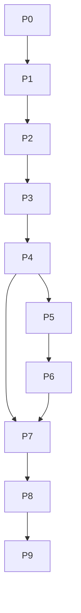

# 分阶段实施路线图

## 1. 路线原则

按“可恢复基础设施 → 所有文件 SHA-512 → 共享数据和精确组 → 图片/视频内容索引 → GUI 审阅 → 永久删除 → 十盘与千万级固化”实施。每个阶段都有独立交付门，最终范围包含全部确认能力，不把内容去重或删除长期留作可选项。

## 2. 阶段总览

| 阶段 | 目标 | 复杂度 | 核心交付 |
| --- | --- | --- | --- |
| P0 | 构建与基准骨架 | S | x64、依赖版本、测试项目、基准数据生成器 |
| P1 | RocksDB 与状态机 | L | 持久化任务、断点、工作队列、恢复 |
| P2 | 路径、拓扑和 HDD 调度 | L | Win32 流式发现、物理盘、LCN 电梯排序、坏块超时 |
| P3 | 所有文件流式 SHA-512 | L | 大文件、全文件哈希、十盘读取、增量复用 |
| P4 | MySQL 共享数据与精确组 | L | 初始化、同步、两表模型、千万级精确索引 |
| P5 | 图片/视频媒体数据 | L | 图片 dHash、视频六帧、静态判断、2×3 拼图 |
| P6 | 千万级内容相似索引 | XL | 图片 15 个两段联合键、视频 90 键、时长桶、完整签名压缩、断点 |
| P7 | GUI 完整工作流 | L | 配置、进度、索引、拼图、结果和选择 |
| P8 | 永久删除 | L | 保留一个、条件选择、日志、映射批量删除 |
| P9 | 稳定性和性能交付 | XL | 十盘、坏块、千万级、MySQL 离线、打包报告 |

复杂度表示相对工作量，不是日历承诺。

## 3. P0：构建与基准骨架

### 工作项

- 新增 `DedupCore` 静态库和 `DedupTests`。
- 固定 RocksDB、MySQL 8.0+ 客户端和 FFmpeg 版本；Everything SDK 仅用于诊断工具。
- 明确 `Release|x64`，处理误导的 x86 配置。
- 建立可生成千万级路径、SHA-512、图片 dHash 和视频六元 dHash 的基准数据工具。
- 建立受控临时删除目录和错误注入读取适配器。

### 交付门

- 所有项目 x64 构建依赖清晰。
- 基准数据可重复生成，不需要创建千万个真实大文件。
- 测试不会永久删除用户数据。

## 4. P1：RocksDB 与状态机

### 工作项

- 单持久库、多个 `scan_id`、Column Family 和版本化值。
- `WriteBatch` 更新结果、工作状态和同步消息。
- 扫描、内容匹配和删除批次状态机。
- 暂停、取消、崩溃恢复、压缩和空间监控。
- 建立 exact/image/video 二级索引 Column Family 骨架。

### 交付门

- 进程强制结束后可从检查点恢复。
- RocksDB 写失败会安全停止生产者。
- 多任务数据不串扰。

## 5. P2：路径、拓扑和 HDD 调度

### 工作项

- Win32 原生枚举改为流式发现，所有普通文件入清单。
- GUI 路径快照、排序和 `Missing/Offline/OutOfScope`。
- 卷 GUID、文件 ID、物理盘和介质类型。
- 每盘有界队列、读取线程配置和全局计算预算。
- NTFS retrieval pointers、卷物理区间、有界窗口电梯排序。
- overlapped I/O、坏块有限重试、64 KiB 复试、60 秒无进展超时。
- 坏块日志、`Unreadable/ReadTimeout/CancelPending`，无整盘熔断。

### 交付门

- 同一物理盘多分区共享通道。
- HDD 排序窗口内物理位置顺序正确，非 NTFS 退化。
- 坏块只跳过文件，后续文件和其他磁盘继续。
- 任一缺字节文件都不会进入成功哈希状态。

## 6. P3：所有文件流式 SHA-512

### 工作项

- 用固定块 BCrypt 替换整文件内存读取。
- 支持零字节、超大文件、取消、进度和文件变化。
- 所有新/变化普通文件进入哈希；硬链接共享一次读取。
- 增量复用未变化摘要。
- 保持旧 `ComputeFileSHA512` C ABI。
- 约 10 块混合盘同时读取基准。

### 交付门

- 大于 4 GiB 文件结果与权威工具一致。
- 内存不随文件大小增长。
- 坏块、超时和变化不产出摘要。
- 多盘同时读取，同 HDD 默认不因并发寻道退化。

## 7. P4：MySQL 共享数据与精确组

### 工作项

- MySQL 连接、TLS、连接池、测试连接和初始化表。
- 需要迁移时调用配置的 `mysqldump` 备份目录。
- `file_path_sha512` 和 `sha512_file_data` 两表边界。
- RocksDB 持久化待同步、MySQL 离线继续扫描、恢复后幂等补同步。
- `(sha512, path_id)` 覆盖索引、键集分页和全量单遍精确聚合。
- 增量只刷新受影响 SHA-512。

### 交付门

- MySQL 离线不阻塞扫描。
- 重放不产生重复路径或内容行。
- 千万级精确分组接近 O(N)，无两两比较。
- 路径和内容数据可独立维护。
- 配置页面没有重建/清空数据库按钮。

## 8. P5：图片和视频媒体数据

### 工作项

- 图片 9×8 dHash，不做旋转归一。
- 视频 `t/7` 至 `6t/7` 六帧 dHash。
- 六帧 15 组平均距离 `< 5` 静态判断。
- 单个 2 行 × 3 列拼图，SHA-512+算法版本命名。
- 图片/视频尺寸、视频时长、帧率、编码、码率和像素格式。
- 明确不提取音轨。
- 新路径命中内容表后复用媒体数据和拼图。

### 交付门

- 每视频只有一个拼图文件且顺序正确。
- 静态视频只参与 SHA-512。
- 音频无声纹和音轨数据。
- 缩略图失败可独立重试。

## 9. P6：千万级内容相似索引

### 工作项

- 图片 dHash 拆 5 个 12/13 位片段，RocksDB posting list。
- 视频按时长桶，并为六个帧位生成 30 个分段键。
- posting list 分片压缩、热门完整哈希聚合和候选对规范化。
- MySQL 主键键集分页、索引版本命名空间和原子切换。
- RocksDB 构建/匹配检查点与增量更新。
- 图片真实距离 0 至 4；视频六帧距离和 0 至 29。

### 交付门

- 穷举小样本证明索引无漏候选。
- 千万级合成数据不出现 O(N²) 计算路径。
- 新路径复用 SHA-512 时不重复建立内容索引。
- 中断后从索引检查点继续。
- 索引磁盘占用和 compaction 可观察。

## 10. P7：GUI 完整工作流

### 工作项

- 路径添加、删除和拖动优先级。
- 每物理盘读取线程、全局计算线程和 FFmpeg 单任务线程。
- 读取块、每盘队列、HDD LCN 开关、排序窗口、坏块重试和无进展超时配置。
- RocksDB、MySQL 8、TLS、连接/命令超时、重试间隔、同步批量、mysqldump、备份目录和初始化表。
- 缩略图目录、格式、视频拼图单格尺寸、图片预览尺寸和内存/显存 LRU 预算。
- 配置单位、范围、推荐值、资源预算预估、任务快照和缩略图规格版本提示。
- 安装目录 `config.json`、UTF-8 JSON 模式、版本迁移、DPAPI 密码、原子替换、有效备份和损坏恢复。
- 本地/远端双进度、逐盘和索引进度。
- 精确组、图片相似、视频整张 2×3 拼图和距离。

### 交付门

- UI 线程无扫描、哈希、FFmpeg、MySQL 或删除 I/O。
- 大结果分页，缩略图缓存有界并及时释放。
- 坏块、超时和 `CancelPending` 可见但不误报整盘暂停。
- 本地完成和远端同步完成清晰区分。
- 非法配置无法启动；当前任务不受页面修改影响，中断任务按原配置恢复。
- 缩略图尺寸变化只按需重建预览资源，不重算内容指纹。
- 应用重启后从安装目录 JSON 恢复；文件损坏、目录不可写或保存中断不会破坏上一有效配置，也不会泄露明文密码。

## 11. P8：永久删除

### 工作项

- 较大、低质量、指定磁盘、最新、最旧、最小、最大和路径优先级选择。
- 条件选择与“永久删除选中文件”按钮分离。
- 每组强制保留一个。
- dHash 组显示图片或视频拼图。
- 二次确认、路径/证据重检、文件日志。
- 本地文件永久删除后，批次末尾删除路径映射。
- MySQL 失败保留 RocksDB tombstone；内容表不删除。

### 交付门

- 任何条件组合都不能删除组内全部成员。
- 失败文件不删除映射。
- 日志不可写时不开始删除。
- 重启可继续处理映射 tombstone。
- 所有删除测试只作用于受控测试目录。

## 12. P9：稳定性和性能交付

### 工作项

- 十盘混合读取、HDD 物理顺序、坏块和超时基准。
- 千万级精确、图片和视频索引构建/匹配基准。
- RocksDB 空间、写放大、compaction 和恢复。
- MySQL 离线峰值、补同步、索引计划和大表分页。
- 长时间暂停/恢复/取消和进程崩溃。
- GUI 显存/内存预算和永久删除部分失败。
- Release x64 打包、许可证、PDB、操作和恢复文档。

### 交付门

- `08-测试性能与交付计划.md` 的正确性、安全、稳定性和结构性性能门全部满足。
- 默认线程、块、窗口、超时、posting 大小和 RocksDB 参数有真实数据支持。
- 已知限制明确，包括驱动可能延迟响应 `CancelIoEx`。

## 13. 现有文件变更映射

| 当前文件 | 计划 |
| --- | --- |
| `VideoSc/dllmain.cpp` | 拆分流式 SHA-512、dHash、视频指纹和拼图 |
| `VideoSc/VideoSc.h` | 保持旧 ABI，增加版本化批处理能力 |
| `DiskInfo/DiskInfo.*` | 卷、介质、物理区间和拓扑 API |
| `VideoScGUI/EverythingFileListQuery.*` | 保留为诊断工具；生产扫描使用 `DedupCore/discovery/NativeFileDiscovery.*` |
| `VideoScGUI/VideoScApp.*` | 收敛为导航和依赖装配 |
| `VideoScGUI/RenderBackend.*` | 保持 D3D11/ImGui 生命周期，增加有界纹理缓存协作 |
| `VideoScGUI/VideoScGUI.vcxproj` | 引用 DedupCore、RocksDB、MySQL 客户端和新源文件 |
| `VideoSc.sln` | 新增 `DedupCore`、`DedupTests`，明确 x64 |

## 14. 依赖关系

GUI 基础配置可与后端阶段交叉开发，但永久删除只能在分组、持久化、日志和恢复均稳定后实施。

## 15. 需求追踪

| 需求 | 阶段与证据 |
| --- | --- |
| 所有文件 SHA-512 | P3 完整流式哈希 |
| 图片 dHash `< 5` | P5 算法，P6 六段两两联合索引 |
| 视频六帧平均 `< 5`、时长差 2 秒 | P5 算法，P6 时长桶和三十段索引 |
| 静态画面只用 SHA-512 | P5 静态判定和排除 |
| 2×3 拼图 | P5 生成，P7 展示和 LRU |
| 约 10 块 HDD/SSD | P2 调度，P9 十盘基准 |
| HDD 坏块与超时跳过 | P2 错误策略，P9 故障基准 |
| HDD 读取顺序优化 | P2 LCN 电梯，P9 性能证据 |
| 千万级比较 | P4 精确 O(N)，P6 dHash 索引，P9 基准 |
| RocksDB 断点和增量 | P1、P6 |
| MySQL 共享数据 | P4 |
| 路径表/内容表分离 | P4 |
| 路径 GUI 和运行配置 | P7：线程、I/O、队列、重试、超时、同步批量、缩略图尺寸与缓存 |
| JSON 配置文件与密码保护 | P7：安装目录 `config.json`、模式版本、DPAPI、原子保存和备份恢复 |
| 永久批量删除、保留一个 | P8 |
| 删除路径映射、保留内容表 | P8 |
| 日志而非数据库审计 | P8 |

## 16. 实施起点

从 P0/P1 开始，不直接先做 GUI 删除按钮。第一条可运行纵切应为：一个扫描路径 → RocksDB → 单盘流式 SHA-512 → MySQL 两表同步 → 自动精确组；随后再扩到多盘、HDD 优化、媒体相似、千万级索引和永久删除。
