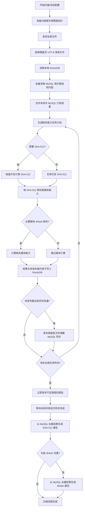

# “开始扫描”目标流程设计计划

> 日期：2026-07-15  
> 状态：已完成实现；Debug/Release x64 构建及 DedupTests 32/32 已通过（2026-07-15）
> 关联计划：`2026-07-15-multi-disk-adaptive-threading-plan.md`

## 1. 目标

“开始扫描”执行一条可中断、可恢复、适配多物理硬盘的完整流水线：

1. 获取全部扫描路径下的文件。
2. 按物理硬盘把文件列表输出到不同清单文件。
3. 读取本地 RocksDB 与 MySQL 中已有的路径、SHA-512 和 dHash 数据；MySQL 不可用时允许仅按本地数据继续规划。
4. 根据文件类型判断“该文件应有的结果是否完整”，排除全部结果已经有效的文件。
5. 只执行缺失的 SHA-512 或媒体能力任务，结果先原子持久化到本地 RocksDB。
6. 计算期间本轮待同步操作达到配置页现有“同步批量”时，发布一批并同步到 MySQL；计算结束后立即发布不足阈值的尾批。
7. MySQL 同步完成后自动按 MySQL 全量有效路径生成 SHA-512 精确重复报告。
8. 用户勾选 dHash 去重时，再按 MySQL 全量媒体结果生成 dHash 相似报告；复选框默认不勾选。

## 2. 当前实现与目标的差异

| 环节 | 当前实现 | 目标差异 |
| --- | --- | --- |
| 文件发现 | 按物理盘收集在 `discovered_by_disk_` 内存向量 | 需要落盘为每盘独立清单，并流式规划，避免大量文件常驻内存 |
| 增量判断 | 只查本机 RocksDB | 需要联合查询 RocksDB 与 MySQL |
| SHA-512 复用 | 本地路径记录可复用时跳过 | 需要同时利用 MySQL 路径映射和按 SHA-512 共享的内容记录 |
| 媒体完整性 | 主要通过 `media_algorithm_version` 判断 | 需要分别判断图片 dHash、六帧视频缩略图 dHash 等必要能力是否齐全；图片不要求缩略图，视频拼图文件不作为完整性门槛 |
| MySQL 同步 | 每个 SHA/媒体结果完成后立即写持久化同步队列，后台可马上同步，即使只有一条也会提交 | 需要按配置页现有“同步批量”形成批次：达到阈值边计算边同步，计算结束强制刷新尾批；历史待同步和失败重试优先且不受阈值限制 |
| SHA-512 去重 | 同步队列清空后自动从 MySQL 生成 | 数据源已符合目标，但触发条件要改为当前扫描批次同步屏障 |
| dHash 去重 | 从本机 RocksDB 的 `ShaFileData` 和本机活动路径生成 | 必须改为读取 MySQL 全量媒体内容和全量活动路径 |

## 3. 目标状态流



## 4. 阶段设计

### 4.1 阶段 A：预检与扫描快照

1. 校验扫描路径、RocksDB、MySQL 配置和线程参数。
2. 冻结 `ScanOptions`，包含：
   - 扫描路径和保留优先级。
   - Everything 参数。
   - 多盘读取策略和自适应计算策略。
   - 当前配置页“同步批量”值，作为本轮计算期间的发布阈值。
   - 缩略图格式、尺寸和媒体算法版本。
   - 是否在精确去重后继续执行 dHash 去重。
3. 创建 `scan_id` 和断点，所有后续清单、任务、暂存同步消息和报告触发均绑定该 `scan_id`。

### 4.2 阶段 B：按物理盘生成文件清单

发现器继续自动获得 `storage_target_key` 和 `StorageMediaType`，但不再把全量 `DiscoveredFile` 保存到内存。

推荐目录结构：

```text
data/scan_manifests/<scan_id>/
  manifest.json
  disk_000_<safe-storage-key>.jsonl
  disk_001_<safe-storage-key>.jsonl
```

`manifest.json` 保存扫描根、物理盘键、介质类型、文件数量、清单文件名和完成状态。每条 JSONL 至少保存：

- 完整路径和规范化路径。
- 文件大小、创建时间、修改时间。
- 文件类型。
- 卷 GUID、物理存储键、扫描根优先级。
- HDD 可用时的近似物理起始位置。

写入规则：

1. 每盘独立顺序写入，临时文件完成后原子改名。
2. Native 多线程发现时每个清单写入器独立加锁，不使用一个全局文件锁。
3. 发现阶段取消时保留未完成标记；恢复扫描时重新生成该盘清单，不把半文件当成完成输入。
4. 后续规划和哈希阶段流式读取 JSONL，不恢复全量内存向量。
5. 清单在计算完成时不删除；只有对应 `scan_id` 的 MySQL 同步全部成功后才删除整个清单目录。离线计算、同步等待、同步失败或程序退出时均保留，供恢复和追踪使用。

### 4.3 阶段 C：联合读取 RocksDB 与 MySQL

#### 本地优先级

1. 先按规范化路径查询本地 `FilePaths`。
2. `LocalOnly`、`Pending` 或待重试的本地记录代表尚未同步的新状态，优先于 MySQL，禁止被远端旧数据覆盖。
3. 本地缺失或只有已同步旧状态时，再读取 MySQL 补齐。

#### MySQL 查询范围

不把 MySQL 全表一次性加载进内存。对清单中的规范化路径计算现有 `path_hash`，按固定批量查询 `file_path_sha512`，并对命中结果再次比较完整 `normalized_path`，避免摘要碰撞误复用。

命中路径 SHA-512 后，再按 SHA-512 批量读取 `sha512_file_data`。查询结果写入当前扫描的 RocksDB 规划缓存，供清单流式判断使用。

#### MySQL 不可用时的本地降级

1. 扫描开始时先尝试连接和批量查询 MySQL；连接或查询失败不阻止文件发现、规划和本地计算。
2. 当前扫描标记为 `LocalPlanningDegraded`，界面和日志明确显示“仅依据本地数据规划”，不能把查询失败解释成“MySQL 中不存在记录”。
3. 降级模式只复用 RocksDB 中可安全验证的数据，远端已有但本地缺失的结果可能被重新计算；这是允许的保守行为。
4. 新结果仍暂存到 RocksDB；达到“同步批量”时发布到正式同步队列，计算结束时强制发布尾批，MySQL 恢复后继续同步。
5. 清单与扫描检查点在后续 MySQL 同步真正完成前保持不变，不能因本地计算完成而清理。

#### 复用安全条件

路径级 SHA-512 只能在以下条件均成立时复用：

1. 规范化路径一致。
2. 文件大小和最后修改时间一致。
3. Windows 文件身份可用时，卷序列号和文件 ID 一致。
4. SHA-512 字段存在且格式合法。

若路径级条件不成立，则重新计算 SHA-512；计算后可按新的 SHA-512 复用 MySQL 或 RocksDB 中已有的媒体内容结果。

### 4.4 阶段 D：按文件类型生成缺失能力计划

任务不再只有“整文件已算/未算”两种状态，而是记录能力位：

| 文件类型 | 完整结果要求 |
| --- | --- |
| 其他文件 | 有效 SHA-512 |
| 音频 | 有效 SHA-512 |
| 图片 | 有效 SHA-512、图片 dHash、匹配当前媒体算法版本 |
| 视频 | 有效 SHA-512、六帧视频缩略图 dHash、匹配当前媒体算法版本 |

已确认的完整性口径：

- 图片不需要生成或持久化缩略图。
- 视频六帧缩略图 dHash 完整即视为视频媒体特征完整；`contact_sheet_path` 或 2×3 拼图文件不存在，不触发重新计算。
- 新计算仍可按现有配置生成 2×3 拼图作为可选展示产物，但拼图保存失败只记录警告，不得使已经成功生成的六帧 dHash 回退为失败。

规划结果至少分为：

1. `SkipComplete`：全部必要结果完整，只刷新路径扫描状态。
2. `HashRequired`：路径 SHA-512 不可安全复用。
3. `MediaRequired`：SHA-512 已知，但对应媒体能力缺失或版本过期。
4. `HashThenInspectMedia`：先计算 SHA-512，再按内容摘要决定是否需要媒体任务。

完整性优先复用现有明确字段，不以本机文件路径是否存在作成功判断：

- 图片使用 `image_dhash.has_value()` 与 `media_algorithm_version`。
- 视频使用 `has_video_dhashes`、六帧 dHash 实际完整性与 `media_algorithm_version`。
- `contact_sheet_path` 仅是可选展示产物路径，不属于必要能力。

视频 dHash 与 2×3 拼图可共享同一次解码采样，但任务成功状态以六帧 dHash 为准；已有有效 dHash 不因拼图缺失或输出配置变化而回退。

### 4.5 阶段 E：计算与阈值批量同步

1. SHA-512 按物理盘清单和多盘读取策略调度。
2. HDD 保持物理位置排序，SSD 保持并发顺序读取。
3. SHA-512 和媒体阶段使用已确认的自动/固定计算线程逻辑。
4. 每个任务完成后，用一个 RocksDB `WriteBatch` 原子写入：
   - 路径或内容业务记录。
   - 当前任务终态。
   - 当前扫描的“待发布同步操作”暂存记录。
5. 使用单一批次发布器串行维护当前 `scan_id` 的待发布数量；达到冻结的 `sync_batch_size` 后，立即原子发布一个不超过该数量的批次到正式 `SyncQueue` 并唤醒 `MySqlSyncService`。
6. 计算速度较快、暂存数量超过一个批次时，连续发布多个完整批次；发布和计算并行进行，不等待该批 MySQL 提交完成才继续计算。
7. 正式 `SyncQueue` 中启动前遗留的历史操作和失败重试始终由现有同步服务优先处理，即使不足 `sync_batch_size` 也立即尝试，不受当前扫描的发布阈值限制。
8. 当前扫描已经发布后发生同步失败的操作留在正式队列中，沿用现有指数退避，不退回暂存区，也不与后续新结果重新凑批。
9. 失败、不可读和超时计算任务也必须进入终态，不能永久阻塞最终同步屏障；无 SHA-512 的失败路径只保留本地错误状态和日志。

### 4.6 阶段 F：计算完成、尾批刷新与最终同步屏障

当本轮所有计划任务均为成功、跳过、不可读、超时或已确认失败终态后：

1. 把扫描阶段切换为 `FlushingSyncTail`，停止为当前扫描增加新计算结果。
2. 当前 `scan_id` 仍有不足 `sync_batch_size` 的暂存操作时，立即原子发布全部尾批，不再等待数量门槛。
3. 每次发布通过 RocksDB 原子批处理完成“写入正式 `SyncQueue` + 删除暂存记录 + 更新发布计数”，保证崩溃后不会丢失或重复发布。
4. 给 `SyncOperation` 增加 `batch_scan_id`，MySQL 同步服务可报告当前扫描批次的待处理、已成功和失败数量。
5. 尾批发布完成后再次唤醒 `MySqlSyncService`，扫描进入 `WaitingForSyncBarrier`；计算期间已同步成功的完整批次无需重复处理。
6. 无论扫描开始时是否采用过 `LocalPlanningDegraded`，MySQL 暂时不可用时都停留在“等待 MySQL 同步”状态；本地计算结果、暂存尾批和正式同步队列均可在重启后继续。
7. 历史操作和失败重试继续优先处理；由于正式队列保持顺序，当前扫描全部确认时，其之前的持久化同步操作也必须已经确认。
8. 只有当前扫描所有已发布操作均确认成功且暂存数量为零后，才把状态设为 `CompletedSynchronized`，删除该 `scan_id` 的每盘清单目录，并触发全局去重。
9. 清单删除失败不回滚已完成的 MySQL 同步，只记录可重试的清理任务；报告触发不依赖清单物理删除成功。

### 4.7 阶段 G：基于 MySQL 全量结果去重

#### SHA-512 精确去重

保留现有 `ExactDuplicateReader` 的方向：流式读取 MySQL 全部 `active=1` 路径，按 SHA-512 排序生成精确重复组，报告分页结果保存在本地 RocksDB 供 UI 展示。

触发条件改为：当前扫描批次同步完成，而不是仅由 GUI 模糊判断队列是否存在一条消息。

#### dHash 相似去重

当前 `GenerateSimilar()` 只读取本机 RocksDB，不能满足全局结果要求。计划改为：

1. 从 MySQL 流式读取匹配当前 `media_algorithm_version` 的全部图片/视频内容记录。
2. 在 RocksDB 使用当前报告 `generation_id` 建立临时候选索引，不把 MySQL 全量数据写入本机正式业务记录。
3. 使用现有图片汉明距离、视频六帧距离和时长规则完成候选复核及并查集合组。
4. 从 MySQL 流式连接全部活动路径成员，生成最终相似组。
5. 发布报告后删除代际临时索引；取消或异常时也由清理器回收。
6. dHash 报告在 SHA-512 报告完成后串行执行，避免两个全量 MySQL 流式查询和 RocksDB 报告写入互相争用。

MySQL 是两类报告的事实数据源；本地 RocksDB 只保存报告代际、临时候选索引和 UI 分页数据。

## 5. 界面与进度

“扫描任务”窗口按目标流程显示：

1. 发现文件并生成每盘清单。
2. 读取本地已有结果。
3. 查询 MySQL 已有结果；不可用时显示“仅依据本地数据规划”的降级警告并继续。
4. 规划任务：跳过、需 SHA-512、需媒体。
5. SHA-512 计算。
6. 媒体 dHash 计算；视频 2×3 拼图仅作为可选产物。
7. 计算期间达到阈值后发布并同步完整批次。
8. 计算结束刷新尾批并等待 MySQL 最终同步。
9. 生成 SHA-512 全局报告。
10. 可选生成 dHash 全局报告。

补充统计：

- 每盘清单文件路径和文件数。
- 本地命中、MySQL 命中、完整跳过数量。
- 仅 SHA、仅媒体、SHA 后媒体任务数。
- 当前扫描暂存数量、同步阈值、已发布批次数、正式队列待同步、已同步和重试数量。
- 全局精确报告和相似报告生成进度。

扫描入口按钮统一显示“开始扫描”。在按钮附近增加“同步后生成 dHash 相似报告”复选框，默认不勾选，并把选择冻结到扫描快照，运行中修改不影响当前任务。

## 6. 数据库与兼容性

### RocksDB

建议复用 `Checkpoints` 保存当前扫描的清单状态、规划缓存和暂存同步操作，键全部带 `scan_id` 前缀；正式业务记录仍使用 `FilePaths`、`ShaFileData` 和 dHash 索引列族。

### MySQL

本次完整性口径可复用现有图片 dHash、六帧视频 dHash、`has_video_dhashes` 与 `media_algorithm_version` 字段，不因缩略图或拼图状态新增 MySQL 列，也不要求为本流程升级 MySQL 模式。`batch_scan_id` 只需存在于本地持久化同步操作与检查点中，用于批次屏障和恢复，不进入业务表。

如果实施中发现现有同步队列编码没有可扩展版本位，只升级本地 `SyncOperation` 编解码并提供旧记录兼容读取；不得把本地队列格式变化扩大为无必要的 MySQL 表迁移。

### 旧扫描恢复

旧检查点没有每盘清单、能力计划和同步批次边界。按已确认策略，不严格保留旧调度语义；恢复时从文件发现阶段重新建立新清单和任务计划，已落入 RocksDB 的有效 SHA/dHash 仍可复用。

## 7. 异常与恢复边界

1. 清单写入失败：当前物理盘发现阶段失败，不进入规划。
2. MySQL 查询失败：切换到 `LocalPlanningDegraded`，仅按 RocksDB 继续规划和计算；禁止把“未查询到”误判为“数据库没有”，并保留清单直到以后同步完成。
3. RocksDB 与暂存操作必须原子写入，防止业务结果存在但同步意图丢失。
4. 计算取消：已发布到正式队列的完整批次继续按正常规则同步；不足阈值的暂存尾批不强制发布，保留清单、暂存操作和任务状态供恢复，且不触发自动去重。
5. 同步取消或程序退出：正式同步队列保留，重启继续；自动去重不得提前触发。
6. 报告取消：不影响已经同步的业务数据，只保留上一代已发布报告。
7. MySQL 全量 dHash 查询异常：报告生成失败但扫描数据仍保持已同步完成状态，可手动重试报告。

## 8. 测试计划

1. 多路径、多 HDD/SSD 生成独立完整清单，重叠路径只进入最高优先级清单一次。
2. 百万级模拟清单以流式方式规划，不恢复全量内存向量。
3. 本地完整命中、MySQL 完整命中、路径变化、内容能力缺失分别进入正确任务类型。
4. 视频只有 SHA 时补六帧 dHash；已有有效 SHA、六帧 dHash 和当前算法版本时，即使 2×3 拼图文件缺失也必须直接跳过媒体计算。
5. 图片已有有效 SHA、图片 dHash 和当前算法版本时，不因没有缩略图而补算。
6. 当前扫描暂存数量为 `sync_batch_size - 1` 时，计算仍在进行期间不得发布；达到 `sync_batch_size` 时立即发布一个完整批次并允许与后续计算并行同步。
7. 计算正常结束时不足阈值的尾批立即发布；尾批确认前不触发报告或清单删除。
8. 历史待同步操作与失败重试即使不足阈值也立即处理，并排在当前扫描新发布批次之前。
9. 发布暂存操作过程中崩溃，恢复后没有丢失或重复的同步意图；已成功同步的完整批次不重复提交。
10. 扫描开始时 MySQL 不可用，流程显示本地降级并按 RocksDB 继续计算；恢复连接后能够继续处理已发布批次和后续尾批。
11. MySQL 未完全同步时不触发去重、不删除每盘清单；同步完成后删除清单目录，删除失败进入可重试清理但不回滚同步。
12. SHA-512 自动报告只包含 MySQL 全量活动路径。
13. dHash 可选报告包含其他机器已同步但本机 RocksDB 不存在的媒体结果。
14. dHash 复选框默认不勾选；未勾选时只自动生成 SHA-512 报告。
15. 取消覆盖发现、规划、SHA、媒体、阈值批次发布、尾批刷新、同步等待和报告生成各阶段。
16. 多盘线程、自适应 CPU、断点恢复、异常边界和现有核心测试全部通过。
17. `Debug|x64`、`Release|x64` 全解决方案构建成功，`DedupTests` 全部通过。

## 9. 已确认语义

1. 每盘 JSONL 清单在对应扫描批次同步到 MySQL 完成后删除；同步前、离线期间和失败时保留。
2. 扫描开始时 MySQL 不可用，允许仅根据 RocksDB 本地数据继续规划与计算，稍后恢复同步。
3. 视频以六帧缩略图 dHash 完整为媒体特征完成条件；不要求 `contact_sheet_path` 指向的拼图文件在当前机器存在。
4. 图片不需要生成或持久化缩略图，只要求 SHA-512、图片 dHash 与当前媒体算法版本。
5. 扫描页面增加 dHash 去重复选框，默认不勾选；勾选后在 SHA-512 报告成功后自动执行。
6. 复用配置页现有“同步批量”作为当前扫描新结果的发布阈值：计算期间达到阈值立即同步，正常计算结束立即刷新不足阈值的尾批；历史待同步数据和失败重试不受阈值限制并优先处理。
