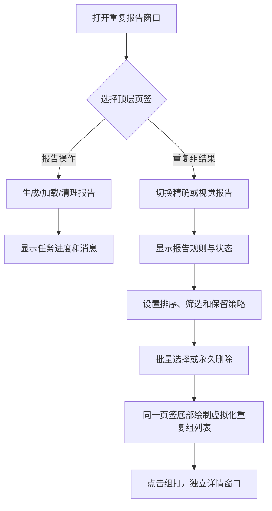

# 重复组浏览窗口拆分与桌面化布局优化计划

> 日期：2026-07-17  
> 状态：已执行，Debug/Release 构建及现有自动化测试通过  
> 方案口径：新增独立、可停靠、可拖出、可关闭的“重复组浏览”窗口；“重复报告”原窗口保留报告类型、筛选、排序、批量选择和删除等操作

## 1. 需求目标

1. 将当前“重复组结果”中的重复组列表拆到新的独立窗口。
2. 报告类型切换、报告规则信息、筛选条件、排序方式、保留策略、批量选择和永久删除继续留在原“重复报告”窗口。
3. 同时调整默认停靠布局和控件组织，使界面更符合桌面应用常见的“控制区 + 主结果区 + 详情窗口”使用习惯。
4. 不复制报告、排序或选择状态；两个窗口共享现有 `VideoScApp` 状态，保证操作结果即时反映到列表。
5. 保持大报告的虚拟化加载、缓存淘汰和详情窗口行为，不因拆窗增加 RocksDB 读取或内存峰值。

## 2. 当前实现核对

涉及现有代码：

- `VideoScGUI/VideoScApp.h`
  - `DuplicateReportPage` 只表示“报告操作/重复组结果”两个页签；
  - `m_showDuplicateReportWindow` 控制整个重复报告窗口；
  - `m_duplicateReportPage` 记录当前页签；
  - 排序、报告摘要、行索引、组缓存和当前组选择均已是窗口外的共享状态。
- `VideoScGUI/VideoScApp.cpp`
  - `RenderDuplicateReportWindow()` 同时绘制报告操作页和结果页；
  - 结果页依次绘制报告类型、元数据、排序、筛选/保留策略、选择与删除操作、重复组虚拟列表；
  - `ApplyReportSort()` 会排序摘要、清空组缓存、重建行索引并请求列表回到顶部；
  - 重复组列表使用 `ImGuiListClipper`，仅加载可见行；
  - `RenderDuplicateReportDetailWindow()` 已经是独立、可停靠的详情窗口；
  - `RenderDockSpace()` 当前默认把“重复报告”独占右侧主区域。

当前主要布局问题：

1. 结果页上方操作控件较多，窗口高度不足时会挤压主列表。
2. 排序按钮横向连续排列，小尺寸或窄停靠区域下容易换行混乱。
3. 控制操作和大列表共用一个页签，用户无法同时查看列表并调整筛选或排序。
4. “重复报告”既承担任务控制又承担主数据浏览，窗口职责过重。
5. 当前 `DuplicateReportPage` 只服务于页签切换，拆成独立窗口后将失去必要性。

## 3. 修改前流程图



问题表现：操作区越高，列表可视面积越小；调整排序时必须回到结果页上方，无法形成稳定的控制区和主数据区。

## 4. 修改后目标流程图


目标边界：

- 原窗口是“控制面板”，维护报告类型、筛选、排序和批量操作。
- 新窗口是“主结果区”，只展示当前控制状态对应的重复组，并保留列表行的直接交互。
- 详情窗口继续负责缩略图、质量指标、相似证据和跨组关系等深度信息。
- 三个窗口共享同一份 generation、摘要、排序、持久选择和当前组状态。

## 5. 目标桌面布局

首次启动或用户执行“恢复默认布局”后采用三栏工作区：

```text
┌──────────────────────────────────────────────────────────────────────────────┐
│ 菜单栏：视图 / 诊断工具 / 恢复默认布局                                      │
├──────────────────────┬────────────────────────┬──────────────────────────────┤
│ 设置、扫描路径、     │ 重复报告控制           │ 重复组浏览                   │
│ 扫描任务             │                        │                              │
│                      │ 报告类型与状态         │ 当前报告只读摘要             │
│ 现有上下分区保持     │ 生成/加载/清理         │ 重复组虚拟化列表             │
│                      │ 排序与筛选             │ 组成员保留/删除状态           │
│                      │ 保留策略与批量操作     │ 点击组打开详情               │
└──────────────────────┴────────────────────────┴──────────────────────────────┘
```

布局规则：

1. 左侧现有设置和扫描区域约占 30%。
2. 剩余工作区再拆成控制区和结果区，结果区宽度大于控制区。
3. 窄窗口下控制区自动切换为单列并允许垂直滚动，避免按钮依赖大量 `SameLine()`。
4. 所有窗口仍可由用户拖动、停靠、拆出或关闭，布局继续由 ImGui ini 保存。
5. 不强制清空已有用户布局；已有布局首次出现新窗口时使用合理初始尺寸。用户执行“恢复默认布局”后应用新的三栏布局。

## 6. 详细修改方案

### 6.1 拆分窗口和渲染职责

涉及文件：

- `VideoScGUI/VideoScApp.h`
- `VideoScGUI/VideoScApp.cpp`

修改内容：

1. 新增 `RenderDuplicateGroupBrowserWindow()`，只绘制重复组浏览窗口。
2. 新增 `m_showDuplicateGroupBrowserWindow`，默认显示，并由“视图”菜单独立控制。
3. `Render()` 的报告相关顺序调整为：
   - 重复报告控制窗口；
   - 重复组浏览窗口；
   - 当前组详情窗口。
4. 从 `RenderDuplicateReportWindow()` 移出以下内容：
   - `all_report_groups` 子窗口；
   - `ImGuiListClipper` 虚拟行遍历；
   - 组标题与成员行绘制；
   - 列表末尾的组缓存淘汰调用。
5. 原窗口不再使用“报告操作/重复组结果”顶层页签，删除失去用途的 `DuplicateReportPage` 和 `m_duplicateReportPage`。
6. 不把列表数据复制到新模型；新窗口直接读取现有 `m_reportSummaries`、`m_reportRowStarts` 和 `m_reportGroupCache`。
7. 调整相关方法和字段的中文文档注释，明确“控制窗口/浏览窗口/详情窗口”的职责。

### 6.2 原“重复报告”窗口改为控制面板

保留在原窗口的功能：

1. SHA-512 精确重复/视觉三级相似报告类型切换。
2. 生成精确报告、生成视觉报告、加载已发布报告。
3. 删除报告及其确认弹窗。
4. 报告生成、取消、清理、选择和永久删除进度。
5. 报告 generation、分组数、算法元数据和配置不匹配提示。
6. 排序方式。
7. 指定磁盘、图片/视频距离上限等条件输入。
8. 六项保留策略。
9. 按条件选择当前组、按条件选择全部报告、删除选中文件。
10. 持久选择数量、体积、组数和执行消息。

布局调整：

1. 顶部使用报告类型选择和当前报告摘要，用户先确认“正在操作哪份报告”。
2. 生成、加载放在常用命令区；删除报告放在独立危险操作区，避免和普通按钮混排。
3. 七个横排排序按钮改为带标签的下拉框，排序枚举和行为保持不变；精确报告不显示视觉距离排序项。
4. 将指定磁盘和距离上限归入“选择范围/筛选条件”。
5. 将六项保留规则归入“保留策略”，按现有固定优先级分组显示。
6. 批量选择与永久删除形成独立操作区，并在按钮附近显示禁用原因和当前选择汇总。
7. 报告算法元数据放入默认展开的“当前报告信息”区域；长说明允许折叠，避免挤占常用操作空间。
8. 使用 `BeginTable` 或固定分组子区域实现响应式双列/单列布局，不新增通用 UI 框架。

### 6.3 新增“重复组浏览”窗口

窗口内容：

1. 顶部只读摘要：当前报告类型、generation、分组总数、当前排序名称、已选择文件数量和体积。
2. 当原控制窗口被关闭时，提供“显示重复报告控制”导航按钮；该按钮不承载筛选或排序功能。
3. 主体使用现有 `ImGuiListClipper` 和统一滚动容器，占用窗口剩余空间。
4. 组标题继续显示组号、成员数量、可释放体积和平均视觉距离。
5. 点击组标题继续设置当前组并打开现有详情窗口。
6. 点击成员行继续切换该成员的 `[保留]/[删除]` 状态，这是列表行的直接操作，不迁移为全局筛选或排序控件。
7. 报告为空、尚未加载、报告已清理、加载失败分别显示明确空状态，不展示无意义的空白列表。
8. 列表窗口关闭后停止绘制和加载可见组；缓存仍按既有帧龄策略及时回收。

新窗口明确不包含：

- 报告类型切换；
- 排序下拉框；
- 指定磁盘和距离条件；
- 保留策略；
- 全报告批量选择；
- 永久删除按钮；
- 报告生成或清理按钮。

### 6.4 共享状态与跨窗口同步

1. 原窗口切换报告类型时，继续触发 `m_loadReportRequested` 并清理过期当前组状态。
2. 原窗口修改排序后，继续通过 `ApplyReportSort()`：
   - 排序 `m_reportSummaries`；
   - 清空组缓存；
   - 重建 `m_reportRowStarts`；
   - 请求新浏览窗口滚动到顶部。
3. 新窗口选中组后，原窗口的“按条件选择当前组”立即使用同一份 ordinal、group id 和 generation。
4. 新窗口手动切换成员后，继续先写 `ReportSelectionStore`，成功后同步列表缓存、详情副本和选择汇总。
5. 报告类型、generation 切换、报告清理和运行时关闭时，继续统一清空当前组、详情、关系缓存和缩略图。
6. 不新增跨线程 UI 事件总线；所有窗口仍在同一 GUI 帧读取和写入 `VideoScApp` 状态。

### 6.5 菜单、默认停靠和布局恢复

1. “视图”菜单增加独立条目：
   - `重复报告控制`；
   - `重复组浏览`。
2. 保留现有窗口身份，避免无必要破坏用户已经保存的“重复报告”停靠信息。
3. 重置布局时同时恢复两个窗口为显示状态，并关闭动态详情窗口。
4. 更新 DockBuilder 默认布局：左侧保留设置/路径/扫描，中间停靠重复报告控制，右侧停靠重复组浏览。
5. 新浏览窗口设置仅首次生效的合理初始尺寸，已有 ini 布局不被自动清空。
6. 界面提示用户可通过“恢复默认布局”获得新的三栏工作区。

## 7. 性能与可靠性约束

1. 继续使用单份摘要数组和行起始索引，不为新窗口复制全部分组。
2. 继续使用 `ImGuiListClipper`，不可改成一次绘制全部成员。
3. 只有浏览窗口可见时才调用 `AcquireReportGroup()` 加载可见组。
4. 排序后必须清空 ordinal 关联缓存，避免列表显示旧组数据。
5. `ReportSelectionStore` 仍是待删除选择的持久事实来源，窗口状态不能替代 RocksDB。
6. 新窗口关闭、报告清理或 generation 切换后不能残留旧详情和跨组关系缓存。
7. 不改变报告生成线程、三阶段图片算法、完整链接分组、删除前 SHA-512 复核或 MySQL/RocksDB schema。

## 8. 预计修改文件

| 文件 | 修改范围 |
|---|---|
| `VideoScGUI/VideoScApp.h` | 新增浏览窗口声明和可见状态；删除旧页签枚举/状态；补充职责注释 |
| `VideoScGUI/VideoScApp.cpp` | 拆分控制/浏览渲染；重排控件；增加菜单和默认停靠；保持共享状态同步 |
| `docs/superpowers/plans/2026-07-17-duplicate-group-browser-layout-optimization-plan.md` | 记录方案、流程、验收与执行结果 |

本次不计划修改 `DedupCore`、数据库 schema 或报告算法代码。

## 9. 实施顺序

1. 在头文件增加浏览窗口入口和可见状态，移除旧页签状态。
2. 从现有结果页提取虚拟列表到新窗口，先保持列表行为完全不变。
3. 将报告类型、元数据、排序、筛选和删除操作整理回原控制窗口。
4. 将排序按钮改为下拉选择，并按报告类型过滤不可用选项。
5. 增加“视图”菜单项、默认三栏停靠和布局重置处理。
6. 核对报告切换、排序、当前组、手动选择、缓存清理和详情窗口的跨窗口状态。
7. 完成构建、自动化测试和 GUI 人工验收后，在本文回填执行结果。

## 10. 验证计划

### 10.1 自动化验证

1. Debug x64 全解决方案构建通过。
2. Release x64 全解决方案构建通过。
3. Debug/Release `DedupTests` 保持全部通过。
4. 搜索确认旧 `DuplicateReportPage`、旧顶层页签 ID 和结果列表旧位置已完全移除。

### 10.2 GUI 人工验收

1. 默认布局显示控制窗口和浏览窗口，用户可以同时操作和查看结果。
2. 两个窗口均可停靠、拖出、关闭，并可从“视图”菜单重新打开。
3. 恢复默认布局后形成左侧辅助区、中间控制区、右侧结果区。
4. 切换精确/视觉报告后，浏览窗口立即显示正确报告，旧当前组和详情不残留。
5. 修改每一种排序方式后，浏览窗口顺序正确并回到顶部。
6. 指定磁盘、距离上限和保留策略只出现在控制窗口。
7. “按条件选择当前组”作用于浏览窗口最后点击的当前组。
8. 手动点击成员后，浏览列表、详情窗口和控制窗口选择汇总同步。
9. 大报告滚动仍只加载可见组，滚动过程无明显卡顿或内存持续增长。
10. 关闭浏览窗口后不再加载组；重新打开后仍显示当前报告和持久选择。
11. 报告为空、加载失败、报告被清理时显示明确空状态。
12. 生成、选择、删除任务运行时的禁用规则、进度和安全退出行为不回归。

## 11. 风险与控制

### 风险 1：拆窗后出现两套报告状态

控制：不新增窗口级报告副本；两个窗口只使用 `VideoScApp` 现有共享状态。

### 风险 2：排序后新窗口仍引用旧 ordinal 缓存

控制：继续由 `ApplyReportSort()` 统一清缓存、重建行索引并重置滚动。

### 风险 3：新窗口关闭后缓存不再淘汰

控制：把组缓存维护移到不依赖原控制窗口可见性的稳定帧路径，隐藏浏览窗口时不加载新组并清理过期项。

### 风险 4：默认布局覆盖用户自定义布局

控制：不主动清空现有 ImGui ini；只有首次布局或用户主动恢复默认布局时应用新三栏结构。

### 风险 5：控制区过窄导致按钮拥挤

控制：常用排序改为下拉框；控制区使用分组和响应式单/双列布局，危险操作独立显示。

## 12. 最终验收标准

1. 重复组列表已经从原窗口拆到独立“重复组浏览”窗口。
2. 报告类型、筛选、排序、保留策略、批量选择和永久删除仍只在原“重复报告”窗口。
3. 两个窗口可同时显示，修改控制状态后列表即时更新。
4. 当前组和成员手动选择在浏览窗口可用，并与原窗口汇总、详情窗口和 RocksDB 持久状态一致。
5. 首次/重置布局符合“辅助区 + 控制区 + 主结果区”的桌面应用习惯。
6. 已有用户布局不会被代码无条件清空。
7. 大报告继续虚拟化加载，不增加全量分组副本或明显内存峰值。
8. 报告算法、持久化结构、删除安全边界和后台任务流程不发生语义变化。
9. Debug/Release 构建和现有自动化测试全部通过。

## 13. 计划边界与确认结果

- 本计划按“新界面 = 独立、可停靠的 ImGui 功能窗口”制定，不是原窗口内新增页签。
- 列表行上的“点击组看详情”和“点击成员切换保留/删除”继续留在浏览窗口；全局筛选、排序和批量操作留在原窗口。
- 用户已明确下达“执行计划”，实现按上述边界完成。

## 14. 执行结果

### 14.1 已完成修改

1. 删除旧 `DuplicateReportPage` 和“报告操作/重复组结果”顶层页签状态。
2. 原“重复报告”窗口已改为控制窗口，保留：
   - 精确/视觉报告类型切换；
   - 报告生成、加载、清理和任务进度；
   - 报告规则与 generation 信息；
   - 排序、指定磁盘、距离条件和保留策略；
   - 当前组/全部报告选择、永久删除及选择汇总。
3. 排序操作由七个连续按钮改为单个下拉框；精确报告自动隐藏视觉距离排序项。
4. 生成、清理和选择操作改为等宽表格工具栏，危险操作与普通操作分区显示；窄停靠区域自动退化为单列按钮。
5. 新增独立“重复组浏览”窗口：
   - 显示当前报告、generation、分组数、排序和选择汇总；
   - 继续使用 `ImGuiListClipper` 虚拟化列表；
   - 保留点击组打开详情和点击成员切换保留/删除；
   - 控制窗口关闭时提供重新显示入口；
   - 尚未加载报告和空报告使用独立空状态。
6. “视图”菜单新增“重复报告控制”和“重复组浏览”两个独立开关。
7. 默认/重置布局改为：左侧设置与扫描、中间报告控制、右侧重复组浏览。
8. 已有 ImGui ini 不会被无条件清空；新窗口保留首次显示尺寸，用户可主动恢复默认三栏布局。
9. 组缓存淘汰移到每帧稳定路径：关闭浏览窗口后不再加载新组，旧缓存仍会按帧龄释放。
10. 报告算法、`DedupCore`、数据库 schema、持久选择格式和删除安全流程均未修改。

### 14.2 自动化验证结果

- Debug x64 全解决方案构建：通过。
- Debug `DedupTests`：46/46 通过。
- Release x64 全解决方案构建：通过。
- Release `DedupTests`：46/46 通过。
- 静态搜索确认：旧 `DuplicateReportPage`、`duplicate_report_page_tabs` 和“重复组结果”页签绘制入口均已移除。
- 构建仅出现既有 vcpkg manifest 已禁用提示，不影响目标生成。
- 损坏 TIFF 安全测试仍输出预期 FFmpeg 解码诊断，测试本身通过。

### 14.3 未自动化验收项

以下交互需要在真实桌面环境中人工确认，本轮未把它们写成已验证事实：

1. 已保存旧 ImGui ini 时，新浏览窗口首次出现的位置和尺寸是否符合用户屏幕习惯。
2. 通过“恢复默认布局”得到三栏工作区后的实际宽度观感。
3. 窄屏、高 DPI 和长路径数据下的控件换行、横向滚动与文字可读性。
4. 真实大报告持续滚动时的主观流畅度与内存曲线。
5. 用户拖出、重新停靠、关闭并从“视图”菜单恢复两个报告窗口的完整交互。
