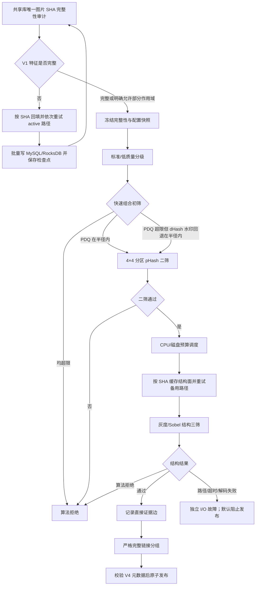

# 图片三级相似设计符合性实施与验收记录

> 日期：2026-07-17  
> 状态：代码实施与隔离验证完成；真实共享库回填、SSD/HDD 混合盘和生产样本验收待运行  
> 修改计划：`2026-07-17-image-three-stage-design-conformance-remediation-plan.md`  
> 根因报告：`2026-07-17-image-three-stage-design-conformance-root-cause.md`

## 1. 实施结论

已把图片相似链路收敛为以下可靠组合：

标准质量默认初筛为 `PDQ ≤ 31 或 dHash ≤ 4`；低质量严格分支为 `PDQ ≤ 24 或 dHash ≤ 2`。dHash 只在 PDQ 未召回时作为水印回退候选，之后仍必须通过分区 pHash 和结构三筛，不能单独形成相似边。

## 2. 主要实现

- 配置 schema 升至 v5，增加标准/低质量双配置、候选预算、热门签名上限、批次和取消粒度。
- 报告 schema v4 冻结完整性、标准/低质量阈值、候选资源峰值、实际结构线程和 CPU 位计数路径。
- 增加全量图片特征完整性统计、历史回填协调器和 RocksDB 检查点；报告核心层再次执行完整性门禁。
- 候选器使用 PDQ 16×16 半径 1 扁平索引与动态 dHash 回退索引；两条路径互斥计数，避免重复候选。
- 低质量图片不再静默跳过；证据保存质量类别、PDQ/dHash 距离、是否使用回退、pHash 和结构量化值。
- 候选内存、临时字节、候选对、热门签名、写批次和取消检查均有硬上限；超限不发布。
- 三筛使用有效线程上限、每物理盘许可、多 active 路径重试和 SHA 级共享结构缓存。
- I/O/超时/解码失败与算法拒绝分开，默认存在未解决 I/O 故障时阻止发布。
- POPCNT/SWAR 运行时分派已统一到核心库和 VideoSc DLL，保留强制标量诊断开关。
- GUI 显示 V4 规则、低质量阈值、特征完整性、候选峰值和实际数据库 schema；删除前重新严格加载报告元数据。
- 新增独立 `DedupBenchmarks` 项目，不拖慢日常 `DedupTests`。

## 3. 稳定语料与阈值校准

固定语料位于 `DedupTests/assets/image_similarity/`。测试直接读取仓库文件，不联网，也不在运行时生成验收输入。基准图片冻结了 PDQ 32 字节、质量分和 16 个分区 pHash 金值。

| 样本 | PDQ 距离 | dHash 距离 | pHash 通过区 | 结构全局/裁剪/通过占比 | 结果 |
|---|---:|---:|---:|---:|---|
| 2× 分辨率 | 0 | 0 | 16 | 902544 / 974262 / 992188 | 通过 |
| 亮度变化 | 4 | 1 | 14 | 997078 / 985346 / 1000000 | 通过 |
| 暖色调 | 8 | 2 | 14 | 996904 / 988458 / 1000000 | 通过 |
| 局部高对比水印 | 44 | 3 | 12 | 801225 / 1000000 / 906250 | 通过 dHash 回退及后两筛 |
| 不同主内容难负样本 | 134 | 46 | 0 | 8037 / 342975 / 0 | 初筛拒绝 |

校准直接否定了把 PDQ 半径扩大到 48 的中间方案：高半径会放大候选碰撞。最终采用小半径 PDQ 与小半径 dHash 的互斥组合召回，继续由 pHash 和结构证据控制误组。

## 4. 构建、测试和规模基准

测试环境可识别信息：Windows NT 10.0.22631.0，Intel64 Family 6 Model 151，20 个逻辑处理器。WMI/CIM 硬件查询因当前权限被拒绝，因此未记录更具体型号和物理内存。

| 验证项 | 结果 |
|---|---|
| `VideoSc.sln` Debug x64 | 成功 |
| Debug `DedupTests` | 46/46 passed |
| `VideoSc.sln` Release x64 | 成功 |
| Release `DedupTests` | 46/46 passed |
| Release，100 万相同热门签名 | 73 ms；峰值估算 320786492 字节；展开 0 对；2 个签名延迟人工复核 |
| Release，1000 万输入、512 MiB 预算 | 分配前拒绝；原始记录预计 1200000000 字节 |

Release 构建日志中出现一次现有环境的 `pwsh.exe` 不存在提示，但 MSBuild 最终退出码为 0，全部项目均生成成功。

## 5. 测试覆盖新增项

- 配置 v5 JSON 往返、旧配置迁移和低质量跨配置约束。
- PDQ 运行时/强制标量距离一致性。
- 固定 PDQ、质量分和 16 区 pHash 金值。
- 分辨率、亮度、色调、水印正样本与不同主内容难负样本。
- 扁平候选集合与暴力两两结果完全一致。
- PDQ 超限、dHash 水印回退召回与低质量严格回退拒绝。
- 热门签名、候选对预算和取消。
- 回填检查点往返与清除。
- 结构缓存首路径失败后备用路径成功。
- 三筛全局线程、每盘许可与取消。
- V4 元数据、dHash 回退证据和损坏规则拒绝。
- 旧报告不能绕过新删除门禁。

## 6. 尚未在本机执行的生产验收

以下项目没有伪装成已通过：

1. 未连接或修改用户真实 MySQL 资源库；因此没有执行真实历史全量回填、断点续跑和生产数据完整性守恒。
2. 未在真实 SSD/HDD 混合盘上测量磁盘队列和吞吐；当前未知介质按更保守的 HDD 每盘上限调度。
3. 固定语料覆盖了本项目目标的核心变体，但不是大规模真实业务图片集；上线前仍应以只读副本运行误组审阅。
4. GUI 已编译并具备阶段/门禁显示，但本轮未启动 GUI 做人工交互验收。
5. 1000 万规模验证的是分配前预算拒绝，不是允许 1.2 GiB 记录进入候选器后的完整吞吐。

这些项目不影响代码构建和隔离测试结论，但在生产启用自动删除前必须完成。其中任何一项发现差异，都应保留报告只读、禁止自动删除，并回到对应配置或调度阶段修正。

