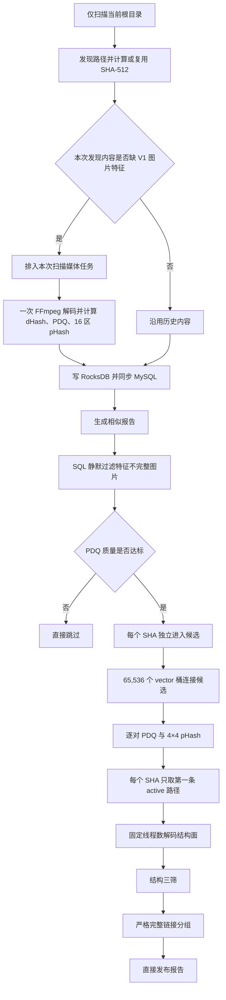
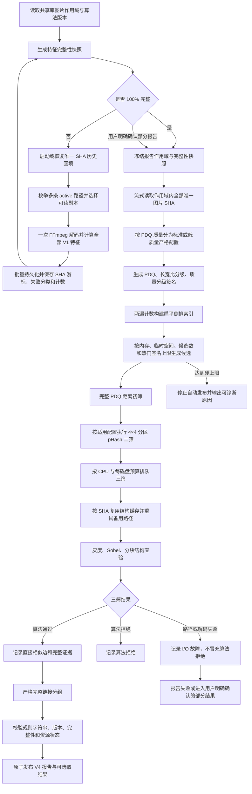
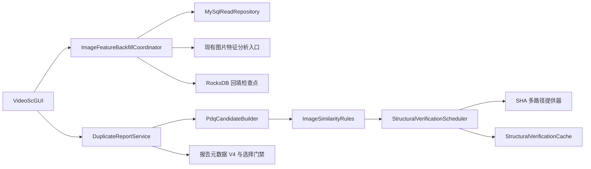
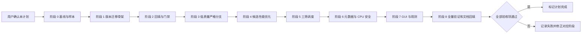

# 图片三级相似设计符合性修改计划

> 日期：2026-07-17  
> 状态：已执行；代码实施与隔离验证完成，真实共享库和混合磁盘生产验收待运行  
> 实施记录：`2026-07-17-image-three-stage-design-conformance-implementation-record.md`  
> 根因依据：`2026-07-17-image-three-stage-design-conformance-root-cause.md`  
> 实施原则：可靠性优先、严格避免误组、资源有界、任务可恢复、报告可审计  
> 实施边界：本计划仅覆盖主内容相同图片；不支持旋转、裁剪、平移、局部重复和仅语义相似图片

## 1. 修改目标

在保留现有 `Meta PDQ-256 → 4×4 分区 pHash → 灰度/Sobel 结构直验 → 严格完整链接` 主体的基础上，补齐根因报告中的 4 项 P1、4 项 P2 和 2 项 P3 偏差，使图片相似报告具备以下能力：

1. 对共享库内的唯一图片 SHA 执行全量、可取消、可恢复、幂等的历史特征回填，报告生成前可证明本次作用域的特征完整度。
2. PDQ 低质量图片不再静默跳过，而是进入独立且更严格的二筛、三筛阈值分支。
3. 使用 `(PDQ-256, 长宽比分级, 质量分级)` 签名压缩和扁平倒排索引降低候选开销，同时保持自动分组所需的每一条直接相似边都经过完整验证。
4. 候选内存、临时空间、候选数、热门签名规模、结构缓存和并发任务全部有显式上限；取消操作能在有界时间内生效。
5. 三筛按 CPU 和磁盘读取预算调度，按 SHA 尝试多条 active 路径；路径或解码故障与算法拒绝分开统计。
6. 报告元数据冻结完整性快照、三阶段规则、阈值配置和实际执行模式；报告选择和删除前重新严格校验。
7. 用稳定二进制金样、真实变体、难负样本、迁移测试和百万级合成基准形成可重复验收证据。

本计划不替换 Meta ThreatExchange PDQ、FFmpeg 或 RocksDB。现有三方库已经覆盖核心哈希、解码和本地状态存储，新增依赖不会显著提高可靠性；候选索引、调度和门禁使用项目内小型组件实现，避免引入额外运行时和 ABI 风险。

## 2. 修改前流程

当前流程的主要风险是：历史内容静默漏筛、低质量图片漏筛、热门桶退化、候选资源无上限、三筛 I/O 失控、可读副本未重试，以及报告无法证明执行规则与数据完整性。

## 3. 修改后目标流程

### 3.1 自动报告的安全条件

- 默认只有作用域特征完整度为 100%、候选和临时空间未越界、没有未决热门签名、三筛没有未分类故障时，才发布可用于自动选择的报告。
- 若仍有无可读路径、永久解码失败或用户主动跳过的 SHA，只能由 GUI 展示精确清单和计数后，让用户对本次运行执行一次性“生成部分作用域报告”确认。
- 部分作用域报告必须冻结遗漏原因和 SHA 数量，默认不可直接进入删除流程；用户需重新确认报告范围后才能选取。
- 任何预算超限、取消、元数据校验失败或证据写入失败都不得发布伪装成完整结果的报告。

## 4. 总体架构调整

新增组件保持单一职责：

- `ImageFeatureBackfillCoordinator`：负责作用域审计、回填状态机、取消、续跑和进度，不复制图片算法。
- `ImageFeatureBackfillCheckpointStore`：只持久化回填任务状态、SHA 游标、算法版本和分类计数。
- `PdqCandidateBuilder`：只负责签名、扁平索引、候选去重、批量写入和资源上限。
- `StructuralVerificationScheduler`：只负责 CPU/磁盘预算、路径重试、任务排队和结果分类。
- `PopcountKernel`：统一运行时 POPCNT/SWAR 分派，供图片、旧 dHash 和 DLL 兼容 API 使用。

## 5. 分阶段实施计划

### 阶段 0：冻结基线、验收语料与观测指标

1. 在 `DedupTests/assets/image_similarity/` 增加稳定二进制图片，不依赖运行时生成器或网络下载。
2. 冻结三类基线：官方 PDQ 金样、项目 pHash 位级金样、结构面金样。
3. 建立正样本矩阵：不同分辨率、JPEG 压缩、亮度、对比度、gamma、冷暖色调，以及不同位置、透明度和面积不超过目标范围的水印。
4. 建立难负样本矩阵：同人物不同帧、同场景不同构图、同模板不同商品/文本、低纹理图和故意构造的桶碰撞。
5. 在真实样本上记录正常和低质量图片的 PDQ/pHash/结构距离分布，以“难负样本自动误组为 0”为阈值冻结前置条件；未完成校准前，不将低质量配置标记为生产可用。
6. 记录当前 Release x64 `42/42` 测试和相似报告资源指标，作为回归基线。

交付物：稳定测试资源、阈值校准记录、基线测试结果和指标字段定义。

### 阶段 1：配置、模型和版本迁移骨架

1. `ImageSimilarityConfig` 拆出共享控制项和两个阈值配置：`standard_profile`、`low_quality_profile`。
2. 增加 `ImageQualityClass`；任一图片被判定为低质量时，该图片对应用更严格配置，不允许回退到标准配置。
3. 增加候选预算配置：内存 MiB、临时空间 MiB、最大候选对、热门签名成员/直接对上限、批写大小和取消检查粒度。
4. 配置 schema `4 → 5`；读取兼容 v4，首次成功迁移后写 v5，并保留备份。迁移规则必须经过 `ConfigValidator`，不能静默接受非法阈值。
5. 报告 schema `3 → 4`、报告元数据 codec `3 → 4`、相似证据 codec `2 → 3`。旧 V3 报告可读但标记为旧规则；新删除链路只信任重新严格校验过的报告。
6. MySQL 当前字段足以承载回填后的图片特征，本阶段不升级 MySQL schema；GUI 改为显示实际 `schema.current_version`，移除硬编码版本 1。

交付物：可兼容迁移的配置/模型、版本化 codec、迁移单元测试；业务流程暂不切换。

### 阶段 2：全量历史特征回填与报告完整性门禁

1. 为 `MySqlReadRepository` 增加按 SHA 升序流式枚举“不完整或算法版本过期图片”的接口，同时返回按优先级排序的全部 active 路径候选和 `storage_target_key`。
2. 增加作用域完整性统计接口，至少返回：总唯一 SHA、完整、版本过期、无特征、无 active 路径、已知永久失败和剩余。
3. 实现 `ImageFeatureBackfillCoordinator`：
   - 以唯一 SHA 为任务单位；
   - 完整且版本匹配时幂等跳过；
   - 依次验证路径可读性，并在打开、超时或解码失败时尝试备用路径；
   - 调用现有 `AnalyzeImagePerceptualFeaturesV1`，一次解码生成全部特征；
   - 沿用现有 RocksDB/MySQL 同步链路，不再实现第二套写入协议；
   - 每批保存 SHA 游标、算法版本、计数、吞吐和失败分类；
   - 取消后停止提交新任务、等待已提交任务安全收敛，再保存检查点。
4. 使用 RocksDB `Checkpoints` 独立前缀保存回填检查点，不新增 MySQL 任务表；任务重新启动时校验作用域和算法版本，不匹配则新建代次。
5. `DuplicateReportGenerator` 在核心层再次执行完整性门禁，避免只靠 GUI 绕过。部分作用域必须携带显式用户确认令牌和完整性快照。
6. GUI 增加回填区域：开始/暂停/继续/取消、总数/完成/失败/剩余、吞吐/ETA、失败分类和可展开清单。

交付物：可恢复回填、完整性快照、核心层门禁和 GUI 进度；普通扫描继续复用同一分析函数并自然提高完整度。

### 阶段 3：低质量图片的严格二筛和三筛

1. 删除 `pdq_quality < pdq_min_quality` 的直接跳过路径，改为标记 `LowQuality`。
2. 候选阶段仍使用完整 PDQ 距离；二筛和三筛根据图片对质量分级选择 `low_quality_profile`。
3. 低质量配置只能比标准配置更严格：PDQ/pHash 最大距离不得更大，结构相似度最小值不得更低。该跨配置约束加入 `ConfigValidator`。
4. `SimilarityEvidence` 记录实际应用配置、两侧质量和每阶段测量值；不能只记录最终布尔结论。
5. 报告统计拆分为：标准质量已评估/通过/拒绝、低质量已评估/通过/拒绝、缺特征、版本不匹配、无路径、打开失败、超时、解码失败和取消。
6. 初始阈值只作为工程默认值；阶段 0 金样校准通过并在计划验收记录中冻结后，才允许标记为生产阈值。

交付物：低质量图片不漏筛、规则更严格、证据可追踪、统计守恒。

### 阶段 4：签名压缩、扁平倒排与候选资源上限

1. 抽取 `PdqCandidateBuilder`，从 `DuplicateReportService` 移出候选构建细节。
2. 以 `(PDQ-256, 长宽比分级, 质量分级)` 生成签名。签名相同只用于压缩索引工作量，不代表直接建立相似边。
3. 将 `65,536 × vector` 替换为两遍构建的扁平倒排：
   - 第一遍 `bucket_counts[65536]` 计数；
   - 前缀和生成 `offsets[65537]`；
   - 第二遍写入连续 `postings[N]`；
   - 每次只处理一个 PDQ 槽，复用缓冲区。
4. 使用紧凑 `CandidateRecord` 保存 SHA、尺寸、质量、PDQ 和 pHash。超过内存预算时顺序溢写到本次报告的临时命名空间，并记录峰值。
5. 对候选对做标准化键去重并批量写 RocksDB，禁止逐对 `Put`；批次前后和每个固定比较块检查取消标志。
6. 保持可靠性的硬约束：进入自动完整链接分组的每一个成员对都必须具有直接通过 PDQ、pHash 和结构三筛的证据。
7. 热门签名展开超过成员数或直接对预算时，不自动合并；输出 `HotSignatureDeferred` 诊断。达到全局候选、内存或临时空间硬上限时停止发布并给出明确原因。

交付物：有界候选生成、可及时取消、批量持久化、无近似捷径造成的误组。

### 阶段 5：自适应三筛调度、多路径重试和缓存

1. 实现 `StructuralVerificationScheduler`，复用或提取 `DiskHashScheduler` 已有的 CPU 和每磁盘预算逻辑。
2. 有效并发取配置上限、CPU 允许量、全局读取预算和各物理磁盘预算的最小可用值；SSD/HDD 分开限流，不能仅按固定线程数启动。
3. 三筛任务携带有序路径候选，不再只传第一条路径。顺序依据路径可读性、目标磁盘负载和稳定键确定，失败后尝试备用副本。
4. `StructuralVerificationCache::Get` 改为接收路径提供器或候选列表；按 SHA 缓存成功结构面，共享 future 仍只允许同一 SHA 一次有效加载。
5. 结构对按 `storage_target_key` 和左侧 SHA 稳定排序，提高相邻读取局部性；工作队列、已解码缓存和未决 future 均设置容量上限。
6. 结果类型拆分为 `AlgorithmRejected`、`NoReadablePath`、`OpenFailed`、`TimedOut`、`DecodeFailed`、`Cancelled`。I/O 故障不得计为 pHash 或结构算法拒绝。
7. 在媒体打开、流信息、解码和缩放各边界统一调用中断分类函数，稳定区分超时、取消和普通打开失败。

交付物：磁盘友好且资源有界的三筛、多副本容错、准确失败分类。

### 阶段 6：元数据、报告选择与 POPCNT 安全收口

1. V4 报告元数据冻结：
   - 主筛/二筛/三筛精确规则标识；
   - 标准和低质量阈值；
   - 图片算法版本；
   - 作用域及完整性快照；
   - 候选和结构资源预算、峰值、热门签名延迟数；
   - 实际 SIMD/标量路径及任务完成状态。
2. `ValidateSimilarReportMetadataV4` 对精确规则字符串、版本、阈值关系、计数守恒和完成状态逐项验证，并复用配置验证逻辑。
3. `ReportSelectionStore` 保存报告 schema、规则版本、作用域和验证模式。恢复选择及执行删除前重新读取并校验报告元数据，移除仅凭布尔量或 `has_measured_distance` 缺失就放行的路径。
4. V3 报告仍可查看；只有通过 V3 已知规则精确校验的报告可恢复旧选择，新建选择和删除建议先重建 V4 报告。V3、V4 证据不得混组。
5. 在 `DedupCore` 增加统一 `PopcountKernel`，图片规则和旧 dHash 均通过运行时 CPUID 选择 POPCNT 或 SWAR；保留强制标量测试开关。
6. `VideoSc` DLL 内增加对应运行时分派，静态视觉路径和公开汉明距离 API 都不得无条件调用 POPCNT；避免通过 DLL 回调替代核心库内热点函数。

交付物：可审计报告、删除前二次门禁、旧 CPU 安全运行和新旧算法一致性。

### 阶段 7：GUI 与运行观测

1. 报告页按真实阶段展示完整性审计、回填、候选、二筛、结构调度、完整链接和发布状态。
2. 增加以下实时指标：输入唯一 SHA、标准/低质量数量、签名数量、峰值桶、候选生成/去重/通过数、临时字节、缓存命中、队列深度、CPU 并发、各磁盘并发、三筛失败分类、各阶段耗时和取消延迟。
3. 报告发布前展示完整性、预算越界、未决热门签名和 I/O 故障；不满足自动条件时禁用自动选择/删除入口。
4. 修正数据库初始化版本提示，直接显示当前 schema 常量。
5. 所有 GUI 取消动作只发出一次取消信号，不在 UI 线程等待长时间 I/O；后台完成收敛后再恢复按钮状态。

交付物：进度可解释、异常可定位、危险入口受门禁控制。

### 阶段 8：测试、基准、构建与文档回填

1. 补齐第 8 节测试矩阵；所有新格式必须包含 round-trip、损坏输入、旧版本读取和迁移测试。
2. 新增独立 `DedupBenchmarks` 控制台项目，只运行合成百万/千万级候选和结构调度基准，不拖慢普通 `DedupTests`。
3. 完成 Debug x64、Release x64 构建与 `DedupTests` 全量运行；性能基准记录硬件、数据规模、峰值内存、临时空间、候选吞吐、取消延迟和磁盘队列。
4. 回填功能使用隔离测试库或 fake repository 验证，不连接或修改用户真实资源库。
5. 更新设计文档、配置样例、报告格式、故障处理和运维说明；只有所有验收项通过后，才把计划状态改为完成。

## 6. 预计文件变更

### 6.1 新增文件

| 文件 | 作用 |
|---|---|
| `DedupCore/orchestration/ImageFeatureBackfillCoordinator.{h,cpp}` | 历史图片特征完整性审计与可恢复回填状态机 |
| `DedupCore/persistence/ImageFeatureBackfillCheckpointStore.{h,cpp}` | RocksDB 回填检查点、游标和分类计数 |
| `DedupCore/dedup/PdqCandidateBuilder.{h,cpp}` | 签名压缩、扁平倒排、候选去重与预算控制 |
| `DedupCore/dedup/StructuralVerificationScheduler.{h,cpp}` | CPU/磁盘预算、多路径重试和三筛结果分类 |
| `DedupCore/dedup/PopcountKernel.{h,cpp}` | 核心库运行时 POPCNT/SWAR 分派 |
| `VideoSc/CpuDispatch.{h,cpp}` | DLL 内部运行时 CPU 能力分派 |
| `DedupTests/assets/image_similarity/*` | 稳定图片金样、变体和难负样本 |
| `DedupBenchmarks/*` | 不进入日常测试的规模与资源基准项目 |

### 6.2 修改文件或模块

| 文件或模块 | 修改内容 |
|---|---|
| `DedupCore/config/AppConfig.*` | 双阈值配置、候选/结构预算、schema v5 |
| `DedupCore/config/JsonConfigStore.*` | v4 到 v5 兼容读取、迁移写入与备份 |
| `DedupCore/config/ConfigValidator.*` | 范围、低质量更严格关系和资源上限校验 |
| `DedupCore/models/CoreModels.*`、`CoreModelCodec.*` | 质量分级、三筛结果分类、证据 codec v3 |
| `DedupCore/persistence/MySqlReadRepository.*` | 完整性统计、缺失特征流、多 active 路径流 |
| `DedupCore/orchestration/ScanCoordinator.*` | 复用回填分析入口和统一任务/失败分类，不承担回填状态机 |
| `DedupCore/dedup/DuplicateReportService.*` | 完整性门禁、阶段编排、严格发布条件和元数据 v4 |
| `DedupCore/dedup/ImageSimilarityRules.*` | 标准/低质量配置选择和统一 popcount |
| `DedupCore/dedup/StructuralVerificationCache.*` | 多路径提供器、备用路径重试和终态结果 |
| `DedupCore/dedup/ReportSelectionStore.*` | 保存并重验报告版本、规则、作用域和模式 |
| `VideoSc/dllmain.cpp` | 稳定中断分类和运行时 CPU 分派接入 |
| `VideoScGUI/*` | 回填 UI、门禁、统计、诊断和正确 schema 展示 |
| `DedupTests/main.cpp` 及测试辅助文件 | 全部功能、迁移、故障、并发和属性测试 |
| `DedupCore/DedupCore.vcxproj`、`VideoSc/VideoSc.vcxproj*`、`VideoSc.sln` | 纳入新增源文件与基准项目 |

文件名在实施时可以按项目现有命名规则微调，但不得把回填、候选、三筛调度重新堆回 `DuplicateReportService.cpp` 或 GUI 类。

## 7. 数据与格式迁移方案

1. **配置**：读取 v4 时把现有阈值迁入 `standard_profile`；低质量配置写入经过阶段 0 校准的更严格值。成功验证后写 v5，同时保留旧配置备份。
2. **MySQL**：不新增表、不修改已有图片特征列；回填只补写当前 V1 字段及版本。若实施时发现现有查询无法稳定分页，再单独提交 schema 修改计划，不在本计划内临时扩表。
3. **RocksDB**：新增带版本和任务代次的回填检查点前缀、候选临时命名空间和 V4 报告记录。中断恢复前校验算法版本和作用域指纹。
4. **报告**：V3 只读兼容，V4 使用新元数据和证据。报告写入继续采用临时命名空间构建、完整校验后原子切换，失败时不覆盖上一个有效报告。
5. **选择记录**：旧选择恢复时先验证对应旧报告；无法验证则展示为失效并要求重建，不自动映射到 V4。

## 8. 测试与验收矩阵

### 8.1 算法可靠性

- PDQ 官方金样逐字节一致。
- 4×4 pHash 位序、DCT、DC 排除和中位数规则逐位一致。
- 不同分辨率、压缩、亮度、对比度、gamma、冷暖色调和目标范围内水印的主内容相同图片通过三级筛选。
- 难负样本自动误组必须为 0；若出现误组，收紧阈值或修正规则后重新冻结，不以提高召回为理由接受误删风险。
- 旋转、裁剪、平移、局部重复和仅语义相似不作为正样本；不得为其放宽算法。
- 低质量样本必须实际进入严格分支，且证据记录应用的配置。

### 8.2 候选正确性与性能

- 随机 PDQ 集合上，扁平倒排结果与暴力枚举的完整汉明距离结果集合一致。
- 签名压缩前后，最终直接相似边和完整链接分组完全一致。
- 热门签名、全同签名和故意碰撞输入不会无界占用内存或自动误组。
- 候选内存、临时空间和总对数超限均稳定停止，不发布不完整报告。
- 批量 RocksDB 写入失败、磁盘满和取消均能清理本次临时命名空间或保留可恢复状态。
- 百万/千万级合成基准记录资源曲线；验收重点是配置上限严格生效、吞吐不随无关桶平方退化、取消在配置的检查粒度内响应。

### 8.3 回填与迁移

- 首次全量、取消、继续、进程重启恢复、重复执行幂等、算法版本升级和作用域变化。
- 第一条路径不存在但第二条可读时成功回填；全部路径失败时分类与计数准确。
- v4 配置迁移到 v5 后语义不丢失；非法低质量阈值拒绝启动。
- V3 报告可查看但不能绕过新门禁；V4 损坏元数据不能恢复选择或删除。
- 完整性统计满足 `总数 = 完整 + 各类未完成`，部分报告遗漏数与元数据一致。

### 8.4 三筛并发、缓存与 CPU

- 相同 SHA 并发请求只执行一次成功结构加载，其余共享 future。
- 缓存命中、淘汰、备用路径、超时、取消和永久错误状态符合预期。
- CPU 和每磁盘并发预算在 SSD/HDD 混合场景下不越界。
- 强制标量与 POPCNT 在随机输入、边界输入上结果完全一致；不支持 POPCNT 的 CPU 不执行非法指令。
- 打开失败、流信息超时、解码失败和算法拒绝分别进入正确统计。

### 8.5 构建与回归

- `VideoSc.sln` Debug x64 构建成功。
- `VideoSc.sln` Release x64 构建成功。
- `DedupTests` 全量通过，且原有 42 项测试无回归。
- 基准、迁移和故障注入结果写入实施记录；未执行的检查不得标记为通过。

## 9. 性能控制与预期

性能优化以“结果不降级、资源有硬上限”为前提：

| 环节 | 修改前风险 | 修改后控制 |
|---|---|---|
| 历史特征 | 报告阶段静默遗漏 | 独立回填、按 SHA 游标续跑、批量持久化 |
| 候选索引 | 大量小 vector 和热门桶平方退化 | 两遍扁平倒排、签名压缩、热门签名延迟 |
| 候选存储 | 逐对 RocksDB Put | 紧凑记录、标准化去重、WriteBatch |
| 内存与磁盘 | 无候选/临时空间硬上限 | 配置化 MiB/对数上限，越界停止发布 |
| 取消 | 内层长循环不检查 | 固定比较块、批次和 I/O 边界检查 |
| 结构解码 | 固定线程、单路径、HDD 争抢 | CPU/磁盘预算、多路径重试、稳定排序 |
| 结构缓存 | 只解决同 SHA 重复加载 | 在有界缓存上保留共享加载并记录命中/淘汰 |
| 位计数 | 部分路径无条件 POPCNT | 运行时 CPUID 分派和 SWAR 回退 |

本计划不在缺少目标硬件和真实数据规模的情况下承诺固定秒数。实施验收以同机基线对比、峰值资源上限、取消延迟和结果集合一致性为准；所有具体吞吐数均在阶段 8 基准报告中给出。

## 10. 根因到修改项映射

| 根因项 | 修改阶段 | 验收证据 |
|---|---|---|
| P1-01 全量回填和完整性门禁缺失 | 阶段 2、7 | 回填恢复测试、完整性守恒、核心层发布门禁 |
| P1-02 低质量图片直接跳过 | 阶段 1、3 | 低质量分支金样、严格关系校验、统计守恒 |
| P1-03 候选未压缩且资源无界 | 阶段 4 | 暴力枚举属性测试、热门签名和预算测试 |
| P1-04 固定三筛并发且单路径 | 阶段 5 | 磁盘预算、多路径、故障分类和取消测试 |
| P2-01 缺少目标样本和规模证据 | 阶段 0、8 | 稳定资源、难负样本、百万/千万基准 |
| P2-02 元数据规则未精确验证 | 阶段 1、6 | V4 元数据损坏/篡改/旧版本测试 |
| P2-03 超时误分类 | 阶段 5 | 媒体各阶段故障注入测试 |
| P2-04 POPCNT 旧 CPU 风险 | 阶段 6 | 强制标量一致性和 CPUID 分派测试 |
| P3-01 GUI schema 版本错误 | 阶段 7 | GUI 显示当前 schema 常量 |
| P3-02 pHash 缺少提前退出和观测 | 阶段 3、4、7 | 分区累计距离提前退出、阶段计数与耗时 |

## 11. 回滚与故障处理

1. 每阶段独立提交，并在 Debug/Release 构建和对应测试通过后再进入下一阶段。
2. 配置 v5 迁移保留 v4 备份；迁移失败则保持旧配置并拒绝启动新报告，不覆盖原文件。
3. 回填只补齐现有特征字段，任务幂等且可取消；停止新协调器不会破坏已完成特征。
4. V4 报告在临时命名空间构建，只有最终校验成功才切换当前报告指针；失败时继续保留上一个有效报告。
5. 候选临时数据带报告运行 ID；正常完成后删除，异常退出后由下次启动按状态恢复或安全清理。
6. 若新候选器或调度器出现结果差异，保留只读诊断开关在测试环境同时运行旧/新路径并比较边集合；生产不允许在差异未解释时自动发布。
7. 不使用 `git reset --hard`、数据库破坏性迁移或删除用户资源作为回滚手段。

## 12. 实施顺序与确认点

执行前需要用户确认本计划。确认后按上述顺序实施；除阶段 0 的真实样本阈值校准结果外，不在实施过程中临时改变“严格避免主内容不同图片误组”的目标，也不扩展旋转、裁剪、局部匹配或语义相似范围。
