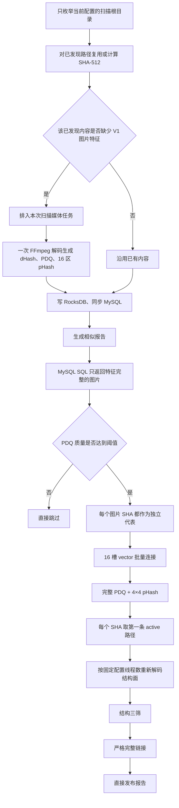
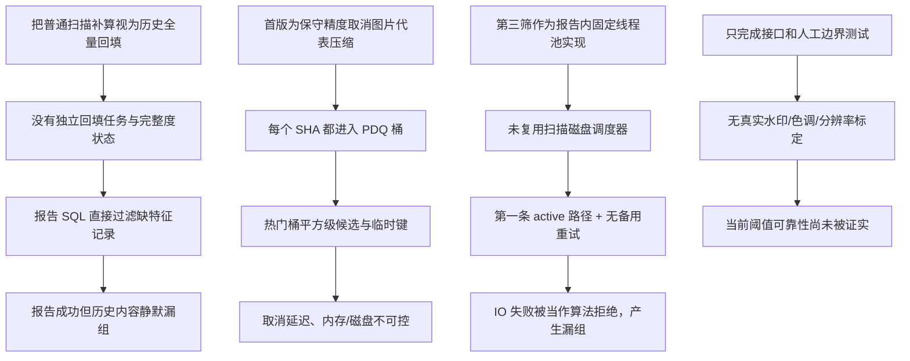

# 图片三级相似设计符合性根因排查报告

> 日期：2026-07-17  
> 状态：根因已确认；修改计划已执行，详见实施与验收记录  
> 实施记录：`2026-07-17-image-three-stage-design-conformance-implementation-record.md`  
> 对照设计：`2026-07-17-main-content-image-three-stage-performance-modification-plan.md`  
> 排查方式：只读源码审计、数据链路追踪、现有 Release x64 测试复跑；未修改实现、未连接真实 MySQL、未扫描用户资源

## 1. 结论

当前项目已经具备 `PDQ-256 → 4×4 分区 pHash → 灰度/Sobel 结构直验 → 严格完整链接` 的主体代码，且 Meta ThreatExchange PDQ 以固定提交集成，图片新链路没有用旧 dHash 作为放行条件。

但当前实现不能判定为“完整符合设计并可按原方案验收”。共确认：

- 4 项 P1 高优先级偏差；
- 4 项 P2 中优先级偏差；
- 2 项 P3 低优先级偏差。

最关键的结论是：

1. 没有设计要求的“按唯一 SHA 全量、可恢复历史回填”和报告发布完整性门禁；缺特征历史图片会被 SQL 静默过滤。
2. 低质量 PDQ 图片不是进入更严格二、三筛，而是直接排除；统计分类还会出现总数与分项不相等。
3. 图片没有按 `(PDQ, 长宽比分级)` 压缩代表项，热门桶会退化为平方级候选；候选内层没有及时取消和容量上限。
4. 三筛直接使用固定线程数和每个 SHA 的第一条 active 路径，没有 CPU/磁盘预算门控、可读性选择和备用路径重试，既可能压垮 HDD，也可能把有可读副本的相似对误拒绝。
5. `42/42` 现有测试通过，但没有覆盖本功能的真实目标样本、候选穷举一致性、历史回填和百万级性能，因此不能证明“大量水印、不同分辨率、不同色调”已经可靠达标。

在上述 P1 偏差修正并补足验收证据前，不建议把设计文档状态继续解释为“全部设计完成”。

## 2. 当前实际流程

与设计相比，缺失的关键控制点是：全量历史 SHA 回填任务、回填完整性统计/确认、低质量严格分支、热门签名压缩、候选容量上限、第三筛 CPU/磁盘预算门控、可读路径选择和真实样本验收。

## 3. 符合设计的部分

以下内容已由源码确认，不属于本次问题：

1. **可靠库优先**：`third_party/pdq/UPSTREAM.md:1-8` 固定 Meta ThreatExchange 提交 `4b98d786c3b9c40e62cc31fe20f7e6d9fe729757`，并保留许可证与上游说明。
2. **扫描单次解码**：`VideoSc/dllmain.cpp:373-498` 只解码一帧，再生成 `9×8`、`64×64`、`256×256` 三个灰度面；`VideoSc/dllmain.cpp:1214-1272` 一次返回全部持久化图片特征。
3. **4×4 分区 pHash**：`VideoSc/ImagePerceptualHash.cpp:15-96` 使用固定 256×256、4×4 分区、32×32 输入、可分离 8×8 低频 DCT、排除 DC 和固定中位数规则。
4. **结构直验边界正确**：`VideoSc/ImageStructuralPlane.cpp:115-198` 只做固定坐标整图结构比较，没有旋转、裁剪、平移或局部搜索，并对最差 25% 块做有上限裁剪。
5. **图片不回退旧 dHash 放行**：图片候选和二筛使用 PDQ、分区 pHash；旧 dHash 仍只用于兼容展示和视频路径。
6. **严格完整链接存在**：`DedupCore/dedup/DuplicateReportService.cpp:2258-2310` 在把当前代表加入组前，逐一检查它与组内已有代表的直接三筛关系边。
7. **结构缓存主体存在**：`DedupCore/dedup/StructuralVerificationCache.cpp:39-86` 按 SHA 使用 LRU 与共享 future，同 SHA 并发请求可等待同一次加载。
8. **持久化版本已扩展**：配置、核心模型、同步消息、MySQL 字段和报告元数据均已加入图片三级特征与算法版本。

## 4. P1 高优先级偏差

### P1-01 没有全量历史回填和报告完整性门禁，历史图片会被静默漏掉

**设计要求**

- 设计文档 `:355-366` 要求按唯一内容 SHA 做全量、可恢复回填，展示总数/完成数/失败数/剩余数，并在完整度满足用户确认条件后才允许发布新报告。
- 设计文档 `:549` 明确要求回填未完成时禁止发布报告。

**源码证据**

- `DedupCore/orchestration/ScanCoordinator.cpp:646-672` 只从当前配置的扫描根目录发现文件。
- `DedupCore/orchestration/ScanCoordinator.cpp:1052-1075` 的规划输入仅来自本次发现清单。
- `DedupCore/orchestration/ScanCoordinator.cpp:1113-1125`、`:1151-1176` 只会为本次已发现且可复用的路径检查 `MediaComplete` 并补建媒体任务。
- 没有独立的“枚举 MySQL 全部历史图片 SHA → 选择可读路径 → 回填 → checkpoint”任务或状态模型。
- `DedupCore/persistence/MySqlReadRepository.cpp:397-403` 在 SQL `WHERE` 中直接要求 PDQ、质量分、16 区 pHash和两个算法版本完整；缺特征图片不会进入报告生成器。
- `VideoScGUI/VideoScApp.cpp:1603-1607` 直接调用 `GenerateSimilar`，调用前没有范围完整度检查或用户确认。
- `DedupCore/dedup/DuplicateReportService.cpp:2886-2895` 完成现有输入后直接发布报告。

**根因**

实现把“普通扫描时顺带重算已发现文件”当成了“历史全量回填”。这只能覆盖仍位于当前扫描根目录、且能在本次发现的内容，不能覆盖 MySQL 中其他历史范围、未重新扫描路径、缺本地缓存映射或回填失败对象。报告读取层又用 SQL 预过滤代替完整性审计，导致生成器既不知道缺了多少内容，也无法实施门禁。

**触发条件**

- 数据库从旧版本升级后直接生成相似报告；
- 只扫描部分目录；
- 历史路径已移出当前扫描范围；
- 某些图片上次回填失败或尚未重扫。

**影响**

- 同底图资源被漏组，报告仍显示“成功”；
- `skipped_invalid_images` 无法统计被 SQL 排除的缺特征图片；
- 自动报告链路可能在用户不知情时发布不完整结果。

### P1-02 低质量 PDQ 图片被直接排除，没有更严格二、三筛分支

**设计要求**

- 设计文档 `:139-143` 要求质量分 `<=49` 的图片被标记为低质量，并只有在通过更严格二、三筛后才允许成组。
- 设计文档 `:523-526` 要求 GUI 明确展示低质量、特征缺失、不确定和失败对象，不静默丢弃。

**源码证据**

- `DedupCore/dedup/DuplicateReportService.cpp:1477-1490` 把低于 `pdq_min_quality` 的图片直接跳过，不进入代表、候选、pHash 或结构三筛。
- 当前配置只有一个普通二、三筛阈值集合，没有低质量图片的更严格阈值或状态分支。
- 同一段代码只在 `visualStatus == InvalidImage` 时增加 `skipped_invalid_images`；低质量图片的 `visualStatus` 是 `Valid`，因此只增加总数，不增加图片分项。
- `VideoScGUI/VideoScApp.cpp:1738-1742` 同时显示跳过总数、图片数、视频数，低质量图片存在时可能出现“总数 > 图片数 + 视频数”。

**根因**

实现阶段把低质量策略收敛成了“保守排除”，但数据模型和报告状态没有增加 `LowQuality` 分类，也没有独立的严格阈值。这个收敛与用户已确认的设计目标相反，且统计模型仍按“无效图片/无效视频”二分，无法准确解释低质量跳过。

**影响**

- 低纹理、压缩严重、分辨率低或被水印显著影响的同底图更容易被漏掉；
- 用户看不到具体低质量对象和原因；
- 报告跳过统计不自洽。

### P1-03 热门 PDQ 桶仍可能平方级爆炸，缺少及时取消与资源上限

**设计要求**

- 设计文档 `:143` 要求先压缩相同 `(PDQ, 长宽比分级)` 签名。
- 设计文档 `:154-160` 要求紧凑/扁平 postings、逐槽释放工作集和受控临时空间。
- 设计文档 `:453-460`、`:501-505` 要求百万/千万规模基准、与穷举逐对一致、容量和取消清理测试。

**源码证据**

- `DedupCore/dedup/DuplicateReportService.cpp:692-700` 的图片 `VisualSignatureKey` 是 `I/<SHA-512>`，即每个不同内容 SHA 都是独立代表，没有按 PDQ 和长宽比分级压缩。
- `DedupCore/dedup/DuplicateReportService.cpp:1667-1696` 把所有图片代表装入内存向量。
- `DedupCore/dedup/DuplicateReportService.cpp:1746` 使用 `std::vector<std::vector<uint32_t>>(65536)`，不是设计中的扁平 postings 或外排结构。
- `DedupCore/dedup/DuplicateReportService.cpp:1791-1801` 对同桶和邻桶执行嵌套两两连接；热门桶复杂度为平方级。
- `DedupCore/dedup/DuplicateReportService.cpp:1771-1776` 每个通过的候选对单独写一个 RocksDB 键。
- 取消只在槽循环条件 `:1780-1782` 检查；同一个大桶的内层循环和 `saveImageCandidate` 不检查取消。
- 没有候选对数量、单桶大小、临时 RocksDB 字节数或内存峰值的硬上限。

**根因**

为确保每个图片 SHA 都真正经过结构三筛，首版取消了图片签名代表压缩，但没有补上“代表与成员结构等价校验后展开”的机制。候选阶段只实现了数学召回和跨槽去重，没有实现设计要求的热门桶治理、扁平存储、批量写入、预算和内层取消。

**触发条件**

- 大量缩略图、占位图、低纹理图、模板图或视觉上高度接近但 SHA 不同的资源；
- PDQ 质量阈值配置较低；
- 百万级以上图片库。

**影响**

- 候选数、RocksDB 临时空间和运行时间可能按 `O(n²)` 增长；
- 用户点击取消后仍可能长时间卡在当前热门桶；
- 进程存在内存/磁盘空间耗尽风险。

### P1-04 三筛路径选择与并发没有复用磁盘门控，可能误拒绝并压垮 HDD

**设计要求**

- 设计文档 `:262-264` 要求三筛线程数取配置、CPU 预算、全局读取预算和对应磁盘读取预算的最小值。
- 设计文档 `:355-365` 要求优先选择当前可读取路径，并记录缺文件或解码失败原因。

**源码证据**

- `DedupCore/persistence/MySqlReadRepository.cpp:424-426` 只按 `path_id` 返回 active 路径。
- `DedupCore/dedup/DuplicateReportService.cpp:2015-2042` 对每个 SHA 保存遇到的第一条 active 路径；没有 `exists`、可读性探测、磁盘类型排序或备用路径列表。
- `DedupCore/dedup/DuplicateReportService.cpp:2026-2042` 直接按 `structural_worker_threads` 创建固定线程池，没有使用 `DiskHashScheduler`、CPU 自适应预算或每盘读取门控。
- `DedupCore/dedup/DuplicateReportService.cpp:2077-2087` 路径缺失或结构加载失败时直接把候选记为拒绝，没有尝试同 SHA 的其他 active 路径，也没有把具体失败原因写入报告结果。
- `DedupCore/dedup/StructuralVerificationCache.cpp:97-114` 只加载调用方给定的单一路径。

**根因**

第三筛被实现为报告内部的通用固定线程池，路径索引也被简化为 `SHA → 单路径`。它绕开了扫描链路已经存在的物理盘识别、每盘队列、读取预算和失败分类能力。

**触发条件**

- 同一 SHA 有多条 active 路径，其中最小 `path_id` 已离线或不可读；
- 候选分布在同一机械硬盘；
- 用户把结构线程数配置得高于当前 CPU/磁盘预算。

**影响**

- 即使同 SHA 还有可读副本，候选也可能被误拒绝，造成漏组；
- 多线程随机重解码可把 HDD 打满，并影响扫描或其他任务；
- 失败只计入“拒绝碰撞”，无法区分算法拒绝与 IO/解码失败。

## 5. P2 中优先级偏差

### P2-01 缺少证明目标可靠性的黄金样本、真实变体、迁移和容量测试

**设计要求**

- 设计文档 `:232-238` 要求官方 PDQ/冻结黄金输出、pHash 稳定舍入和标量/优化路径逐位一致。
- 设计文档 `:419-451` 要求真实水印、分辨率、编码质量、亮度、Gamma、冷暖色调、难负样本、历史回填、取消、缺文件和缓存测试。
- 设计文档 `:453-460` 要求 Release x64 百万/千万规模基准。

**现有测试证据**

- `DedupTests/main.cpp:1049-1102` 只检查一张 `testsrc2` 图片能生成特征，以及同一文件和自身比较得到满分。
- `DedupTests/main.cpp:1106-1151` 使用人工构造的 PDQ/pHash 位数组检查距离 31/32 和 12/16 边界，没有验证真实图片生成出的 Hash。
- `DedupTests/main.cpp:865-883` 只检查 MySQL 初始化 SQL 文本不包含破坏性语句，没有执行 1→2 迁移、失败恢复或重复迁移。
- 测试工程没有调用 `GenerateSimilar` 的图片三级端到端场景，也没有 `StructuralVerificationCache` 的共享加载、淘汰、失败或取消测试。
- 没有 PDQ 官方输出、pHash 位序/DCT 黄金向量、PDQ 批量候选与穷举对照、热门桶、百万级内存/临时空间或真实正负样本测试。

**本次复跑结果**

- `x64/Release/DedupTests.exe`：`42/42 passed`。
- 测试二进制时间晚于本次审计的核心图片源码，结果可用于确认现有测试仍通过。
- 该结果只能证明现有 42 项测试，没有覆盖上述缺失验收项。

**根因与影响**

实施优先完成了接口、持久化和规则边界，部署数据验收被留到后续，但设计文档顶部仍标记“核心实现和自动测试已完成”。因此当前阈值和预处理只能视为工程起始值，不能据此宣称对“大量水印、不同分辨率、不同色调”已经达到高可靠。

### P2-02 报告元数据没有完整校验三级算法标识，选择安全过度依赖布尔标记

**源码证据**

- `DedupCore/dedup/DuplicateReportService.cpp:444-465` 会读取 `image_primary_rule`、`image_secondary_rule`、`image_tertiary_rule` 和全部阈值。
- `DedupCore/dedup/DuplicateReportService.cpp:477-494` 的 `currentRules` 没有比较三个三级算法标识，也没有完整复用配置校验器检查全部阈值和缓存范围。
- `DedupCore/dedup/ReportSelectionStore.cpp:194-200` 只要上层传入“已经三级验证”，图片选择就直接允许，不再逐项测量旧 dHash。

**根因**

元数据兼容判断主要依赖 `report_schema_version`、桶规则、成组规则和 `image_uses_three_stage_verification`，但保存下来的具体一级/二级/三级算法标识没有进入拒绝条件。

**影响**

损坏数据或未来未正确升级 schema 的算法变化，可能被当成当前三级报告解释；选择/删除链路会信任该报告已完成当前三级验证。正常由当前版本生成的报告不受影响，但版本隔离边界不完整。

### P2-03 图片打开和流信息阶段会把超时误报为普通打开失败

**源码证据**

- `VideoSc/dllmain.cpp:373-390` 在 `avformat_open_input` 和 `avformat_find_stream_info` 失败后只判断取消，不判断中断回调是否因超时触发，超时会返回 `VIDEOSC_ERR_OPEN_FAILED`。
- `VideoSc/dllmain.cpp:459-464` 解码阶段会识别超时，但超时错误文本仍统一为 `Cannot decode image frame`。

**根因与影响**

同一个 FFmpeg 中断回调在不同阶段采用了不一致的状态映射。慢网络盘、异常文件或无进展探测触发时，扫描失败原因和重试策略无法区分“文件打不开”与“读取超时”，也不符合设计要求的稳定失败分类。

### P2-04 POPCNT 运行时回退只覆盖新图片规则，旧 dHash/视频路径仍直接执行指令

**设计要求**

- 设计文档 `:223-228` 要求 x64 不支持 POPCNT 时使用确定性 SWAR 回退，并记录实际路径。

**源码证据**

- `DedupCore/dedup/ImageSimilarityRules.cpp:12-31` 的新图片 PDQ/pHash 路径已正确做 CPUID 检测和 SWAR 回退。
- `DedupCore/dedup/DHashSimilarity.cpp:47-48` 的视频/兼容 dHash 距离仍直接调用 `__popcnt64`。
- `VideoSc/dllmain.cpp:572-581` 的视频静态画面检测直接调用 `__popcnt64`。
- `VideoSc/dllmain.cpp:2160-2204` 的公共 `ComputeHammingDistance` 在 MSVC 下也直接调用 `__popcnt`。

**根因与影响**

CPU 分派只在新增的 `ImageSimilarityRules` 内局部实现，没有抽成所有汉明距离共用的运行时内核。现代 CPU 通常不会触发，但在不支持 POPCNT 的合法 x64 CPU 上，视频分析或兼容 API 可能执行非法指令；报告元数据记录的路径也不能代表整个项目实际使用情况。

## 6. P3 低优先级偏差

### P3-01 数据库初始化成功提示仍写“模式版本 1”

- `DedupCore/persistence/MySqlSchema.h:12` 当前 schema 是 2；`DedupCore/persistence/MySqlSchema.cpp:161-165` 写入并返回版本 2。
- `VideoScGUI/VideoScApp.cpp:1148-1151` 无论新建、检查或迁移成功都提示“模式版本 1”，也没有区分“已迁移到 2”。

这不会改变数据库内容，但会误导部署排查和验收。

### P3-02 二筛没有实现设计中的早退，报告可观测性也少于设计

- 设计文档 `:237` 要求失败区超过 4 后立即拒绝；`DedupCore/dedup/ImageSimilarityRules.cpp:76-96` 总是计算并排序全部 16 区。单对只有 16 次 popcount，影响较小，但属于未落地的性能条款。
- 最终结果只记录少量候选、缓存和拒绝总数；没有低质量、缺特征、IO/解码失败、单桶峰值、临时字节数、峰值内存、阶段耗时和磁盘吞吐等设计要求的分类指标。

## 7. 设计符合性矩阵

| 设计条款 | 当前状态 | 结论 |
|---|---|---|
| Meta PDQ 固定可靠库 | 已实现 | 符合；但缺官方黄金输出对照 |
| 扫描一次解码生成持久特征 | 已实现 | 符合 |
| PDQ → 分区 pHash → 结构三筛 | 主链已实现 | 基本符合 |
| 不处理旋转、裁剪、局部、语义相似 | 已实现 | 符合 |
| 严格完整链接 | 已实现 | 符合 |
| 历史图片全量、可恢复回填 | 未实现独立链路 | 不符合，P1 |
| 回填完整度门禁后发布报告 | 未实现 | 不符合，P1 |
| 低质量图片进入更严格路径 | 直接排除 | 不符合，P1 |
| 相同 PDQ/长宽比签名压缩 | 图片按 SHA 独立 | 不符合，P1 |
| 热门桶、内存、临时空间有上限 | 无硬上限 | 不符合，P1 |
| 三筛 CPU/磁盘预算门控 | 固定线程池 | 不符合，P1 |
| 当前可读路径选择与备用路径 | 第一条 active 路径 | 不符合，P1 |
| 报告算法版本严格隔离 | 部分校验 | 部分符合，P2 |
| 取消/超时稳定错误分类 | 打开阶段误分类 | 部分符合，P2 |
| 全项目 POPCNT 运行时回退 | 仅新图片路径 | 部分符合，P2 |
| 真实正负样本与大规模验收 | 未覆盖 | 不符合，P2 |

## 8. 根因关系图

## 9. 建议的确认边界

本报告只确认根因和设计偏差，不是修改计划，也没有执行实现修改。

建议用户先确认以下判断是否符合预期：

1. 历史图片必须按数据库中唯一 SHA 全量回填，而不是仅依赖用户再次扫描原目录。
2. 回填未达到用户确认的完整度时，相似报告必须禁止发布，不能静默忽略缺特征图片。
3. 低质量 PDQ 图片必须保留为明确状态，并走可配置的更严格二、三筛，而不是直接删除候选资格。
4. 热门 PDQ 签名需要代表压缩或等价的热门桶治理，同时必须保证每个最终成员仍满足结构直验安全边界。
5. 三筛必须接入 CPU/磁盘预算和备用路径重试；IO/解码失败不能计为算法不相似。
6. 真实水印、分辨率、编码、色调正样本和难负样本，以及百万级容量基准，属于功能验收的必需项。

确认根因正确后，再单独生成中文修改计划，并在计划中给出修改前、修改后流程图；在用户再次确认修改计划前不执行代码修改。
