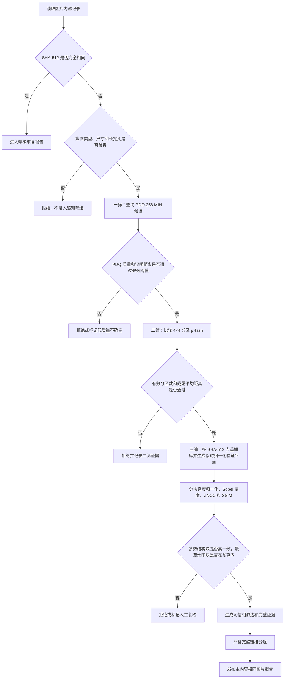

# 主内容相同图片三级组合筛选推荐方案

> 日期：2026-07-17  
> 状态：已合并进 `2026-07-17-main-content-image-three-stage-performance-modification-plan.md`，禁止按本文直接执行代码修改  
> 适用范围：图片资源；视频继续沿用现有六帧 dHash 流程  
> 推荐主链：`PDQ-256 快速召回 → 4×4 分区 pHash 二筛 → 归一化结构直验三筛`

> 取代说明：新修改方案已补齐 CPU 运行时分派、批量 PDQ 候选索引、IO/线程池、结构缓存、存储迁移、历史回填、测试基准和分阶段实施顺序。本文只保留为算法选型历史记录。

## 1. 目标与判定边界

本方案只筛选“主内容来自同一张原图”的资源，允许存在：

- 不同图片分辨率；
- JPEG、PNG、WebP 等不同编码及压缩质量；
- 全局亮度、对比度、Gamma 和色调变化；
- 文字、图片、半透明、平铺等水印；
- 水印位置、文字和透明度不同。

本方案明确不处理：

- 旋转、镜像；
- 裁剪、补画、扩图；
- 只包含局部相同区域；
- 主体、场景或语义相似，但实际不是同一张底图；
- 依靠 CLIP、DINOv2 等语义向量把“相似内容”归为重复。

精度策略采用：

```text
优先避免误删不同图片
→ 不确定候选不自动成组
→ 不允许只凭一个低维 Hash 判定最终相同
```

## 2. 当前项目事实

1. `VideoSc/dllmain.cpp` 当前把图片首帧直接缩放为 `9×8 GRAY8`，生成一个 64 位 dHash。
2. `ShaFileData`、RocksDB、MySQL 和报告证据目前只保存图片 dHash，没有 PDQ、pHash 分区签名或结构验证证据。
3. 当前图片候选使用 dHash 动态分段索引，最终执行长宽比与完整 64 位汉明距离校验。
4. 当前图片 dHash 默认最大距离为 `4`，长宽比默认容差为 `10%`。
5. 当前相似组已经使用严格完整链接：组内任意两张图片都必须满足关系边，这一点应继续保留。
6. 项目已经使用 FFmpeg 解码，不依赖 OpenCV；`vcpkg.json` 当前只有 MySQL、RocksDB 和 nlohmann-json。
7. 现有 `dHash + pHash` 草案把 dHash 当作硬门槛，只对接近 dHash 阈值的候选执行 pHash。

## 3. 为什么不推荐现有 `dHash → 条件 pHash`

64 位 dHash 适合快速判断整体明暗梯度，但不适合作为本需求的唯一召回门槛：

- 图片先缩到 `9×8`，水印可能直接改变有限的梯度位；
- 当前阈值 `4` 偏严格，带水印底图可能在第一层直接漏掉；
- 即使后续 pHash 更可靠，被 dHash 拒绝的图片也永远不会进入 pHash；
- 盲目提高 64 位 dHash 阈值会明显增加碰撞与候选数，并降低“相似但不同图片”的区分能力。

因此，dHash 可以继续保留用于兼容旧报告、UI 展示、视频流程或诊断统计，但不能再作为新图片三级流程的必过硬门槛。

## 4. 推荐结论

| 层级 | 算法 | 作用 | 是否持久化 | 拒绝成本 |
|---|---|---|---|---|
| 前置 | SHA-512、媒体类型、长宽比 | 精确去重和无损硬过滤 | 已有 | 极低 |
| 一筛 | PDQ-256 + MIH | 高召回地找出可能来自同一底图的候选 | 是 | 低 |
| 二筛 | 4×4 分区 pHash64 共识 | 忽略少数水印区域，检查多数固定位置的低频结构 | 是 | 中 |
| 三筛 | 归一化亮度 + 梯度 ZNCC/分块 SSIM | 直接验证大部分画面结构是否一致 | 仅保存分数证据 | 高 |
| 分组 | 严格完整链接 | 防止 A≈B、B≈C、A≠C 的链式误合组 | 报告持久化 | 仅处理通过边 |

第三筛不推荐继续使用另一个小 Hash。目标要求排除“主内容相似但不同”的图片时，最终必须回到对齐后的结构数据进行直接验证；否则三个相关的感知 Hash 仍可能一起误判。

## 5. 目标流程框图



## 6. 一筛：PDQ-256 快速候选召回

### 6.1 推荐原因

PDQ 使用 256 位感知签名，并提供图像质量分数。相对当前 64 位 dHash，它更适合承担大规模“同一底图修改版”的候选召回职责：

- 256 位签名保留的信息更多，宽松召回时碰撞风险低于 64 位 dHash；
- 设计目标包含大规模快速处理；
- 灰度归一化和频域特征适应分辨率、压缩、亮度和一定程度的覆盖变化；
- 官方提供 C++ 参考实现，可以把项目现有 FFmpeg 解码结果直接交给 Hash 核心，不需要引入 OpenCV；
- 同时输出质量分数，可以避免把纯色、极低纹理图片按普通阈值自动成组。

### 6.2 候选索引

推荐使用 PDQ 官方说明中的 256 位 MIH 结构：

```text
PDQ 256 位
→ 切为 16 个 16 位 slot
→ 枚举 slot 内允许的近邻值
→ 合并候选内容 SHA-512
→ 计算完整 256 位汉明距离
```

初始候选阈值建议从 `PDQ distance <= 31` 开始标定。该值只能作为实验起点，不能未经项目样本测量直接成为最终发布阈值。

需要特别注意：

- 阈值 `16～31` 时，16 位 slot 只需要枚举距离 `0～1` 的邻居；
- 阈值提高到 `32～47` 后，每个 slot 需要枚举更多邻居，RocksDB 查询与候选量会明显上升；
- 不应为了覆盖重水印直接把阈值拉高到 `40+`，必须先测量召回率和候选放大倍数；
- `PDQ quality <= 49` 可以作为低质量起点，但本项目应将其视为“不自动判定”，不能静默丢失或当正常签名处理。

### 6.3 长宽比前置门槛

本需求明确不考虑裁剪，因此现有 `10%` 长宽比容差过宽。推荐初始改为：

```text
abs(ratio1 - ratio2) / max(ratio1, ratio2) <= 1%
```

允许因整数缩放产生的轻微比例误差，但不允许明显不同比例的图片进入 PDQ 候选。最终值应在 `0.5%～2%` 内用真实数据标定。

## 7. 二筛：4×4 分区 pHash 共识

### 7.1 设计目的

全图 Hash 可能被局部水印干扰。由于本需求不处理旋转和裁剪，可以利用“对应区域位置固定”这一强约束：

1. 将图片统一转换为固定 `256×256` 灰度验证图；
2. 使用分位数拉伸或等价方式消除全局亮度、对比度差异；
3. 固定切成 `4×4`，共 16 个区域；
4. 每个区域生成一个稳定的 64 位 DCT pHash；
5. 比较相同位置的 16 对 pHash；
6. 允许丢弃距离最差的少量区域，用于容纳水印；
7. 同时检查“通过区域数”和“截尾后的平均距离”，不能只看一个全局平均值。

### 7.2 推荐初始规则

以下值仅用于建立第一版标定基线：

```text
区域数量：16
单区域候选距离：pHash Hamming <= 10
最低通过区域：12/16
最多忽略最差区域：4/16，也就是 25%
截尾平均距离：先从 <= 8 开始测量
```

采用双条件的原因：

- 只看平均值，少数非常差的区域可能被大量简单区域稀释；
- 只看通过数量，不同图片可能因天空、墙面等低纹理区域偶然通过；
- “多数区域通过 + 截尾平均通过”可以同时限制覆盖范围和整体结构差异。

### 7.3 水印边界

推荐默认把“可忽略的严重水印区域”限制为总区域的 `25%`：

- 水印覆盖不超过约 25% 时，允许最差区域不影响主体判断；
- 半透明平铺水印即使分布更广，只要多数区域底图结构仍稳定，也可能通过；
-  opaque 水印或大面积遮挡超过预算时，不自动判为同图，进入不确定或人工复核；
- 不能无限提高忽略比例，否则会逐渐变成“局部相同即可通过”，与需求边界冲突。

## 8. 三筛：归一化结构直接验证

### 8.1 为什么三筛不再使用小 Hash

PDQ 和 pHash 都是压缩后的感知摘要。它们适合减少候选，但无法单独证明两张图片的大部分像素结构来自同一底图。

第三筛只处理已经很少的候选对，推荐重新解码候选图片，生成临时验证平面后直接比较：

1. 固定缩放为 `256×256` 灰度图；
2. 使用 5%/95% 分位数进行亮度与对比度归一化；
3. 计算 Sobel 梯度，降低色调变化对结果的影响；
4. 切为 `8×8`，共 64 个结构块；
5. 对对应块计算零均值归一化互相关 ZNCC；
6. 对归一化亮度块计算 SSIM 或等价结构分数；
7. 丢弃最差 `25%` 结构块，再计算覆盖率、中位数和截尾平均值；
8. 只有梯度结构与归一化亮度结构都通过，才生成最终相似边。

### 8.2 推荐初始证据

三筛证据至少保存：

```text
pdq_hamming_distance
pdq_quality_left / pdq_quality_right
zoned_phash_distances[16]
zoned_passed_count
zoned_trimmed_mean
structural_valid_block_count
gradient_zncc_median
gradient_zncc_trimmed_mean
normalized_luma_ssim_trimmed_mean
ignored_block_count
algorithm_version
frozen_thresholds
```

结构分数阈值不能凭经验直接冻结。第一版 benchmark 可以从以下范围观察分布：

- 梯度 ZNCC 中位数：`0.95`；
- 梯度 ZNCC 截尾平均：`0.90`；
- 归一化亮度 SSIM 截尾平均：`0.90`；
- 有效结构块：至少 `48/64`。

这些只是采样起点，不是当前已确认的业务阈值。

### 8.3 IO 与缓存

三筛不把 `256×256` 灰度图永久写入 MySQL 或 RocksDB：

- 按 SHA-512 唯一内容解码，同一报告 generation 内只解码一次；
- 使用有界 LRU 或共享 future 复用临时验证平面；
- 严格受现有报告线程池和内存预算约束；
- 候选完成或报告取消后释放临时平面；
- 只持久化最终数值证据和算法版本。

## 9. 分组规则

继续使用当前严格完整链接，不允许改成普通并查集连通分量：

```text
图片进入同一组
⇔ 组内任意两个不同 SHA-512 内容
   都通过长宽比、PDQ、分区 pHash 和结构三筛
```

这可以防止：

```text
A 与 B 通过
B 与 C 通过
但 A 与 C 不通过
却因为传递连接被错误放入同一组
```

删除安全复核也必须重新使用报告冻结的三级阈值和算法版本，不能只复核 dHash。

## 10. 数据与索引建议

每个唯一图片内容建议增加：

| 字段 | 类型建议 | 原始大小 |
|---|---|---:|
| `image_pdq_hash` | 32 字节定长数组 / `BINARY(32)` | 32 B |
| `image_pdq_quality` | `uint8` / `TINYINT UNSIGNED` | 1 B |
| `image_zoned_phashes` | 16 个 `uint64` / `BINARY(128)` | 128 B |
| `image_perceptual_algorithm_version` | 版本字符串或稳定枚举 | 可变 |

不含数据库键、索引和压缩开销时，核心新签名约 `161 B/唯一图片内容`：

- 100 万内容约 161 MB；
- 1000 万内容约 1.61 GB；
- PDQ MIH 的 RocksDB slot 索引会产生额外且更大的键值开销，必须单独做千万级 benchmark。

推荐新增独立的版本化 PDQ 索引命名空间，不复用 `image_dhash_index` 的旧键格式。新旧报告不得混用算法版本。

## 11. 新图片与历史数据

### 11.1 新图片

新图片建议在一次 FFmpeg 解码中同时完成：

```text
原始解码帧
→ PDQ 所需亮度输入
→ 256×256 归一化灰度图
→ PDQ-256 + quality
→ 16 个分区 pHash
→ 原子写入 ShaFileData
→ RocksDB 持久化并进入 MySQL 同步队列
```

不得为了两个持久 Hash 重复打开和解码图片。

### 11.2 历史图片

历史数据不能继续采用“先用旧 dHash 找候选，再惰性补 PDQ”：

- 旧 dHash 漏掉的水印图片不会触发补算；
- PDQ 承担新的一筛索引，因此所有要参与新报告的历史图片都必须具有 PDQ；
- 推荐提供可取消、可断点恢复、按唯一 SHA-512 内容执行的全量特征回填任务；
- 既然全量回填已经发生一次解码，同时计算分区 pHash，避免以后再次读盘；
- 缺少本地可读路径的历史内容不参与新三级报告，并记录明确原因。

## 12. 依赖与实现边界

推荐：

- 复用现有 FFmpeg 做图片解码、像素格式和缩放转换；
- 引入 Meta PDQ C++ Hash 核心和 MIH 思路；
- 不引入其示例 I/O 层 `CImg.h`，避免额外图片解码链路和许可证边界；
- 不为 pHash、ZNCC、Sobel、SSIM 单独引入完整 OpenCV；这些固定尺寸内核可以在现有模块内实现并做 golden 测试；
- 落地前必须核对并保留上游 PDQ 源码许可证和版权声明。

推荐模块边界：

- `VideoSc` 媒体 DLL：解码、归一化、PDQ、分区 pHash、临时验证平面；
- `DedupCore`：候选索引、阈值策略、结构分数比较、严格分组和报告证据；
- RocksDB/MySQL：持久化版本化签名与报告结果；
- GUI：只读取进度快照和报告证据，不在渲染线程解码或计算。

## 13. 不推荐方案

| 方案 | 不推荐原因 |
|---|---|
| `dHash → pHash` 硬门控 | 水印导致 dHash 假阴性后无法被二筛挽回 |
| 三层全部使用全图小 Hash | 算法相关性高，无法可靠排除相似但不同图片 |
| CLIP/DINOv2 向量 | 会主动召回语义或主体相似但底图不同的图片 |
| 颜色直方图 | 色调变化不稳定，且不同图片可能具有相同配色 |
| ORB/SIFT | 本需求不处理旋转、裁剪、局部重复，引入的可变特征和匹配成本没有对应收益 |
| 全图原始 SSIM | 对水印和色调变化过于敏感；应使用归一化、分块、截尾版本 |
| 只要任一局部区域相同就通过 | 会退化为局部重复检测，违反需求边界 |

## 14. 阈值标定数据集

正式阈值必须用项目数据标定。测试集至少包括：

### 14.1 正样本：必须召回

- 240p、480p、720p、1080p、4K；
- JPEG 不同质量、PNG、WebP；
- 亮度、对比度、Gamma、色温和色调变化；
- 左上、右下、中央水印；
- 透明和不透明文字水印；
- 图片 Logo 水印；
- 平铺水印；
- 水印覆盖率约 5%、10%、15%、20%、25%；
- 多种变化叠加。

### 14.2 困难负样本：必须拒绝

- 同一人物、动物、建筑或商品的不同照片；
- 同一视频的不同帧；
- 同一模板但正文或主体图不同；
- 构图接近但细节不同；
- 配色和亮度分布相似但内容不同；
- 一张图只是另一张图的局部区域；
- 主体相同但背景不同。

### 14.3 指标

分别记录每层：

```text
输入数量
候选对数量
正样本召回率
困难负样本误通过率
候选放大倍数
每百万图片索引时间
每百万候选比较时间
RocksDB 临时与持久空间
峰值内存
三筛重复解码次数
```

推荐验收方向：

- 一筛优先追求接近 100% 的正样本召回；
- 二筛显著降低候选，但不承担最终删除安全结论；
- 三筛在困难负样本集中不得出现未审查的自动误组；
- 所有不确定、低质量、缺失特征和无法解码的内容都必须可追踪，不能静默降级为仅 dHash。

## 15. 预计修改范围

执行阶段预计涉及：

- `VideoSc/VideoSc.h`
- `VideoSc/dllmain.cpp`
- `DedupCore/models/CoreModels.h/.cpp`
- `DedupCore/models/CoreModelCodec.cpp`
- `DedupCore/dedup/DHashSimilarity.h/.cpp`，或拆分为独立图片感知索引模块
- `DedupCore/dedup/DuplicateReportService.h/.cpp`
- `DedupCore/config/AppConfig.h/.cpp`
- `DedupCore/config/JsonConfigStore.cpp`
- `DedupCore/config/ConfigValidator.cpp`
- `DedupCore/persistence/RocksStore.h/.cpp`
- `DedupCore/persistence/MySqlSchema.h/.cpp`
- `DedupCore/persistence/MySqlReadRepository.cpp`
- `DedupCore/persistence/SyncOperation.cpp`
- `VideoScGUI/VideoScApp.cpp`
- `DedupTests/main.cpp`
- `scripts/Generate-MediaTestFiles.ps1`，补充色调和覆盖率矩阵

MySQL 当前 schema version 为 `1`，执行时需要先走现有备份流程，再做显式版本迁移；不能只修改 `CREATE TABLE IF NOT EXISTS`。

## 16. 推荐实施顺序

1. 确认第 17 节需求边界。
2. 扩充带水印、色调变化和困难负样本的数据集。
3. 建立 PDQ 官方样本 golden、项目解码一致性和性能 benchmark。
4. 实现一次解码输出 PDQ 与分区 pHash，不接报告流程。
5. 用实测距离分布冻结一筛和二筛的第一版阈值。
6. 增加 RocksDB、CoreModel、同步消息和 MySQL 兼容迁移。
7. 实现 PDQ 16×16-bit MIH 候选索引和完整汉明复核。
8. 实现二筛分区共识。
9. 实现有界缓存的三筛结构直验。
10. 把三级证据接入严格完整链接、报告元数据和删除安全复核。
11. 增加历史全量特征回填、断点和取消。
12. 增加 GUI 配置、阶段进度、拒绝统计和详情证据。
13. 完成 Debug/Release 构建、自动化测试和百万/千万级性能报告。

## 17. 执行前需要用户确认

1. 本计划只修改图片相似流程，视频继续使用现有六帧 dHash，是否正确？
2. “大量水印”暂按水印数量多、样式多，但严重遮挡区域默认不超过画面 `25%`；超过后不自动成组，是否接受？
3. 为保证不把“相似但不同”误判为同图，三筛允许重新读取并解码少量候选原图，是否接受？
4. 是否接受历史图片执行一次可断点恢复的全量 PDQ + 分区 pHash 回填，而不是继续用旧 dHash 惰性触发？
5. 是否确认采用“高精度优先”：不确定候选宁可漏报，也不自动进入可删除重复组？

## 18. 本轮边界

- 本轮只生成推荐方案文件。
- 未修改业务源码、配置 schema、RocksDB、MySQL 或测试脚本。
- 未下载或引入 PDQ/OpenCV 等第三方代码。
- 用户确认第 17 节后，再生成最终可执行修改计划并等待明确“执行”。

## 19. 参考资料

- Meta PDQ C++ 参考实现：<https://github.com/facebook/ThreatExchange/tree/main/pdq>
- Meta PDQ MIH 说明：<https://github.com/facebook/ThreatExchange/blob/main/pdq/README-MIH.md>
- OpenCV 图像 Hash 算法概览：<https://docs.opencv.org/master/d4/d93/group__img__hash.html>
