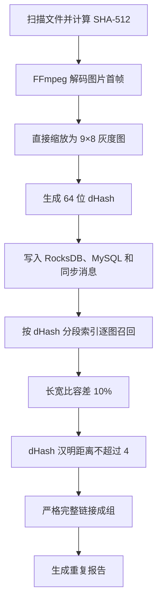
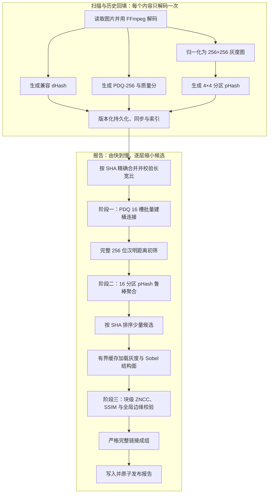

# 主内容相同图片三级筛选与性能优化修改方案

> 日期：2026-07-17  
> 状态：已按用户确认执行；核心实现、GUI、兼容迁移和 Release x64 自动测试已完成  
> 适用范围：图片资源；视频继续沿用现有六帧 dHash 流程  
> 目标平台：Windows x64，针对 x86-64/AMD64 CPU 做运行时优化  
> 取代文档：`2026-07-17-main-content-image-three-stage-hash-plan.md` 与 `2026-07-17-dhash-phash-x86-performance-optimization-plan.md` 中的图片修改内容

## 1. 方案结论

### 1.1 2026-07-17 实施结果

已完成以下落地内容：

1. 图片扫描改用版本化 `AnalyzeImagePerceptualFeaturesV1`，一次 FFmpeg 解码同时产出兼容 dHash、官方 PDQ 核心 Hash/质量分和 16 个分区 pHash。
2. 固定集成 Meta ThreatExchange PDQ C++ 参考实现，版本提交为 `4b98d786c3b9c40e62cc31fe20f7e6d9fe729757`，许可证和上游信息保存在 `third_party/pdq`。
3. 报告初筛按 16 个 16 位 PDQ 槽批量建 65,536 桶，只连接同桶和单比特邻桶；在写临时候选前立即复核 1% 长宽比和完整 PDQ 距离 `<=31`。
4. 二筛使用 4×4 分区 pHash，默认执行 12/16 通过、最多忽略 4 区、裁剪均值 `<=8`。
5. 三筛使用 256×256 灰度/Sobel 结构面、全局边缘 ZNCC、块级 ZNCC+SSIM 鲁棒裁剪；结构面按 SHA 使用有界 LRU 和共享 future 复用。
6. POPCNT 在运行时检测，不支持时使用 SWAR；配置可强制标量路径，报告元数据记录实际路径。没有引入 OpenCV，也没有全局启用 AVX2。
7. 配置、核心模型、同步消息、MySQL schema 和报告 codec 已升级并保留旧读路径；扫描完整性规则会自动把缺少新特征的历史图片重新排入现有媒体处理流程。
8. 新图片报告证据包含 PDQ、分区 pHash 和三项结构量化分；删除选择对新三级报告不再错误叠加旧 dHash 门槛。
9. GUI 已加入三级阈值、线程、缓存和强制标量配置，以及九阶段中文进度和结构证据展示。
10. Release x64 全解决方案构建通过；`DedupTests` 当前为 `42/42 passed`。

实施中的保守收敛：

- 低于 PDQ 质量阈值的图片会被明确计入无效图片并排除自动报告，不回退旧 dHash 放行；后续有真实低质量正样本集后再决定是否增加独立的更严格分支。
- 为保证每个图片内容都真正经过结构三筛，首版不压缩相同图片感知签名；视频仍压缩完全相同的六帧签名。热门图片签名的代表压缩可在加入“代表与每个成员均做结构直验”的等价性测试后再启用。
- AVX2 批处理内核未加入：当前 256 位距离使用 4 次 64 位 XOR+POPCNT，复杂 AVX2 查表路径尚无基准证明有足够收益。

图片去重主链调整为：

```text
精确 SHA-512 合并
  → PDQ-256 快速召回与初筛
  → 4×4 分区 pHash 二筛
  → 归一化结构直验三筛
  → 严格完整链接成组
```

性能优化与算法修改同时实施，核心结论如下：

1. 新图片只解码一次，同时生成 PDQ-256、质量分和 16 个分区 pHash；不为每种 Hash 重复读取文件。
2. PDQ 采用 16 个 16 位槽的多索引哈希思路，但报告阶段使用“按槽批量建桶并连接”，不对每张图片执行数百次 RocksDB 前缀查询。
3. 第二筛只比较定长数组，使用无分配的 64 位异或与 POPCNT；超过失败分区上限立即退出。
4. 第三筛只处理少量候选，按内容 SHA 复用 256×256 灰度、Sobel 梯度和统计量；使用有界 LRU 缓存与共享加载，避免同图重复解码。
5. 继续发布 x64。SSE2 为基础路径，POPCNT、AVX2 仅运行时分派；禁止整个解决方案全局启用 `/arch:AVX2`。
6. 标量与优化路径必须得到逐位一致的 Hash 和一致的阈值判定；优化没有达到可测收益时保留简单路径。
7. 历史图片必须完整回填 PDQ 与分区 pHash，不能用旧 dHash 决定是否回填，否则会永久漏掉被水印明显扰动的同底图。
8. 新流程精度优先：三筛不确定、特征缺失、版本不一致的图片对不自动成组，不回退到旧 dHash 放行。

## 2. 需求边界与执行口径

### 2.1 必须识别

- 同一张底图的不同分辨率；
- JPEG、PNG、WebP 等编码及压缩质量差异；
- 全局亮度、对比度、Gamma 和色调变化；
- 文字、图片、半透明、平铺等水印；
- 水印位置、文字、透明度不同；
- 水印影响面积原则上不超过归一化图像约 25%。

### 2.2 明确不处理

- 旋转、镜像；
- 裁剪、补画、扩图；
- 仅局部区域重复；
- 主体、场景或语义相似，但并非同一张底图；
- 使用 CLIP、DINOv2 等语义向量把“看起来相似”归为重复。

### 2.3 默认精度策略

- 自动归组以低误报为第一目标；
- 允许把边界样本标记为“不确定”，但不允许仅凭某一个低级 Hash 自动成组；
- 长宽比默认从现有 10% 收紧到 1%，因为本需求不支持裁剪和扩图；
- 严格完整链接继续保留：组内任意两张图片都必须存在已通过三筛的关系边；
- 阈值先作为起始值写入配置，最终值必须通过项目真实正负样本标定后冻结。

## 3. 修改前流程



当前流程的主要问题：

1. `9×8` dHash 对大面积或高对比水印过于敏感，作为第一道硬门槛会漏掉同底图。
2. 放宽 64 位 dHash 阈值会快速增加“相似但不同图”的候选，仍不能稳定解决水印问题。
3. 现有长宽比 10% 对“不处理裁剪、扩图”的边界过宽。
4. 当前没有可用于水印容错的局部一致性证据，也没有最终的同坐标结构直验。
5. 现有索引适合 64 位 dHash 的小半径查询，直接扩展到 PDQ-256 会产生过多随机前缀读取。

## 4. 修改后目标流程



## 5. 三级筛选算法

### 5.1 阶段一：PDQ-256 快速召回与初筛

目的：高召回地找出可能来自同一底图的对象，并快速排除绝大多数无关图片。

处理规则：

1. 使用固定版本的 PDQ-256 预处理、256 位 Hash 和质量分。
2. 先校验算法版本和长宽比；长宽比超过 1% 的对象不进入后续比较。
3. 默认候选距离为 `PDQ Hamming <= 31`。
4. 质量分 `<= 49` 的图片不静默删除，而是标记低质量；低质量对只有通过更严格的二筛、三筛才允许成组。
5. 先合并完全相同的 `(PDQ, 长宽比分级)` 签名，以代表项进入候选连接，防止热门 Hash 产生平方级重复比较；最终再展开到成员。
6. 旧图片 dHash 只保留兼容、诊断和视频用途，不作为新图片流程的必过门槛。

#### PDQ 候选索引

PDQ 拆为 16 个 16 位槽。在距离不超过 31 时，任意匹配对象必然至少有一个槽与查询槽的距离不超过 1，可用当前槽值及其 16 个单比特邻居召回。

但不采用“每张图片 × 16 槽 × 17 邻居”的 RocksDB 前缀查询。百万图片会形成约 2.72 亿次前缀探测，并产生大量随机 IO。

报告阶段改为批量桶连接：

1. 流式读取 PDQ Hash，为报告对象分配紧凑序号；
2. 一次只处理一个 16 位槽，将对象写入至多 65,536 个紧凑 postings 桶；
3. 每个已占用桶只与自身及值更大的单比特邻居连接一次，避免对称重复；
4. 候选生成后立即执行长宽比与完整 256 位汉明距离校验；
5. 通过的候选对以规范化 `(minId, maxId)` 写入报告临时 RocksDB 命名空间；
6. postings 使用扁平数组、分段外排或增量编码控制内存，不为每个成员创建独立 RocksDB 键；
7. 每个槽完成后释放工作集，取消、失败或报告发布后清理临时命名空间。

若未来要把 PDQ 阈值提高到 32 以上，必须先评估每槽半径 2 带来的 137 个邻居成本，不作为首版默认能力。

### 5.2 阶段二：4×4 分区 pHash 鲁棒二筛

目的：确认大多数空间区域仍来自同一底图，同时允许少量区域被水印覆盖。

生成规则：

1. 将原图统一为固定方向、固定灰度和 `256×256` 尺寸；
2. 均分为 `4×4` 共 16 个区域；
3. 每区缩放为 `32×32`，执行可分离二维 DCT，只计算需要的 `8×8` 低频区域；
4. 排除 DC 系数，以固定中位数、固定遍历顺序生成 64 位 pHash；
5. 16 个 pHash 固定存储为 128 字节，不使用可变长度容器。

起始判定规则：

- 单区汉明距离 `<= 10` 记为通过；
- 至少 12 个区域通过；
- 最多忽略 4 个受水印影响最大的区域；
- 取距离最小的 12 个区域，裁剪均值 `<= 8`；
- 低质量 PDQ 对可额外要求更低的分区距离，具体值由标定集决定。

这组阈值对应最多约 25% 区域被水印明显干扰。它不是“只看局部相同”：至少 75% 的固定坐标区域必须一致，而且候选还必须通过 PDQ 和第三筛。

### 5.3 阶段三：归一化结构直验

目的：排除色调相近、构图相近或低频 Hash 碰撞，但实际不是同一张底图的候选。

处理规则：

1. 使用固定 `256×256` 灰度图，不做旋转搜索、裁剪搜索、平移搜索或局部特征匹配；
2. 对灰度图计算 Sobel X/Y 梯度、梯度幅值及全局统计量；
3. 按固定网格计算块级 ZNCC 和结构相似度；
4. 对受水印影响最明显的最差 25% 块做有上限的鲁棒裁剪；
5. 同时要求全局边缘相关性、保留块比例和保留块聚合分达到阈值；不能仅因部分块相同而通过；
6. 最终分数按固定顺序计算并量化，避免浮点舍入使不同 CPU 在阈值边界产生不同结果；
7. 边界结果记为“不确定”，不自动成组。

第三筛初始标定范围建议为：

- 全局 Sobel/梯度 ZNCC：`0.90～0.96`；
- 保留块的裁剪均值：`0.92～0.97`；
- 块通过比例：至少 `75%`；
- SSIM 作为补充证据，不单独决定通过。

上述数值只是构建标定工具与配置界面的起始范围。正式默认值由真实水印正样本和难负样本的 ROC/PR 结果确定，不能直接凭经验冻结。

## 6. 计算性能优化

### 6.1 CPU 运行时分派

新增一次性 CPU 能力快照，按以下路径选择内核：

```text
Scalar/SSE2 基线
  → 支持 POPCNT：64/256 位汉明距离使用硬件 POPCNT
  → 支持 AVX2：仅调用单独编译的批处理或结构比较内核
```

约束：

- 不修改为 32 位 Win32 交付，继续使用现有 x64 依赖与产物；
- 不给整个解决方案设置 `/arch:AVX2`；
- AVX2 代码放在隔离的编译单元并由运行时分派调用；
- 256 位单对汉明距离优先使用 4 次 64 位 XOR + POPCNT；AVX2 本身没有通用的 256 位整数 popcount，只有批量基准明显获益时才保留查表向量路径；
- 不支持 POPCNT 时使用确定性的 SWAR 回退；
- 启动日志和报告元数据记录实际选择的 CPU 路径。

### 6.2 PDQ 与 pHash 内核

- 首先接入并冻结参考 PDQ 输出，建立上游黄金样本；优化实现必须与参考输出逐位相同；
- pHash DCT 使用预计算系数、可分离计算、固定中位数与稳定舍入；
- 为每个工作线程保留对齐 scratch buffer，禁止在候选循环中反复分配；
- 只计算 8×8 低频所需中间结果，不执行完整 DCT；
- 标量、SSE2、AVX2 不允许因 FMA 或求和次序产生不同 Hash；
- 分区比较使用定长数组，累计失败区超过 4 后立即拒绝；
- 对一个候选对的简单 64 位比较不强制向量化，以基准数据决定批处理路径。

### 6.3 第三筛结构计算

- 每个唯一内容 SHA 只生成一次归一化灰度面、Sobel 面和块统计量；
- 灰度使用 `uint8`，X/Y 梯度可使用 `int16`，点积与平方和使用足够宽的整数累加器；
- 均值、方差、点积预计算后复用，候选对比较不重复扫描不变统计量；
- 固定运算顺序并量化最终分数，使标量和 SIMD 在阈值边界得到同一判定；
- 第三筛候选按左侧 SHA 分组排序，提升同图复用和缓存局部性。

## 7. IO、线程池与缓存优化

### 7.1 扫描与历史回填

- 复用 `ScanCoordinator` 当前 `media-compute` 有界线程池、CPU 自适应门控和每磁盘读取门控；
- 新特征在同一次图片解码中计算，默认 `ffmpeg_threads_per_task = 1`；
- 不再创建 PDQ、pHash 各自的长期线程池；
- 写入仍采用有界队列和背压，取消后停止提交新任务并等待已运行任务收口；
- 复用 FFmpeg 中断回调，响应取消和超时。

### 7.2 报告阶段

- 阶段一和阶段二复用并泛化现有 `dhash-report` 报告验证池；
- 阶段三在一、二筛结束后顺序进入单独阶段，不与前两阶段同时占满 CPU 和磁盘；
- 第三筛工作线程数取以下最小值：配置值、当前 CPU 预算、全局读取预算、对应磁盘读取预算；
- 队列容量建议为工作线程数的 2～4 倍，并保持有界；
- 单报告只允许一个结构验证池，报告结束必须 join 并释放。

### 7.3 报告级结构缓存

新增按内容 SHA 键控的有界 LRU 缓存：

- 缓存内容：`256×256` 灰度、Sobel X/Y、块统计量；
- 同一 SHA 并发加载时使用共享 future/状态项，只允许一次真实解码；
- 缓存容量使用独立的 `structural_cache_mib`，不挤占 RocksDB block cache；
- 按灰度 64 KiB、两张 `int16` 梯度面约 256 KiB 估算，每图约 320 KiB；默认 256 MiB 可容纳约 800 个结构面；
- 淘汰只释放缓存引用，不影响正在比较的任务；
- 记录命中、未命中、等待共享加载、淘汰、真实解码次数。

## 8. DLL 接口与模块边界

### 8.1 ABI 兼容

当前 `VideoScMediaResult` 没有 `structSize`，不能直接在结构末尾追加新字段，否则旧调用方会发生 ABI 越界写入。

推荐新增版本化接口，而不是修改旧结构：

- 保留 `AnalyzeMediaFile`，继续支持旧 dHash/视频调用；
- 新增 `VideoScImageFeatureOptionsV1` 与 `VideoScImageFeatureResultV1`，两者都带 `structSize` 和算法版本；
- 新增 `AnalyzeImagePerceptualFeaturesV1`，一次返回 PDQ、质量分和 16 个 pHash；
- 第三筛使用独立的版本化结构面接口，并明确缓冲区所有权和释放函数；如果最终比较完全放入 DLL，则只返回固定大小的比较结果，优先减少跨 DLL 大缓冲区传递；
- 所有接口校验结构大小、版本和空指针，失败返回明确错误码与错误文本。

### 8.2 建议模块

以下拆分以职责边界为准，实施时可按现有项目命名收敛，避免为单函数创建过多文件：

- `VideoSc`：图片解码、PDQ、分区 pHash、结构面与 CPU 内核分派；
- `DedupCore/dedup`：三级阈值规则、PDQ 批量候选索引、候选去重、严格完整链接；
- `DedupCore/orchestration`：扫描和历史回填调度；
- `DedupCore/persistence`：版本化模型、RocksDB、MySQL、同步消息和报告临时空间；
- `VideoScGUI`：配置、迁移/回填状态、分阶段进度、诊断计数；
- `DedupTests`：黄金样本、属性测试、迁移、取消与性能基准。

建议新增或调整的主要文件：

- 修改 `VideoSc/VideoSc.h`、`VideoSc/dllmain.cpp`、`VideoSc/VideoSc.vcxproj`；
- 新增 `VideoSc/ImagePerceptualHash.*`、`VideoSc/ImageStructuralPlane.*`、`VideoSc/CpuFeatures.*`；
- 必要时隔离 `PerceptualKernelsScalar.*`、`PerceptualKernelsAvx2.*`；
- 修改 `DedupCore/dedup/DHashSimilarity.*`，把图片规则迁移到新的 `ImageSimilarityRules.*`，视频 dHash 规则保留；
- 修改 `DedupCore/dedup/DuplicateReportService.*`；
- 新增 `DedupCore/dedup/PdqCandidateIndex.*`、`StructuralVerificationCache.*`；
- 修改 `DedupCore/orchestration/ScanCoordinator.*`；
- 修改 `DedupCore/persistence/RocksStore.*`、`MySqlSchema.*`、`MySqlClient.*`、`MySqlReadRepository.*`、`SyncOperation.*`、`MySqlSyncService.*`；
- 修改 `DedupCore/config/AppConfig.*`；
- 修改相关报告编码、GUI 配置/进度页面和 `DedupTests`。

## 9. 数据模型、存储与版本迁移

### 9.1 新增持久字段

每个唯一图片内容至少新增：

| 字段 | 建议表示 | 用途 |
|---|---:|---|
| `image_pdq_hash` | 32 字节 | PDQ-256 |
| `image_pdq_quality` | 1 字节无符号 | 低质量分流 |
| `image_zoned_phashes` | 128 字节 | 16×64 位 pHash |
| `image_perceptual_algorithm_version` | 整数或固定标识 | 禁止跨版本误比较 |
| `image_structural_algorithm_version` | 整数或固定标识 | 第三筛与报告证据版本 |

原始签名约 161 字节/唯一图片，不含数据库键和索引开销：100 万张约 161 MB，1000 万张约 1.61 GB。PDQ 报告临时 postings 与候选空间必须单独纳入容量评估。

旧 `image_dhash` 保留，用于兼容旧报告、诊断和既有 UI；新图片自动成组不再依赖它。

### 9.2 版本调整

建议一次性完成以下显式升级：

| 对象 | 当前 | 目标 | 兼容策略 |
|---|---:|---:|---|
| 配置 schema | 3 | 4 | 缺失新字段填默认值并保存前展示 |
| `ShaFileData` codec | 1 | 2 | 可读 v1/v2，写 v2 |
| 同步消息 | 2 | 3 | 可读 v1/v2/v3，写 v3 |
| MySQL schema | 1 | 2 | 备份后显式迁移，不依赖 `CREATE TABLE IF NOT EXISTS` |
| 报告 schema | 2 | 3 | 旧报告只读并标记旧算法，建议重新生成 |
| 报告各 codec | 按当前版本 | 分别递增 | 保留旧读路径，禁止新旧证据混组 |

### 9.3 RocksDB 与临时数据

- 为 PDQ 主签名/特征增加版本化存储，不复用旧 dHash key 编码；
- 报告批量桶索引使用报告 ID 命名的临时空间；
- 临时候选键使用规范化有序 ID，确保多槽召回只保留一条；
- 报告成功时先完成数据与元数据写入，再原子切换发布标记；
- 启动时清理已确认无活动报告引用的过期临时空间；
- 取消和异常不得留下可见的半成品报告。

## 10. 历史图片回填

历史数据必须做全量、可恢复的特征回填：

1. 以唯一内容 SHA 为任务单位，优先选择当前可读取的一个本地路径；
2. 一次解码同时生成 PDQ、质量分和 16 个分区 pHash；
3. 使用现有磁盘读取门控和 CPU 自适应门控，不能抢占正常扫描的全部资源；
4. 按批次提交并保存 checkpoint，支持取消、崩溃后续跑和幂等重试；
5. 只有完整特征和算法版本都成功写入后才标记该 SHA 回填完成；
6. 找不到本地文件或解码失败时记录原因，新报告排除该对象，不使用 dHash 冒充新算法结果；
7. UI 展示总数、完成数、失败数、剩余数、当前吞吐和预计剩余时间；
8. 新报告只有在所选范围的回填完整度满足用户确认条件后才允许发布。

## 11. 配置与可观测性

新增 `ImageSimilarityConfig`，把图片规则从现有 `DHashSimilarityConfig` 分离；视频部分保留 dHash 配置。

建议配置项：

| 配置 | 起始值/范围 | 说明 |
|---|---:|---|
| `aspect_ratio_tolerance_percent` | 1 | 不支持裁剪/扩图 |
| `pdq_max_distance` | 31 | 阶段一召回与初筛 |
| `pdq_min_quality` | 50 | 低于此值进入更严格路径 |
| `zoned_phash_tile_max_distance` | 10 | 单区通过阈值 |
| `zoned_phash_min_passing_tiles` | 12 | 至少 75% 固定区域一致 |
| `zoned_phash_max_ignored_tiles` | 4 | 水印容错上限 |
| `zoned_phash_trimmed_mean_max` | 8 | 最优 12 区聚合阈值 |
| `structural_global_edge_min` | 待标定 | 全局结构底线 |
| `structural_block_score_min` | 待标定 | 保留块聚合阈值 |
| `structural_min_passing_percent` | 75 | 固定坐标块比例 |
| `report_validation_worker_threads` | 延用现值 4 | 阶段一/二上限 |
| `structural_worker_threads` | 初始 2 | 同时受 CPU/磁盘门控限制 |
| `structural_cache_mib` | 256 | 报告级结构缓存 |
| `force_scalar_kernels` | false | 仅测试/诊断使用 |

每次报告冻结完整配置与算法版本。运行日志、进度和报告元数据至少记录：

- CPU 特性及实际内核路径；
- 进入各阶段、被各阶段拒绝、进入不确定状态的数量；
- PDQ 桶数、postings 数、原始候选数、去重候选数、临时字节数；
- 分区 pHash 早退次数和通过数；
- 第三筛缓存命中/未命中、真实解码、共享等待、淘汰、失败数；
- 各阶段耗时、峰值内存、磁盘读取吞吐；
- 取消原因、失败路径和临时空间清理结果。

报告进度阶段调整为：

1. 加载并校验图片特征；
2. 合并完全相同的 PDQ 签名；
3. 按槽构建并连接 PDQ 桶；
4. 完整 PDQ 距离校验；
5. 分区 pHash 二筛；
6. 加载/缓存结构面；
7. 结构三筛；
8. 严格完整链接成组；
9. 写入并发布报告。

## 12. 测试、基准与验收

### 12.1 正确性测试

- PDQ 官方/冻结黄金样本与质量分一致；
- pHash 固定图像、位序、中位数、DCT 舍入黄金样本；
- 标量、POPCNT、AVX2 输出逐位一致；
- 随机生成汉明距离不超过 31 的 PDQ 对，验证 16 槽召回零漏失；
- 小数据集上批量桶连接结果与穷举比较完全一致；
- 16 区边界测试：11/12 个通过区、4/5 个异常区、均值阈值两侧；
- 第三筛在标量与 SIMD 下得到相同量化分数和最终判定；
- 严格完整链接不因传递相似把未直接通过的图片拉进组。

### 12.2 样本集

正样本必须覆盖：

- 多级缩放和不同编码质量；
- 亮度、对比度、Gamma、冷暖色调变化；
- 文字、Logo、半透明、平铺水印；
- 水印占比从小到约 25%，覆盖中央、边缘和多个区域；
- 上述变化的组合。

难负样本必须覆盖：

- 同主体不同拍摄帧；
- 同场景不同构图；
- 同模板不同文字或商品；
- 低纹理、纯色、渐变、截图类图片；
- PDQ 或 pHash 距离很近但底图不同的碰撞样本。

### 12.3 迁移与可靠性

- 配置 3→4、核心模型 1→2、同步 1/2→3 的读写兼容；
- MySQL 备份、1→2 迁移、失败回滚和重复执行；
- 旧报告只读标记与新报告重建；
- 历史回填取消、断点续跑、缺文件、解码失败与幂等；
- 报告在各阶段取消后线程收口、临时空间清理且不发布半成品；
- 同 SHA 并发结构加载只发生一次真实解码。

### 12.4 性能基准

Release x64 下分别测量：

- 单图 PDQ、16 区 pHash、结构面生成吞吐；
- 64 位与 256 位汉明距离在 100 万/1000 万次比较下的吞吐；
- 标量、POPCNT、AVX2 路径差异；
- 100 万/1000 万图片的 PDQ 分槽建桶、候选连接、临时空间和峰值内存；
- 第三筛 1 万/10 万候选对的无缓存、冷缓存、热缓存吞吐；
- HDD 与 SSD 下不同线程数、缓存容量的吞吐和读取放大；
- 新扫描相对现有 dHash 扫描的时间、CPU 和 IO 增量。

性能验收不预设脱离现场的绝对倍数，采用基线相对指标：

- 所有优化路径与标量路径结果完全一致；
- 内存、队列、临时空间均有明确上限；
- 候选索引不得出现按图片执行数百次随机 RocksDB 查询；
- 同一 SHA 在单报告第三筛中原则上只解码一次；
- 单项优化收益低于约 10%～15% 且明显增加复杂度时，不保留该优化；
- 在确认的正样本集上不得因性能优化降低召回；
- 在确认的难负样本验收集上，自动成组误报目标为 0；该指标仅代表验收集，不宣称对未知数据绝对零误报。

## 13. 分阶段实施顺序

### 阶段 0：样本、黄金结果与性能基线

- 固化正样本、难负样本和当前扫描/报告基线；
- 建立 PDQ、pHash、结构分数黄金结果；
- 先实现小规模穷举对照器，作为候选索引正确性基准。

### 阶段 1：版本化 DLL 接口与标量算法

- 新增不破坏旧 ABI 的图片特征接口；
- 接入参考 PDQ、标量分区 pHash 和标量结构面；
- 完成错误码、取消和黄金测试。

### 阶段 2：模型、配置与持久化迁移

- 完成配置、核心模型、同步消息、RocksDB、MySQL 和报告版本升级；
- 先备份、再迁移、再验证读写兼容；
- 此阶段仍不切换正式报告算法。

### 阶段 3：新扫描与历史回填

- 新图片在一次解码中生成全部持久特征；
- 实现可取消、可续跑、受磁盘/CPU 门控的全量历史回填；
- 达到回填完整度要求后才开放新报告。

### 阶段 4：PDQ 批量候选索引

- 实现签名压缩、逐槽 postings、规范化候选和临时空间；
- 与穷举结果逐对比对；
- 完成百万级容量和取消清理测试。

### 阶段 5：分区 pHash 二筛

- 接入 16 区判定、早退和统计；
- 用水印正样本标定 12/16、单区距离和裁剪均值。

### 阶段 6：结构三筛与缓存

- 接入结构面版本化接口、有界 LRU、共享加载和线程门控；
- 用难负样本标定全局边缘、块分数和不确定区间。

### 阶段 7：成组、报告与选择安全

- 新关系证据接入严格完整链接；
- 升级报告证据和算法元数据；
- 确保旧报告、选择状态和新报告之间不会串用不兼容证据。

### 阶段 8：GUI、进度与诊断

- 增加新配置、迁移/回填状态、九阶段报告进度和性能计数；
- 把低质量、特征缺失、不确定和失败对象明确展示，不静默丢弃。

### 阶段 9：CPU 优化

- 在标量正确性冻结后添加 POPCNT 与必要的 AVX2 隔离内核；
- 只有逐位一致并达到基准收益的优化才启用；
- 保留强制标量诊断开关用于回归比较。

### 阶段 10：完整验收

- 完成单元、集成、迁移、取消、真实数据和 Release x64 性能验收；
- 输出最终阈值、吞吐、峰值内存、临时空间和已知边界报告；
- 验收通过后再把新图片报告设为默认流程。

## 14. 风险与回退

| 风险 | 控制措施 | 回退方式 |
|---|---|---|
| 水印超过 25% 导致漏检 | 标记为需求外边界；通过样本标定观察 | 不自动成组，保留人工处理 |
| 放宽 PDQ 导致候选膨胀 | 默认距离 31；批量索引；限制临时空间 | 降低阈值并重建报告 |
| 第三筛重复解码拖慢 HDD | 按 SHA 排序、共享加载、有界缓存、磁盘门控 | 降低结构线程数或缓存容量 |
| SIMD 与标量边界不一致 | 黄金样本、固定舍入、量化分数 | 自动禁用优化路径并使用标量 |
| MySQL/同步版本不一致 | 备份、显式迁移、读旧写新、版本拒绝 | 恢复备份并继续旧流程 |
| 回填未完成产生漏组 | 发布前校验范围完整度 | 禁止新报告发布，不回退 dHash 放行 |
| 报告临时空间过大 | 逐槽处理、扁平 postings、容量指标与上限 | 取消报告并清理临时命名空间 |

旧 `AnalyzeMediaFile`、旧图片 dHash 字段和旧报告读路径在迁移期保留，因此出现问题时可以切回旧报告展示；但旧 dHash 结果不得与新三级关系边混合成组。

## 15. 已确认执行口径

本方案已经把此前推荐算法和性能优化合并为可实施顺序，默认采用：

- 图片 `PDQ-256 → 4×4 分区 pHash → 结构直验`；
- 水印影响面积上限约 25%；
- PDQ 初始距离 31、质量分界 50；
- 图片长宽比容差 1%；
- 结构缓存 256 MiB、结构线程初始 2；
- 历史图片全量回填；
- x64 交付与运行时 CPU 分派；
- 精度优先，不确定对象不自动成组。

用户已明确回复“执行”，上述口径已经进入代码。当前默认阈值仍属于首版工程起始值；对真实水印正样本和难负样本的阈值标定、百万级容量基准属于部署数据验收，不在本次无现场样本的自动测试中虚构结论。
