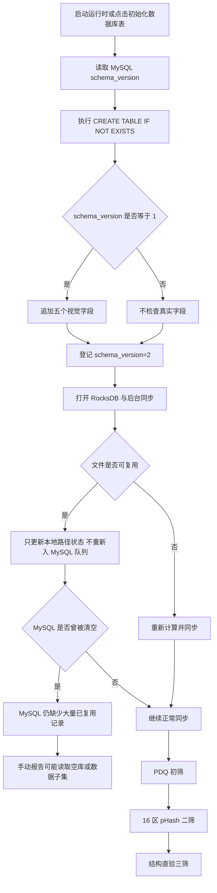
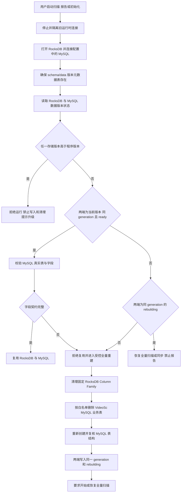
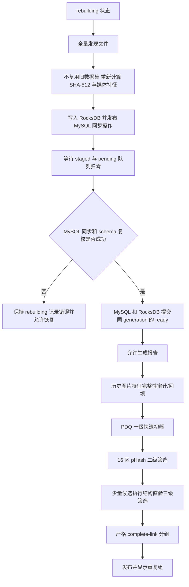

# 数据版本驱动的全量清理、MySQL 模式校验与视觉三级链路修复计划

> 日期：2026-07-18  
> 状态：已执行；代码与自动化验证完成，真实 MySQL 现场待用户验收  
> 关联根因文档：`docs/superpowers/plans/2026-07-18-visual-three-stage-mysql-schema-root-cause.md`  
> 当前现场错误：`Unknown column 'image_pdq_hash' in 'field list'`（MySQL 1054）

## 1. 已确认的设计决策

1. 使用一个递增的应用数据版本 `kCurrentDataVersion` 同时约束 RocksDB 和 MySQL 派生数据，本次首次引入时取值为 `1`。
2. MySQL 现有 `videosc_schema_version` 继续只表示表结构版本；新增 `videosc_data_version` 表表示共享业务数据能否复用，二者不得混用。
3. RocksDB 在 `Default` Column Family 使用固定键 `metadata/data_version` 保存与 MySQL 对应的数据版本记录。
4. 数据版本比较规则固定为：
   - 存储版本缺失或低于程序版本：全量清理 RocksDB 派生数据和 MySQL VideoSc 业务数据，然后进入全量重建状态；
   - 存储版本等于程序版本且两端均为 `ready`：直接复用；
   - 存储版本高于程序版本：拒绝运行，提示升级程序，不允许旧程序覆盖新数据；
   - 两端版本、状态或 generation 不一致：不得静默复用，按可恢复状态处理；无法证明一致时执行全量重建。
5. 全量清理不删除源媒体文件、配置文件和日志，不执行 `DROP DATABASE`，不清理数据库中的非 VideoSc 表。
6. 用户保留配置中的 MySQL 数据库；可以手动删除 VideoSc 业务表，再点击现有“初始化数据库表”。程序不新增“一键删除数据库”按钮。
7. 只有 RocksDB 与 MySQL 的数据版本均为 `ready`、generation 一致、同步队列为空时，才允许生成完整重复报告。

## 2. 当前实现与问题边界

### 2.1 当前已有能力

- `MySqlSchema` 已有 `videosc_schema_version`，当前表结构版本为 `2`。
- 当前干净建表 SQL 已包含以下视觉三级字段：
  - `image_pdq_hash BINARY(32) NULL`
  - `image_pdq_quality TINYINT UNSIGNED NULL`
  - `image_zoned_phashes BINARY(128) NULL`
  - `image_perceptual_algorithm_version INT UNSIGNED NOT NULL DEFAULT 0`
  - `image_structural_algorithm_version INT UNSIGNED NOT NULL DEFAULT 0`
- 图片扫描能够生成 PDQ、PDQ 质量、16 区 pHash 和结构直验所需算法版本。
- MySQL 同步事务失败后会回滚，失败操作保留在 RocksDB 队列并退避重试。
- 自动报告链路会等待当前扫描同步完成；视觉报告内部已按 PDQ 初筛、分区 pHash 二筛、结构直验三筛执行。

### 2.2 当前缺口

1. `videosc_schema_version` 只能说明代码登记过哪个 schema 版本，不能证明真实物理列完整。
2. RocksDB 没有整个派生数据集的统一版本，无法判断本地旧缓存是否可以复用。
3. MySQL 没有独立的数据集版本，删表重建后无法判断业务数据是空库、重建中还是完整可复用。
4. 普通重新扫描会复用 RocksDB 中未变化文件，不会把所有已成功同步过的旧记录再次写入空 MySQL；因此“删除 MySQL 表 + 初始化 + 普通重扫”不能保证恢复全量数据。
5. 现有 MySQL 初始化在登记版本后不核对 `information_schema`，可能把缺列的漂移表误报为初始化成功。
6. 手动生成报告没有统一检查全局同步队列、数据版本状态和最近同步错误，可能对 MySQL 子集发布报告。
7. MySQL 初始化与已启动的后台同步运行时可能使用不同配置快照，也可能在同一时间访问正在维护的表。

## 3. 修改前流程图



修改前的核心问题是：表结构版本、数据完整性和本地缓存可复用性没有形成同一份契约；“表存在”不等于“字段完整”，而“本地记录可复用”也不等于“MySQL 已有对应记录”。

## 4. 目标版本契约

### 4.1 版本记录模型

RocksDB 与 MySQL 保存同一组逻辑字段：

| 字段 | 类型 | 说明 |
|---|---|---|
| `data_version` | `uint32` | 应用派生数据契约版本，本次初始值为 `1` |
| `generation_id` | `uint64` | 一次全量重建的随机标识，用于发现两端来自不同批次 |
| `state` | 枚举 | `rebuilding` 或 `ready` |
| `updated_at_utc_ms` | `int64` | 状态更新时间，仅用于诊断和界面展示 |

MySQL 新表目标结构：

```sql
CREATE TABLE IF NOT EXISTS videosc_data_version (
    singleton_id TINYINT UNSIGNED NOT NULL PRIMARY KEY,
    data_version INT UNSIGNED NOT NULL,
    generation_id BIGINT UNSIGNED NOT NULL,
    data_state TINYINT UNSIGNED NOT NULL,
    updated_at_utc TIMESTAMP(3) NOT NULL DEFAULT CURRENT_TIMESTAMP(3)
        ON UPDATE CURRENT_TIMESTAMP(3)
) ENGINE=InnoDB DEFAULT CHARSET=utf8mb4 COLLATE=utf8mb4_0900_ai_ci;
```

约束：

- 只使用 `singleton_id=1` 一行；
- `data_state=1` 表示 `rebuilding`，`data_state=2` 表示 `ready`；
- 建表本身不自动写入 `ready`，避免把刚创建的空表误判为完整数据集；
- `videosc_schema_version` 升级为 `3`，仅代表程序已认识 `videosc_data_version` 表和当前字段契约。

### 4.2 比较决策表

| RocksDB | MySQL | 处理结果 |
|---|---|---|
| 两端版本等于当前、generation 相同、均为 `ready` | 完整一致 | 复用 |
| 任一端版本缺失或低于当前 | 无高版本端 | 全量清理两端并创建新的 `rebuilding` generation |
| 两端版本等于当前、generation 相同、均为 `rebuilding` | 有可恢复扫描 | 恢复扫描/同步，禁止报告 |
| 两端同版本但 generation 或状态冲突 | 无法证明完整 | 记录诊断后全量重建 |
| 任一端版本高于当前 | 任意 | 拒绝运行，禁止写入和清理 |
| MySQL 版本表刚被手动删除 | RocksDB 任意非高版本 | 视为 MySQL 版本缺失，触发全量重建 |

### 4.3 `rebuilding` 的必要性

不能在清理完成后立刻把版本写成 `ready`。全量扫描、媒体特征计算和 MySQL 同步可能耗时很长，也可能被取消或异常中断。只有满足以下全部条件后才能提交 `ready`：

1. 全量扫描已完成本地计算；
2. 当前扫描 staged 操作为零；
3. 当前扫描 pending 操作为零；
4. 全局 MySQL 同步队列为空；
5. MySQL 最近一次批次成功，且没有未恢复错误；
6. schema 物理字段复核通过；
7. RocksDB 与 MySQL 仍使用同一个 `generation_id`。

## 5. 修改后目标流程图

### 5.1 启动、版本比较与清理



### 5.2 全量重建与视觉三级报告



## 6. 详细修改方案

### 6.1 新增统一数据版本协调器

新增文件：

- `DedupCore/persistence/DataVersionCoordinator.h`
- `DedupCore/persistence/DataVersionCoordinator.cpp`
- 同步更新 `DedupCore/DedupCore.vcxproj` 与 `DedupCore/DedupCore.vcxproj.filters`

职责：

1. 定义 `kCurrentDataVersion=1`、`DataVersionState`、`DataVersionRecord` 和比较结果枚举。
2. 从 RocksDB `metadata/data_version` 读取/写入版本记录。
3. 从 MySQL `videosc_data_version` 读取/写入版本记录。
4. 使用纯函数比较两端版本、generation 和状态，输出：
   - `ReuseReady`
   - `ResumeRebuild`
   - `ResetRequired`
   - `RejectNewerData`
5. 统一执行全量重建准备和 `ready` 提交，避免版本判断散落在 GUI、扫描器和报告生成器。
6. 所有错误信息只包含存储类型、版本、状态和原生错误码，不输出密码或完整 SQL。

不把该逻辑放入 `MySqlSchema`：schema 负责“表结构是否可用”，数据版本协调器负责“两个数据集是否属于同一代且能否复用”，两者职责不同。

### 6.2 扩展 MySQL schema 与物理字段校验

修改文件：

- `DedupCore/persistence/MySqlSchema.h`
- `DedupCore/persistence/MySqlSchema.cpp`

修改内容：

1. 将 `kCurrentMySqlSchemaVersion` 从 `2` 升级为 `3`。
2. 在初始化语句中新增 `videosc_data_version`，但不自动登记 `ready`。
3. 保留 schema 1 到 2 的五个视觉字段迁移；schema 2 到 3 仅新增数据版本表。
4. 在登记 schema 3 前查询 `information_schema.tables`、`information_schema.columns` 和必要索引，核对当前程序 SQL 实际引用的表、列、类型、可空性和关键索引。
5. 至少显式校验本次故障相关的五个视觉字段；最终实现应覆盖以下表的全部程序引用列：
   - `sha512_file_data`
   - `file_path_sha512`
   - `duplicate_group`
   - `duplicate_group_member`
   - `videosc_schema_version`
   - `videosc_data_version`
6. 校验失败时返回具体表名和缺失/不兼容列，不再返回“版本正确，无需重建”。
7. 新增固定白名单的业务表重置函数，按外键依赖顺序处理：
   - `duplicate_group_member`
   - `duplicate_group`
   - `file_path_sha512`
   - `sha512_file_data`
   - `videosc_data_version`
8. 重置函数不得接受外部表名，不得拼接用户输入，不得执行 `DROP DATABASE`，并保留 `videosc_schema_version`。
9. MySQL DDL 无法跨语句事务回滚，因此每一步必须幂等；中途退出后再次运行能够继续删除并重新建表。

### 6.3 RocksDB 全量清理

修改文件：

- `DedupCore/persistence/RocksStore.h`
- `DedupCore/persistence/RocksStore.cpp`
- `DedupCore/persistence/DataVersionCoordinator.cpp`

清理范围固定为当前十个 Column Family：

1. `Default`
2. `ScanTasks`
3. `FilePaths`
4. `ShaFileData`
5. `SyncQueue`
6. `ExactIndex`
7. `ImageDhashIndex`
8. `VideoDhashIndex`
9. `Checkpoints`
10. `Tombstones`

实现要求：

1. 仅在扫描、报告、选择、删除和 MySQL 同步均停止后执行。
2. 为 `RocksStore` 增加职责明确的全 Column Family 清理接口，内部使用固定枚举，不接受路径或 Column Family 名称字符串。
3. 首选已有 RocksDB C API 的批量/范围删除能力；若范围边界不能覆盖任意二进制键，则回退到现有 `DeletePrefix(..., "", batch_size, true)`，可靠性优先于罕见升级操作的极限速度。
4. 清理完成后写入新的 `generation_id + rebuilding` 记录并同步 WAL。
5. 不递归删除 RocksDB 配置目录，不使用通用文件系统删除命令，避免错误配置路径造成越界删除。
6. 不删除源媒体、`config.json`、执行日志和应用错误日志。

### 6.4 运行时前置检查与数据库维护隔离

修改文件：

- `VideoScGUI/VideoScApp.h`
- `VideoScGUI/VideoScApp.cpp`

修改内容：

1. `EnsureRuntime()` 在启动 `MySqlSyncService` 前完成：
   - MySQL 连接；
   - schema 元数据表初始化；
   - RocksDB/MySQL 数据版本比较；
   - 必要的全量清理或高版本拒绝；
   - MySQL 物理字段复核。
2. 只有前置检查成功后才启动后台同步，避免先进入 1054 退避循环再发现 schema 不兼容。
3. 点击“初始化数据库表”前，如果存在空闲运行时，先停止同步并关闭旧 MySQL 连接；初始化完成后标记运行时配置失效，下次操作按页面当前配置重建运行时。
4. 初始化按钮继续只做幂等建表、已知迁移和物理字段校验，不执行数据清理；数据清理由数据版本策略在运行时前置检查中触发。
5. GUI 保存并显示当前数据兼容状态：
   - 程序数据版本；
   - RocksDB 数据版本/状态；
   - MySQL 数据版本/状态；
   - generation 是否一致；
   - 当前是否要求全量扫描。
6. 低版本清理完成后显示明确提示：“旧派生数据已清理，当前 generation 正在重建；完成全量扫描和 MySQL 同步前不能生成报告。”
7. 高版本拒绝时显示两端实际版本和当前程序版本，不提供“继续使用”或“强制降级”按钮。

### 6.5 全量扫描完成后提交 `ready`

修改文件：

- `DedupCore/orchestration/ScanCoordinator.cpp`
- `DedupCore/orchestration/ScanCoordinator.h`
- `VideoScGUI/VideoScApp.cpp`
- 必要时扩展 `DedupCore/persistence/MySqlSyncService.*` 的只读快照

修改内容：

1. 启动于 `rebuilding` generation 的扫描必须被标记为全量重建扫描，不能走旧数据集复用分支。
2. 扫描中断时保持 `rebuilding`，保留现有扫描检查点和持久化同步队列，允许按当前恢复机制继续。
3. 当前扫描完成、历史 staged 操作已发布、全局队列为空且同步无错误后，再提交 `ready`。
4. `ready` 提交顺序和恢复规则：
   - 先把 MySQL 当前 generation 标记为 `ready`；
   - 再把 RocksDB 同 generation 标记为 `ready`；
   - 如果在两次写入之间退出，下次启动只有在 generation 相同、队列为空、扫描检查点已同步完成、MySQL 为 `ready` 时，才允许把 RocksDB 补记为 `ready`；否则维持 `rebuilding` 或重新全量重建。
5. `ready` 提交失败不得影响已同步业务数据，但必须保持报告禁用并记录可重试错误。

### 6.6 报告生成统一门控

修改文件：

- `VideoScGUI/VideoScApp.h`
- `VideoScGUI/VideoScApp.cpp`

在 `StartReportGeneration()` 启动后台线程前统一检查：

1. RocksDB 与 MySQL 数据版本均为当前版本；
2. 两端 generation 相同且均为 `ready`；
3. 当前没有扫描或清理任务；
4. staged 操作数量为零；
5. pending 操作数量为零；
6. 全局同步批次为空；
7. MySQL 已连接且最近错误为空；
8. schema 物理字段校验通过。

任一条件不满足时不生成 SHA-512 或视觉报告，并显示可执行的下一步，例如“恢复全量扫描”“等待 MySQL 重试”或“初始化数据库表”。自动报告与手动报告调用同一套门控，避免两条入口行为不一致。

### 6.7 视觉三级算法链路保持不变

以下算法行为不在本次修改中调整：

1. 一级：PDQ-256 初筛，按普通/低质量图片规则和配置阈值筛选；必要时保留 dHash 兼容回退。
2. 二级：16 区 pHash 逐区门限筛选，快速剔除水印、色调或分辨率变化下仍不满足主内容一致性的候选。
3. 三级：只对少量候选重新解码并执行结构直验，不考虑旋转、裁剪、局部重复。
4. 最终：严格 complete-link 分组，确保同一主组内任意两张图片都满足已验证相似条件。

本次只修复这条链路的 schema、数据完整性和运行前门控，不改变阈值、分组语义或 UI 对相似关系的解释。

### 6.8 日志与诊断

修改文件：

- `DedupCore/logging/ExecutionLogger.*`（仅在现有结构无法表达时扩展）
- `VideoScGUI/VideoScApp.cpp`

新增或统一以下阶段事件：

- `data_version_check`
- `data_reset_started`
- `rocksdb_reset`
- `mysql_business_reset`
- `schema_contract_validation`
- `data_rebuild_started`
- `data_rebuild_ready`
- `data_version_rejected`

日志需包含程序版本、两端存储版本、状态、generation 和失败阶段；不得记录密码、证书内容或完整 SQL。

## 7. 性能与可靠性方案

1. 不新增图片相似库；当前 PDQ、分区 pHash、结构直验和 RocksDB 已覆盖目标，版本治理不需要引入额外第三方依赖。
2. 数据版本比较只读取 RocksDB 一个固定键和 MySQL 一行，开销为常数级。
3. `ready` 状态下不扫描全表、不遍历 RocksDB，正常启动只增加一次 schema 契约查询和两个版本点查。
4. 低版本全量清理是低频升级操作，使用 RocksDB 原生批量能力和固定 MySQL DDL，不逐文件访问源介质。
5. 全量重建沿用现有磁盘调度、媒体工作线程和 MySQL 批量同步，不新增第二套扫描器。
6. 只有 `rebuilding` 才禁止报告；同版本 `ready` 路径继续复用已有 SHA-512、媒体特征、索引和报告缓存。
7. generation + 状态机用于替代跨 RocksDB/MySQL 分布式事务：任意一步中断后宁可保持不可报告，也不把半完成数据当成完整结果。

## 8. 自动化测试计划

修改文件：

- `DedupTests/main.cpp`
- 必要时新增 `DedupTests` 测试辅助文件并更新工程文件

### 8.1 纯策略测试

1. 两端缺失版本返回 `ResetRequired`。
2. 任一端低版本返回 `ResetRequired`。
3. 两端当前版本、同 generation、均为 `ready` 返回 `ReuseReady`。
4. 两端当前版本、同 generation、均为 `rebuilding` 返回 `ResumeRebuild`。
5. generation 不一致返回 `ResetRequired`。
6. 状态不一致且不满足安全收尾条件时返回 `ResetRequired` 或保持 `rebuilding`。
7. 任一端高版本返回 `RejectNewerData`，且不得产生清理 SQL 或 RocksDB 写入。

### 8.2 RocksDB 测试

1. 在十个 Column Family 写入测试数据后执行重置，确认所有旧键消失。
2. 重置完成后只保留新的 `metadata/data_version`，状态为 `rebuilding`。
3. 中途失败不会写入 `ready`。
4. 清理逻辑不访问测试目录外文件。
5. `rebuilding` 检查点可恢复，完成后能够提交 `ready`。

### 8.3 MySQL schema 静态测试

1. 初始化 SQL 包含 `videosc_data_version` 和五个视觉字段。
2. 当前 schema 版本为 `3`。
3. 重置语句只包含固定 VideoSc 业务表，不含 `DROP DATABASE`、用户输入或非白名单表。
4. 建表不自动写入 `ready`。
5. schema 契约列清单覆盖所有同步 UPSERT 和报告 SELECT 引用字段。

### 8.4 可选真实 MySQL 集成测试

使用独立测试数据库和环境变量显式启用，不连接生产库：

1. 空数据库初始化后从 `information_schema` 核对全部字段。
2. 执行包含 `image_pdq_hash`、PDQ 质量和分区 pHash 的 UPSERT，再通过读取仓储回读。
3. 删除 `image_pdq_hash` 后确认 schema 校验明确失败，不得误报成功。
4. 低数据版本触发业务表重建，schema 版本表保留。
5. 高数据版本拒绝且业务表数据不变。

### 8.5 构建与现有回归

1. Debug x64 构建通过。
2. Release x64 构建通过。
3. Debug/Release 的 `DedupTests` 全部通过；当前基线为 `46/46`，新增测试后以新的总数为准，不继续把 `46` 当固定目标。
4. 不修改视觉阈值与分组规则，严格 dHash、跨组关系、虚拟化浏览和删除安全测试继续通过。

## 9. 手工验收步骤

1. 保留 MySQL 数据库，手动删除全部 VideoSc 表，点击“初始化数据库表”。
2. 确认以下查询返回五行：

```sql
SELECT COLUMN_NAME
FROM information_schema.COLUMNS
WHERE TABLE_SCHEMA = DATABASE()
  AND TABLE_NAME = 'sha512_file_data'
  AND COLUMN_NAME IN (
      'image_pdq_hash',
      'image_pdq_quality',
      'image_zoned_phashes',
      'image_perceptual_algorithm_version',
      'image_structural_algorithm_version'
  );
```

3. 确认 `videosc_schema_version` 当前版本为 `3`，`videosc_data_version` 已建表但没有被空库初始化误写成 `ready`。
4. 启动扫描：程序发现 MySQL 数据版本缺失，清理旧 RocksDB 派生数据并创建新的 `rebuilding` generation。
5. 确认扫描执行全量 SHA-512 与媒体特征计算，而不是把全部文件记为“未变化”后跳过同步。
6. 等待 staged、pending 和全局队列归零；确认两端版本记录变为同 generation 的 `ready`。
7. 生成视觉报告，确认依次出现历史特征审计、PDQ、分区 pHash、结构直验和严格分组阶段。
8. 重启程序再次扫描相同文件，确认同版本 `ready` 数据被复用，不触发全量清理。
9. 在测试环境把任一端数据版本改低，确认两端都进入全量重建。
10. 在测试环境把任一端数据版本改高，确认程序只读拒绝，不删除、不覆盖任何数据。
11. 在 MySQL 同步队列未清空时手动生成报告，确认按钮被门控并显示等待同步提示。

## 10. 风险与控制

| 风险 | 控制措施 |
|---|---|
| 误删非 VideoSc 数据 | MySQL 只使用编译期固定表白名单；不接受用户表名；不执行 `DROP DATABASE` |
| 错误 RocksDB 路径导致文件越界删除 | 不递归删除目录，只通过已打开的固定 Column Family API 清理键 |
| 清理中断形成半结构 | DDL 幂等、固定顺序；下次启动根据缺失/冲突版本重新进入重建 |
| 扫描未完成却写成可复用 | 使用 `rebuilding/ready` 状态；队列与 schema 未验证前禁止提交 `ready` |
| 两端 ready 属于不同批次 | 比较 `generation_id`，不只比较整数版本 |
| 旧程序覆盖新版本数据 | 任一端高于程序版本立即拒绝，禁止写入和清理 |
| 手动报告读取 MySQL 子集 | 自动/手动报告共用版本、队列、连接和 schema 门控 |
| 版本检查拖慢正常启动 | RocksDB 单键 + MySQL 单行读取；物理 schema 查询只读 `information_schema` |

## 11. 预计修改文件

新增：

- `DedupCore/persistence/DataVersionCoordinator.h`
- `DedupCore/persistence/DataVersionCoordinator.cpp`

修改：

- `DedupCore/persistence/MySqlSchema.h`
- `DedupCore/persistence/MySqlSchema.cpp`
- `DedupCore/persistence/RocksStore.h`
- `DedupCore/persistence/RocksStore.cpp`
- `DedupCore/orchestration/ScanCoordinator.h`
- `DedupCore/orchestration/ScanCoordinator.cpp`
- `DedupCore/persistence/MySqlSyncService.h`（仅在现有快照不足时）
- `DedupCore/persistence/MySqlSyncService.cpp`（仅在现有快照不足时）
- `DedupCore/DedupCore.vcxproj`
- `DedupCore/DedupCore.vcxproj.filters`
- `VideoScGUI/VideoScApp.h`
- `VideoScGUI/VideoScApp.cpp`
- `DedupTests/main.cpp`
- `docs/实现状态与验收说明.md`
- `docs/superpowers/plans/2026-07-18-visual-three-stage-mysql-schema-root-cause.md`

如实现时发现无需修改 `MySqlSyncService` 即可使用现有 `MySqlSyncSnapshot` 完成门控，则不修改该模块，保持最小改动。

## 12. 执行顺序

1. 建立数据版本模型、纯比较策略与单元测试。
2. 扩展 MySQL schema 3、数据版本表、白名单重置与物理字段校验。
3. 实现 RocksDB 固定 Column Family 全量清理和测试。
4. 把版本前置检查接入 `EnsureRuntime()`，隔离数据库初始化与后台同步。
5. 把 `rebuilding` 接入全量扫描、恢复和同步完成收尾。
6. 统一自动/手动报告生成门控。
7. 补充 GUI 状态、中文错误提示和执行日志。
8. 完成 Debug/Release 构建、全部 `DedupTests` 和可用的真实 MySQL 集成验收。
9. 回填根因文档、实现状态文档和本计划的实际执行结果。

## 13. 本轮边界

- 已按用户确认执行 C++、工程文件、GUI、测试与文档修改。
- 新增 `DataVersionCoordinator`，实现数据版本策略、固定白名单 MySQL 业务表重置、十个 RocksDB Column Family 清理和双端 `ready` 提交。
- `EnsureRuntime()` 已接入同步启动前的只读高版本拒绝、低/缺失/不一致版本重建、schema 物理契约校验和运行时隔离。
- 报告入口已统一检查双端当前版本、同 generation `ready`、连接、同步错误、staged/pending/全局队列和 schema。
- 设置页已显示程序版本、两端版本/状态、generation 一致性和当前兼容状态。
- 实现过程中无需修改 `ScanCoordinator`：全量重置会清空其全部复用数据与检查点；现有扫描/断点机制负责重建，GUI 在检查点收尾前提交 `ready`。
- 为继承运行时前置检查已经建立的 MySQL 连接，仅小幅修改 `MySqlSyncService.cpp` 的初始连接快照；未修改其公共接口。
- Debug/Release x64 构建成功，Debug/Release `DedupTests` 均为 `48/48`。
- 未连接或修改用户真实 MySQL，也未清理用户真实 RocksDB；真实环境手工验收仍按第 9 节执行。
- Release 构建存在非阻断环境告警：当前命令环境找不到 `pwsh.exe`，并行增量链接报告 PDB 类型记录告警；最终产物生成且 Release 测试全部通过。
