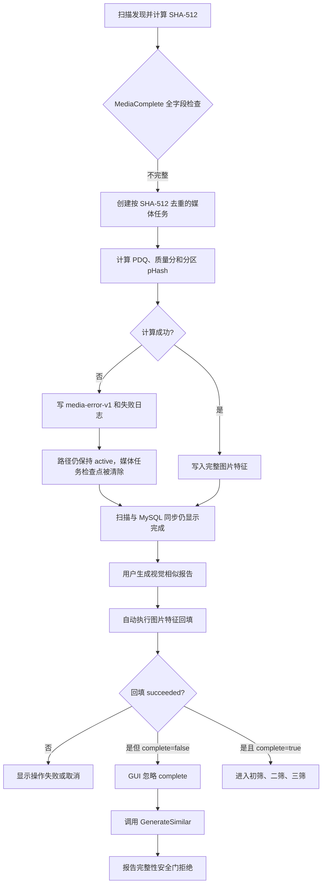
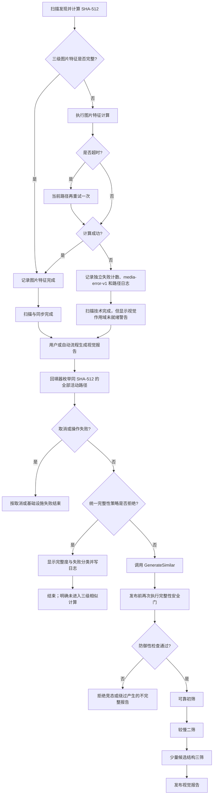

# 视觉报告图片特征完整性安全门修复计划

> 日期：2026-07-18  
> 状态：已执行完成；Debug/Release x64 已构建，两套 `DedupTests` 均为 `49/49 passed`。  
> 根因依据：`docs/superpowers/plans/2026-07-18-image-feature-completeness-gate-root-cause.md`

## 1. 修改目标

1. 图片特征回填执行结束但仍存在未解决图片时，在报告编排层立即停止，不再进入视觉三级相似计算。
2. 向用户显示完整数、总数、未解决数，以及“无可读路径 / 超时 / 解码或特征生成失败”分类。
3. 保留报告生成器内部完整性安全门，继续作为防止竞态和未来调用方绕过预检的第二道防线。
4. 保留 `require_complete_features` 与 `allow_partial_reports` 的现有配置语义；仅当用户显式允许部分报告时，未完整作用域才可继续。
5. 让长错误信息自动换行，并将同样的详细原因写入现有执行失败日志。
6. 扫描阶段把图片特征失败从通用 `failed_files` 中独立计数，扫描完成时明确提示“扫描已完成，但视觉报告尚未就绪”。
7. 对扫描阶段的图片特征超时执行一次有限重试；永久解码失败不做无意义重复计算。
8. 保持当前 `MediaComplete()` 的全字段判定，确保已有 SHA-512 只要缺少任一三级特征就会重新进入媒体任务，而不是被静默漏算。
9. 正常成功路径不增加额外图片解码、候选比较或数据库全表扫描，避免影响正常报告性能。

## 2. 非目标与硬边界

- 不修改 PDQ、分区 pHash、结构三筛算法及其阈值。
- 不修改图片三级相似分组规则和报告格式版本。
- 不修改 MySQL 表结构、数据库版本号或 RocksDB 数据版本号。
- 不自动删除、停用或跳过解析失败的活动文件。
- 不默认开启部分报告，不把安全门改成警告后放行。
- 不把源文件解码失败误报为程序基础设施失败。
- 不把“媒体特征失败”改成整轮扫描失败；哈希、路径和其他有效内容仍可完成同步，但必须明确区分“扫描技术完成”和“视觉报告作用域完整”。
- 不在扫描协调器中复制报告回填器的全活动路径枚举逻辑；同 SHA-512 多路径回退继续由 `ImageFeatureBackfillCoordinator` 统一负责。

## 3. 修改前流程框图



当前问题有两段契约不一致：扫描允许图片特征失败后以活动内容完成同步，却没有单独提示视觉作用域未就绪；报告编排又把 `succeeded=true, complete=false` 当成可以继续生成。失败分类只存在于扫描日志、回填进度和检查点，没有进入最终结果与用户消息。

## 4. 修改后目标流程框图



## 5. 结果状态契约

修改后明确区分“操作成功”和“业务作用域完整”：

| `cancelled` | `succeeded` | `complete` | 配置允许部分报告 | 行为 |
|---:|---:|---:|---:|---|
| `true` | 任意 | 任意 | 任意 | 取消结束，不发布半成品。 |
| `false` | `false` | 任意 | 任意 | 基础设施、MySQL、RocksDB 或检查点失败，显示原始错误。 |
| `false` | `true` | `false` | `false` | 回填流程已跑完但数据仍不完整；显示分类并停止，不进入三级计算。 |
| `false` | `true` | `false` | `true` | 按用户显式配置进入部分报告流程，报告元数据继续标记部分作用域。 |
| `false` | `true` | `true` | 任意 | 正常进入视觉三级相似计算。 |

`succeeded` 不再被解释为“可以直接生成报告”；调用方必须同时应用完整性策略。

扫描阶段的完成语义同步明确：

| 扫描状态 | 图片特征失败数 | 含义 | UI 行为 |
|---|---:|---|---|
| `CompletedLocal/CompletedSynchronized` | `0` | 扫描技术完成，且本轮没有图片特征失败。 | 正常完成提示。 |
| `CompletedLocal/CompletedSynchronized` | `>0` | 路径、哈希和同步已完成，但存在不能用于完整视觉报告的活动图片。 | 黄色警告，显示失败数并指向日志；不得表述为视觉报告已就绪。 |
| `Failed` | 任意 | 扫描基础设施、存储或不可恢复状态失败。 | 保持现有红色失败提示。 |

## 6. 计划修改内容

### 6.1 扫描计算失败契约与有限重试

修改：

- `DedupCore/orchestration/ProgressSnapshot.h`
- `DedupCore/persistence/ScanCheckpointStore.h`
- `DedupCore/persistence/ScanCheckpointStore.cpp`
- `DedupCore/orchestration/ScanCoordinator.cpp`
- `VideoScGUI/VideoScApp.cpp`

计划：

1. 保留 `MediaComplete()` 当前六项图片完整性检查；缺少 PDQ、质量分、分区 pHash、感知版本、结构版本或媒体算法版本时必须创建媒体任务。
2. 在 `ProgressSnapshot` 和扫描检查点中增加图片特征失败内容数，避免继续与哈希失败、视频特征失败共用一个不可解释的 `failed_files`。
3. 扫描检查点 JSON 使用向后兼容可选字段读取；旧检查点缺少新字段时按 `0` 处理，不提升数据库数据版本，也不使旧断点损坏。
4. `ProcessMediaTask` 对 `VIDEOSC_ERR_MEDIA_TIMEOUT` 最多额外重试一次：
   - 取消后不重试；
   - 解码失败、无解码器、打开失败、内存不足等确定性错误不重复；
   - 每次最终失败仍只按一个唯一 SHA-512 计入失败内容数。
5. 最终失败继续写 `media-error-v1` 和 `image_perceptual_features` 路径日志，不自动停用或删除活动路径。
6. 扫描完成时如果图片特征失败数大于零，GUI 显示黄色完成警告，说明报告前会自动执行全活动路径回填，并给出日志定位关键字。
7. 同 SHA-512 的全部活动路径重试继续由 `ImageFeatureBackfillCoordinator` 在 MySQL 同步后执行；扫描协调器不复制这套查询和备用路径顺序逻辑。

### 6.2 集中完整性拒绝策略

修改：

- `DedupCore/dedup/DuplicateReportService.h`
- `DedupCore/dedup/DuplicateReportService.cpp`

计划：

1. 从 `GenerateSimilar` 当前内联条件中提取一个无副作用的完整性策略函数。
2. 输入为 `ImageFeatureCompletenessSnapshot` 与 `ImageSimilarityConfig`，输出当前作用域是否必须拒绝。
3. 报告生成器与 GUI 报告编排共同调用同一函数，避免两处条件随版本演进发生偏差。
4. 原报告安全门继续保留，错误消息继续包含 `complete/total`，但改为更准确的描述，不再提示“先运行回填”。

策略保持当前规则：

```text
require_complete_features
AND incomplete_images > 0
AND NOT allow_partial_reports
```

### 6.3 回填最终结果携带结构化统计

修改：

- `DedupCore/orchestration/ImageFeatureBackfillCoordinator.h`
- `DedupCore/orchestration/ImageFeatureBackfillCoordinator.cpp`

计划：

1. 在 `ImageFeatureBackfillResult` 中增加最终进度/统计快照，复用现有 `ImageFeatureBackfillProgress` 字段定义，不重复创建一组计数器。
2. 正常完成、仍有未解决图片、取消和中途持久化失败等返回路径，都尽量保存当时的统计快照。
3. 初始即全部完整时，填入 `total_images`、`initially_complete_images`、`completed_images`，确保结果契约一致。
4. 保持现有失败分类：
   - `no_readable_path_images`；
   - `timeout_images`；
   - `decode_failed_images`。
5. 不增加 MySQL 查询或二次图片分析；最终统计直接来自本次已有的进度对象和回填后的完整性重统计。

### 6.4 GUI 在回填后执行正确分支

修改：

- `VideoScGUI/VideoScApp.cpp`

计划：

1. 保留现有 `!backfilled.succeeded` 与取消处理。
2. 回填操作成功后，先调用集中后的完整性策略函数。
3. 策略拒绝时：
   - 不调用 `DuplicateReportGenerator::GenerateSimilar`；
   - 构造失败的 `DuplicateReportResult`；
   - 设置未解决图片计数；
   - 生成中文可操作提示；
   - 明确标注“未进入视觉三级相似计算”。
4. 策略允许时才调用 `GenerateSimilar`，包括全部完整和用户显式允许部分报告两种情况。
5. 不删除生成器内的安全门，避免回填结束到读取报告作用域之间的数据变化导致错误发布。

目标错误文本格式：

```text
图片三级特征回填未完成：完整 X/Y，未解决 Z；
无可读路径 A，超时 B，解码或特征生成失败 C。
请检查执行失败日志中的 image_perceptual_features 记录并修复源文件后重试；本次未进入视觉三级相似计算。
```

如果 `Z` 与本轮三类失败总数不相等，额外提示可能存在并发数据变化或回填前已存在的异常状态，不能用分类总数伪装成完整解释。

### 6.5 显示回填实时分类和可换行错误

修改：

- `VideoScGUI/VideoScApp.h`
- `VideoScGUI/VideoScApp.cpp`

计划：

1. 在报告 UI 状态中保存最新 `ImageFeatureBackfillProgress`，继续受 `m_reportResultMutex` 保护。
2. 启动新报告时清零旧回填统计，避免上一次失败数残留。
3. `backfilling_image_features` 阶段额外显示：
   - 初始完整数量；
   - 本轮成功修复数量；
   - 失败数量；
   - 无可读路径、超时、解码失败分类。
4. 最终 `m_reportMessage` 改用可换行渲染，避免长错误在桌面窗口中被水平裁掉。
5. 现有成功、取消、精确报告及三级相似进度布局不改变。

### 6.6 复用现有执行日志

修改：

- `VideoScGUI/VideoScApp.cpp`

计划：

1. 复用现有 `duplicate_report/generation/generate` 失败日志写入路径，不新增日志文件和数据库表。
2. 将结构化计数写入 `detail`，使界面提示和 `execution-failures.log` 可以互相对应。
3. 用户定位具体源文件时，继续使用扫描阶段已有的：
   - `任务=scan`；
   - `操作=image_perceptual_features`；
   - 路径、状态码、系统错误和 DLL 错误文本。

## 7. 测试计划

修改：

- `DedupTests/main.cpp`

### 7.1 完整性策略单元测试

覆盖以下矩阵：

1. 全部完整，默认配置：允许生成；
2. 存在不完整图片，默认配置：拒绝生成；
3. 存在不完整图片，`allow_partial_reports=true`：允许生成；
4. 存在不完整图片，`require_complete_features=false`：允许生成；
5. 总数为零：允许生成，不产生除零或错误拒绝。

### 7.2 回填结果统计测试

在现有图片特征回填检查点测试附近补充纯状态断言，验证：

1. 最终结果可以携带三类失败计数；
2. `completed_images + failed_images` 不超过总数；
3. 初始完整数与本轮完成数的含义不会混淆；
4. `succeeded=true, complete=false` 会被完整性策略拒绝，而不是进入报告生成。

不为此引入真实 MySQL 依赖；策略和状态契约使用确定性单元测试覆盖，真实数据库行为由现有只读查询和现场验收验证。

### 7.3 扫描失败与有限重试测试

补充确定性测试，验证：

1. 已有内容缺少任一图片三级字段时，`MediaComplete()` 判定为不完整并创建媒体任务；
2. 图片特征首次超时、第二次成功时只记录成功，不增加最终失败计数；
3. 连续两次超时后停止重试，只增加一次图片特征失败内容数；
4. 解码失败不重复调用相同输入；
5. 取消状态不重试；
6. 图片特征失败不会被误计为哈希失败或扫描基础设施失败；
7. 新扫描检查点字段能够往返保存，旧 JSON 缺少字段时兼容为零；
8. 扫描完成但存在图片特征失败时，`ProgressSnapshot` 仍保留失败计数且状态可以完成同步；黄色报告未就绪文案由场景验收确认。

若当前 `ProcessMediaTask` 难以注入确定性分析结果，则只抽取最小的“是否重试”纯策略函数，不为测试创建新的媒体分析框架或多层接口。

### 7.4 构建与回归

1. 静态检查所有新增字段的初始化、复制和线程保护。
2. 构建 `Debug|x64` 全解决方案。
3. 运行 Debug `DedupTests.exe`，要求全部通过。
4. 构建 `Release|x64` 全解决方案。
5. 运行 Release `DedupTests.exe`，要求全部通过。
6. 不把历史测试总数写死为验收条件，以执行时实际登记的测试数量为准。

## 8. 现场验收场景

### 场景 A：所有活动图片特征完整

- 自动回填快速完成；
- 正常进入可靠初筛、二筛和三筛；
- 视觉报告成功发布；
- 下游完整性安全门通过。

### 场景 B：存在不可解码或不可读图片，默认配置

- 扫描完成区域显示图片特征失败数量和黄色报告未就绪警告；
- 回填尝试所有活动备用路径；
- 未解决后立即停止；
- 界面显示 `X/Y` 和三类失败计数；
- 错误文本可完整换行显示；
- 执行失败日志包含同样计数；
- 报告进度不出现初筛、二筛、三筛阶段；
- 不发布部分报告。

### 场景 C：用户显式允许部分报告

- 回填仍先尝试修复；
- 未完全修复时允许进入报告生成；
- 现有报告元数据继续记录 `partial_scope_confirmed=true` 和不完整数量；
- 界面成功消息继续显示跳过的无效图片数量。

### 场景 D：回填期间 MySQL/RocksDB/检查点失败

- 按操作失败处理，不伪装成数据不完整；
- 保留底层错误原因；
- 不进入报告生成。

### 场景 E：回填结束后作用域发生变化

- GUI 预检即使通过，报告生成器内部安全门仍重新统计；
- 新增的不完整活动图片会被第二道安全门拒绝；
- 不发布竞态产生的不完整报告。

## 9. 性能与可靠性评估

### 性能

- 图片成功计算路径不新增解码；只有首次超时的图片最多额外分析一次。
- 确定性解码失败、打开失败和无解码器错误不重试。
- 不新增数据库表或索引。
- 不完整时更早结束，省去报告生成器初始化和后续完整性查询、候选生成工作。
- 正常完整路径保留原有生成器防御性重统计，性能行为与当前版本基本一致。
- UI 只复制少量整数计数，开销可忽略。

### 可靠性

- 结构化状态替代字符串反向解析。
- 扫描完成与视觉作用域完整成为两个明确状态，不再用一个“完成”文案混淆。
- `MediaComplete()` 继续按全部三级字段调度，防止已有 SHA-512 缺字段时被错误复用。
- GUI 与报告生成器复用同一完整性策略，减少条件漂移。
- 下游安全门保留，形成“编排预检 + 发布前复检”双层保护。
- 不自动修改源文件活动状态，避免把临时离线、权限错误或介质故障误当成永久删除。

## 10. 预计修改文件

| 文件 | 修改内容 |
|---|---|
| `DedupCore/orchestration/ProgressSnapshot.h` | 增加图片特征失败内容计数，区分扫描技术完成与报告就绪。 |
| `DedupCore/persistence/ScanCheckpointStore.h` | 持久化图片特征失败计数。 |
| `DedupCore/persistence/ScanCheckpointStore.cpp` | 以向后兼容可选字段读写新增扫描统计。 |
| `DedupCore/orchestration/ScanCoordinator.cpp` | 保持全字段调度，增加超时一次重试、独立失败计数和完成警告依据。 |
| `DedupCore/orchestration/ImageFeatureBackfillCoordinator.h` | 回填最终结果增加结构化统计快照及注释。 |
| `DedupCore/orchestration/ImageFeatureBackfillCoordinator.cpp` | 在各返回路径填充最终统计，保持现有回填算法。 |
| `DedupCore/dedup/DuplicateReportService.h` | 声明可复用、无副作用的完整性拒绝策略。 |
| `DedupCore/dedup/DuplicateReportService.cpp` | 实现并在报告安全门中复用统一策略。 |
| `VideoScGUI/VideoScApp.h` | 保存线程安全的回填进度快照。 |
| `VideoScGUI/VideoScApp.cpp` | 修正回填后分支、中文诊断、实时分类、换行显示和日志详情。 |
| `DedupTests/main.cpp` | 增加完整性配置矩阵和状态契约回归测试。 |
| 本计划文档 | 执行后回填实际修改、构建、测试和现场验收结果。 |

## 11. 执行顺序

1. 增加扫描图片特征失败独立计数及向后兼容检查点字段。
2. 实现并测试仅限超时的一次重试，确认确定性错误和取消不会重试。
3. 调整扫描完成提示，区分技术完成与视觉报告未就绪。
4. 提取并测试统一完整性拒绝策略。
5. 扩充回填最终结果的结构化统计。
6. 修正 GUI 报告启动分支，确保不完整默认立即停止。
7. 增加回填实时分类和最终中文诊断。
8. 修正长消息换行并核对执行日志内容。
9. 补充单元测试。
10. 完成 Debug/Release x64 构建和全部测试。
11. 回填本计划的执行结果；需要真实失败图片的现场表现时，明确记录为待用户环境验收，不把静态验证写成现场已通过。

## 12. 执行确认

本计划已按第 11 节执行完成。真实 MySQL 中不可读、超时和解码失败图片的界面分类效果仍需在用户实际数据环境验收；本地构建与确定性测试不冒充现场数据验收。

## 13. 执行结果

### 13.1 已完成修改

1. 扫描进度与检查点新增 `image_feature_failed_contents`：
   - 按唯一图片 SHA-512 统计最终特征失败；
   - 继续保留原 `failed_files` 总计，避免破坏既有统计；
   - 检查点 JSON 对旧记录使用缺省值 `0`，未提升数据库数据版本。
2. 图片扫描分析仅在首次返回 `VIDEOSC_ERR_MEDIA_TIMEOUT` 且未取消时重试一次：
   - 第二次超时停止；
   - 解码失败等确定性错误不重试；
   - 最终失败继续写 `media-error-v1` 和 `image_perceptual_features` 日志。
3. 提取 `ShouldRejectIncompleteImageFeatureScope`，GUI 预检和报告发布前安全门复用同一配置语义。
4. `ImageFeatureBackfillResult` 新增 `final_progress`，成功、未完整、取消及中途失败均尽量保留回填现场。
5. GUI 在默认完整策略下遇到 `succeeded=true, complete=false` 时：
   - 不再调用 `GenerateSimilar`；
   - 显示完整数、总数、未解决数以及三类失败计数；
   - 明确提示本次未进入视觉三级相似计算；
   - 详细文本继续进入现有报告失败日志。
6. 显式允许部分报告时仍可继续调用 `GenerateSimilar`，原有配置能力没有被误删。
7. 扫描窗口显示图片特征失败数和黄色说明；报告回填阶段显示初始完整、本轮修复及失败分类。
8. 报告最终消息启用自动换行，避免完整性错误在桌面窗口中水平裁切。

### 13.2 新增测试覆盖

- 默认配置拒绝不完整图片作用域；
- 显式部分报告放行；
- 关闭完整性要求时放行；
- 完整作用域和空作用域放行；
- 首次超时允许重试、第二次超时停止；
- 取消和确定性解码失败不重试；
- `succeeded=true, complete=false` 不得进入完整报告；
- 回填最终统计守恒；
- 新扫描检查点字段往返；
- 旧检查点缺少新字段时兼容为零。

### 13.3 构建与测试

| 验证项 | 结果 |
|---|---|
| Debug x64 `VideoSc.sln` | 构建成功 |
| Debug x64 `DedupTests.exe` | `49/49 passed` |
| Release x64 `VideoSc.sln` | 全部目标成功生成 |
| Release x64 `DedupTests.exe` | `49/49 passed` |

Release 增量构建出现两类非本次代码错误警告：

- 既有后置步骤调用的 `pwsh.exe` 不在当前命令环境中；
- 旧 Release 增量 PDB 产生 `LNK4020` 类型记录警告。

`VideoScGUI.exe`、`DedupTests.exe` 等目标均已成功链接，Release 全量测试通过，因此上述警告未阻断本次功能验证。损坏 TIFF 的 FFmpeg 输出来自既有故障输入测试，是预期诊断。

### 13.4 现场验收边界

本地没有连接用户实际 MySQL，也没有用户现场那批失败图片，因此以下内容仍需实际环境确认：

1. 扫描窗口显示的图片特征失败数量与现场日志一致；
2. 报告前多活动路径回填能够修复可替代路径；
3. 永久不可读、超时或解码失败时，最终中文错误完整显示三类计数；
4. 默认配置下未进入初筛、二筛、三筛；
5. 修复源文件后重新扫描或重试报告能够通过完整性门。
