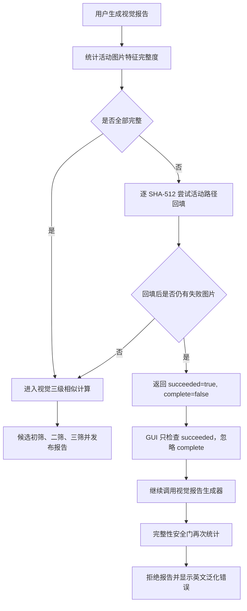

# 视觉报告 `image feature completeness gate` 失败根因文档

> 日期：2026-07-18  
> 状态：根因已完成静态定位，等待用户确认；尚未生成修改计划，尚未修改代码。

## 1. 现象

生成视觉相似报告时，界面提示：

```text
报告生成失败：image feature completeness gate rejected report
```

该错误来自视觉报告发布前的图片特征完整性安全门，不是 MySQL 缺字段、报告文件写入或三级相似算法本身崩溃。

## 2. 结论

### 2.1 直接触发原因

当前 MySQL 有至少一条“存在活动路径的图片内容”未同时满足以下六项条件：

1. `media_algorithm_version = 'media-dhash-v2'`；
2. `image_pdq_hash IS NOT NULL`；
3. `image_pdq_quality IS NOT NULL`；
4. `image_zoned_phashes IS NOT NULL`；
5. `image_perceptual_algorithm_version = 1`；
6. `image_structural_algorithm_version = 1`。

默认配置要求图片特征 100% 完整，并且禁止发布部分报告，所以只要有一条活动图片不完整，报告生成器就会拒绝发布整个视觉报告。该安全门符合“不能漏掉待筛选资源”的项目目标，不应通过勾选“允许本次配置生成部分报告”来掩盖问题。

### 2.2 已确认的编排逻辑缺陷

视觉报告启动前确实会自动执行图片特征回填，但回填完成后的状态语义与界面判断不一致：

- 回填对无法修复的图片按“无可读路径 / 超时 / 解码失败”累计失败数；
- 即使回填后仍有不完整图片，`ImageFeatureBackfillCoordinator::Run` 仍返回 `succeeded=true`、`complete=false`；
- `VideoScApp` 只判断 `succeeded`，没有判断 `complete`，因此仍继续调用视觉报告生成器；
- 视觉报告生成器重新检查完整性并拒绝报告，于是出现当前英文错误；
- 报错中的“run image feature backfill first”也具有误导性，因为本次流程已经执行过回填。

因此，当前错误由两层原因共同形成：

1. **数据层条件**：确有尚未生成完整视觉特征的活动图片；
2. **编排与可观测性缺陷**：界面忽略回填的 `complete=false`，丢弃失败分类，再依赖下游安全门给出泛化错误。

### 2.3 新数据库全量重建仍可能出现

全量重建可以解决旧表缺字段、旧算法版本数据残留等问题，但不能保证所有源图片都能成功解码。

扫描阶段如果图片特征计算失败，会把内容记录标记为 `media-error-v1`，记录失败日志后仍将该内容同步到 MySQL。视觉报告前的回填会再次尝试同一 SHA-512 对应的所有活动路径；如果所有路径仍不可读、超时或解码失败，该图片会继续保持不完整并触发安全门。

所以，本次错误本身不能推导为“数据库重建失败”，也不能推导为“PDQ/分区 pHash 算法未接通”。它证明的是：当前活动图片作用域没有达到 100% 特征完整度。

## 3. 修改前流程框图（当前实际流程）



## 4. 代码证据链

| 环节 | 文件与位置 | 已确认行为 |
|---|---|---|
| 完整性口径 | `DedupCore/persistence/MySqlReadRepository.cpp:419-457` | 只统计存在 `active=1` 路径的图片 SHA-512；六项条件全部满足才算完整。 |
| 待回填目标 | `DedupCore/persistence/MySqlReadRepository.cpp:460-531` | 查询不完整图片，并带出该 SHA-512 的全部活动路径。 |
| 回填失败分类 | `DedupCore/orchestration/ImageFeatureBackfillCoordinator.cpp:147-208` | 逐路径重算；失败分为无可读路径、超时、解码失败。 |
| 回填结果语义 | `DedupCore/orchestration/ImageFeatureBackfillCoordinator.cpp:243-258` | 重统计后即使不完整，仍设置 `succeeded=true`，仅通过 `complete=false` 表示仍有未解决图片。 |
| GUI 编排缺口 | `VideoScGUI/VideoScApp.cpp:2034-2059` | 仅在 `!backfilled.succeeded` 时停止；未检查 `!backfilled.complete`。 |
| 安全门报错 | `DedupCore/dedup/DuplicateReportService.cpp:1675-1693` | 默认要求完整且不允许部分报告；存在不完整图片时生成当前错误。 |
| 最终信息展示 | `VideoScGUI/VideoScApp.cpp:2066-2100` | 仅拼接报告生成结果，回填失败分类和计数没有进入最终消息。 |
| 扫描失败落库 | `DedupCore/orchestration/ScanCoordinator.cpp:1676-1777` | 图片分析失败时写 `media-error-v1` 和失败日志，但内容记录仍会进入同步队列。 |
| 默认安全配置 | `DedupCore/config/AppConfig.h:197-202` | `require_complete_features=true`，`allow_partial_reports=false`。 |

## 5. 当前能确定与不能确定的边界

### 已能从代码确定

- 错误必然由至少一条活动图片特征不完整触发；
- 报告前的自动回填已经执行，不是完全未运行回填；
- 回填后的 `complete=false` 被 GUI 忽略；
- 视觉三级相似计算尚未开始，错误发生在候选生成之前；
- 绕过安全门会生成缺少部分活动图片的报告，不符合当前完整筛选目标。

### 仅凭现有报错不能确定

- 不完整图片的准确数量；
- 是无可读路径、超时还是解码失败；
- 具体哪些文件失败；
- 是否还混有旧算法版本记录。

当前工作区内可见的 `x64/Release/execution-logs` 最后更新时间为 2026-07-17，且只包含当时的 MySQL 连接失败，不是本次运行日志。因此不能用该日志替代用户实际运行目录的数据做进一步归因。

## 6. 只读核验 SQL

以下语句不修改数据，可在当前配置指向的 VideoSc MySQL 数据库执行。

### 6.1 统计完整与不完整图片数

```sql
SELECT
    COUNT(*) AS total_images,
    SUM(CASE WHEN
        d.media_algorithm_version = 'media-dhash-v2'
        AND d.image_pdq_hash IS NOT NULL
        AND d.image_pdq_quality IS NOT NULL
        AND d.image_zoned_phashes IS NOT NULL
        AND d.image_perceptual_algorithm_version = 1
        AND d.image_structural_algorithm_version = 1
        THEN 1 ELSE 0 END) AS complete_images,
    SUM(CASE WHEN
        d.media_algorithm_version = 'media-dhash-v2'
        AND d.image_pdq_hash IS NOT NULL
        AND d.image_pdq_quality IS NOT NULL
        AND d.image_zoned_phashes IS NOT NULL
        AND d.image_perceptual_algorithm_version = 1
        AND d.image_structural_algorithm_version = 1
        THEN 0 ELSE 1 END) AS incomplete_images
FROM sha512_file_data AS d
JOIN (
    SELECT DISTINCT sha512
    FROM file_path_sha512
    WHERE active = 1
) AS p ON p.sha512 = d.sha512
WHERE d.media_kind = 1;
```

### 6.2 按缺失条件统计

这些计数允许重叠，同一图片可能同时缺少多项特征。

```sql
SELECT
    SUM(d.media_algorithm_version <> 'media-dhash-v2') AS algorithm_version_mismatch,
    SUM(d.image_pdq_hash IS NULL) AS missing_pdq_hash,
    SUM(d.image_pdq_quality IS NULL) AS missing_pdq_quality,
    SUM(d.image_zoned_phashes IS NULL) AS missing_zoned_phashes,
    SUM(d.image_perceptual_algorithm_version <> 1) AS perceptual_version_mismatch,
    SUM(d.image_structural_algorithm_version <> 1) AS structural_version_mismatch
FROM sha512_file_data AS d
JOIN (
    SELECT DISTINCT sha512
    FROM file_path_sha512
    WHERE active = 1
) AS p ON p.sha512 = d.sha512
WHERE d.media_kind = 1;
```

### 6.3 列出不完整图片及其活动路径

```sql
SELECT
    HEX(d.sha512) AS sha512,
    d.media_algorithm_version,
    d.image_pdq_hash IS NULL AS missing_pdq_hash,
    d.image_pdq_quality IS NULL AS missing_pdq_quality,
    d.image_zoned_phashes IS NULL AS missing_zoned_phashes,
    d.image_perceptual_algorithm_version,
    d.image_structural_algorithm_version,
    p.path_id,
    p.full_path,
    p.path_state
FROM sha512_file_data AS d
JOIN file_path_sha512 AS p
    ON p.sha512 = d.sha512 AND p.active = 1
WHERE d.media_kind = 1
  AND (
      d.media_algorithm_version <> 'media-dhash-v2'
      OR d.image_pdq_hash IS NULL
      OR d.image_pdq_quality IS NULL
      OR d.image_zoned_phashes IS NULL
      OR d.image_perceptual_algorithm_version <> 1
      OR d.image_structural_algorithm_version <> 1
  )
ORDER BY d.sha512, p.scan_root_priority, p.path_id
LIMIT 200;
```

## 7. 建议的现场确认材料

为了把数据层原因进一步精确到具体文件，需要以下任一项：

1. 第 6 节三条只读 SQL 的结果；或
2. 实际运行程序目录下 `execution-logs/execution-failures.log` 中本次任务附近的 `任务=scan`、`操作=image_perceptual_features` 记录；或
3. 完整未截断的界面错误，其中源码正常情况下应包含 `complete=X; total=Y`。

## 8. 待用户确认的根因判断

请确认以下判断是否与现场一致：

> 扫描或历史数据中存在至少一张活动图片未能生成完整的 PDQ、PDQ 质量、分区 pHash 及算法版本信息；报告前自动回填仍未解决这些图片。GUI 错误地把“回填执行成功但结果不完整”当作可以继续生成报告，最终由下游完整性安全门拒绝，并且未向界面传递具体失败分类。

确认后再生成中文修改计划；修改计划将包含修改前、修改后的完整流程框图，并等待再次确认后执行。
