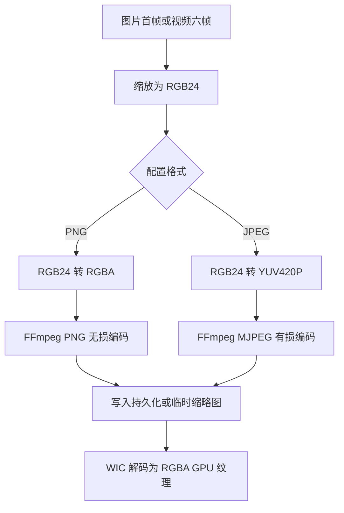

# PNG 缩略图体积过大根因文档

> 日期：2026-07-18  
> 状态：根因已定位，等待用户确认优化范围与是否允许有损编码  
> 边界：本轮只读检查源码与项目内 FFmpeg 编码器能力，未修改代码、配置或现有缩略图

## 1. 结论

1. **可以明显减小缩略图体积，首选方案不是单纯移除 Alpha，而是对照片和视频帧缩略图使用有损 JPEG。** 当前项目已经支持 JPEG，默认配置也是 JPEG；如果现场生成的是 PNG，说明保存配置已切换到 PNG，或目录中保留了此前生成的 PNG。
2. **当前 PNG 编码确实存在无意义 Alpha 通道。** 两条缩略图生成链路的输入都是 `RGB24`，但 `SaveImageFile()` 在输出 PNG 时强制转换为 `AV_PIX_FMT_RGBA`。这个 Alpha 全部来自格式转换，不承载源图片透明信息，可以安全改成 `AV_PIX_FMT_RGB24`。
3. **移除 Alpha 对编码内存有效，但对 PNG 磁盘体积通常不是决定性优化。** 编码帧从每像素 4 字节降到 3 字节，未压缩内存减少 25%；但恒定不透明 Alpha 很容易被 PNG 压缩，最终文件减少比例通常远小于 25%。
4. **PNG 体积大的主因是它对照片/视频帧执行无损压缩。** 这类高纹理内容使用 JPEG 通常比 PNG 小得多；缩略图只用于人工预览，不参与 SHA-512、PDQ、pHash 或结构直验，因此允许有损编码不会改变去重结果。
5. **当前配置变更不能保证历史持久化视频拼图被重建。** `MediaComplete()` 只检查媒体算法特征，不检查缩略图格式、尺寸、编码质量或文件是否仍符合当前配置。已有 PNG 路径会继续保存在内容记录中，设置页“尺寸或格式变化只触发缩略图按需重建”的说明与实际扫描复用逻辑不完全一致。
6. **项目内 FFmpeg 已包含可用编码器。** 本地 `ffmpeg.exe -h encoder=png` 显示 PNG 支持 `rgb24`、`rgba` 和 `mixed/paeth` 预测；JPEG 编码器支持 YUV420P 和 optimal Huffman；项目也带 `libwebp`，但 GUI 当前使用 Windows WIC 解码缩略图，WebP 在目标机器上不能保证无额外组件直接加载，因此不建议作为第一阶段默认格式。

## 2. 当前缩略图生成范围

### 2.1 持久化视频 2×3 拼图

- 扫描视频时生成六帧 `RGB24` 拼图；默认单格长边为 256 像素。
- 输出扩展名由 `ThumbnailConfig::format` 决定，文件保存在 `thumbnails.root_directory`。
- 输出路径持久化到 RocksDB/MySQL 的 `contact_sheet_path`，后续报告优先复用。
- 证据：
  - `DedupCore/orchestration/ScanCoordinator.cpp:1647-1664`
  - `VideoSc/dllmain.cpp:1061-1073`
  - `VideoSc/dllmain.cpp:1164-1177`

### 2.2 临时报告图片预览与视频拼图

- 图片详情按当前配置生成最长边默认 512 像素的临时预览。
- 视频持久化拼图缺失时，在 `%TEMP%\VideoScGUI\preview-*` 生成临时 2×3 拼图。
- 程序正常退出时会删除该进程的临时预览目录，下次启动重新生成。
- 证据：
  - `VideoScGUI/VideoScApp.cpp:642-688`
  - `VideoScGUI/VideoScApp.cpp:691-838`
  - `VideoScGUI/VideoScApp.cpp:841-930`

### 2.3 GPU 纹理

- WIC 最终统一转换为 `GUID_WICPixelFormat32bppRGBA`，D3D11 使用 `DXGI_FORMAT_R8G8B8A8_UNORM`。
- 因此移除磁盘 PNG Alpha 不会降低当前 GPU 纹理显存；显存主要由预览尺寸、缓存条目和显存上限决定。
- 证据：`VideoScGUI/VideoScApp.cpp:3469-3585`。

## 3. 当前编码流程图

## 4. 体积优化方案比较

| 方案 | 预期收益 | 性能影响 | 兼容性 | 结论 |
|---|---:|---:|---|---|
| PNG `RGBA` 改 `RGB24` | 编码帧内存减少 25%；磁盘体积小幅减少 | 转换和内存带宽略降 | 完全兼容 | 应做，但不是主要收益 |
| PNG 使用更强预测/压缩 | 文件再小一些 | 编码 CPU 时间增加 | 完全兼容 | 仅适合必须无损时 |
| JPEG，明确质量约 80～85 | 照片/视频帧通常显著小于 PNG | 编码、解码快 | WIC/FFmpeg 均稳定支持 | **推荐默认方案** |
| 最长边 512→384、单格 256→192 | 像素数减少 43.75% | 编码、磁盘、内存、显存都下降 | 完全兼容 | 可与 JPEG 叠加 |
| WebP quality 75～82 | 通常比 JPEG 进一步减小 | 编码较慢 | 当前 WIC 加载不可靠 | 暂不推荐第一阶段 |
| AVIF | 体积可能最小 | 编码明显更慢 | 当前链路未接入 | 不适合高并发缩略图 |

实际比例受图片纹理、噪点、水印和尺寸影响；没有现场样本时不能承诺固定压缩率。对照片/视频缩略图而言，切换 JPEG 的收益通常远大于只去掉 Alpha。

## 5. 推荐目标

### 5.1 推荐默认策略

1. 图片预览和视频拼图默认输出 JPEG。
2. 新增明确的 `jpeg_quality` 配置，建议默认 `82`，范围限制在 `50～95`。
3. JPEG 使用 YUV420P 和 optimal Huffman，保持 WIC 直接加载。
4. 保留 PNG 作为用户显式选择的无损模式；PNG 改用 `RGB24`，不生成 Alpha。
5. 如仍需继续压缩，优先降低预览长边，而不是使用极高 PNG 压缩级别。

### 5.2 缓存与历史文件必须同步处理

缩略图缓存身份至少应包含：

- 输出格式；
- JPEG 质量或 PNG 编码版本；
- 图片预览最长边；
- 视频拼图单格最长边；
- 缩略图编码版本。

格式或参数变化时，应只重建缩略图展示产物，不重新计算 SHA-512、PDQ、分区 pHash、视频 dHash 或结构直验。新文件成功并持久化新路径后，再删除旧 PNG，避免中途失败导致预览丢失。

## 6. 不建议的做法

1. 不建议仅把 PNG 压缩级别拉满：会增加 CPU 时间，且对照片内容的收益通常有限。
2. 不建议为了磁盘体积直接改成 WebP，而不先补 GUI 解码能力与目标机兼容测试。
3. 不建议修改 GPU 纹理为 RGB 三通道：D3D11 常用纹理和 ImGui 渲染路径仍以 RGBA 最稳定，这与磁盘缩略图编码是不同问题。
4. 不建议删除整个缩略图目录后依赖普通增量扫描自动恢复；当前持久化视频拼图不以格式/尺寸作为 `MediaComplete()` 条件，历史内容可能被直接复用而不重建。

## 7. 待用户确认

生成修改计划前需要确认：

1. 是否允许缩略图采用有损 JPEG，推荐质量 `82`？
2. 优化范围是“持久化视频 2×3 拼图 + 临时图片预览 + 临时视频预览”全部链路，还是只处理其中一种？
3. 是否需要自动迁移并删除已经生成的历史 PNG；如果需要，应采用“新文件成功落盘并更新记录后再删除旧文件”的安全迁移方式。

