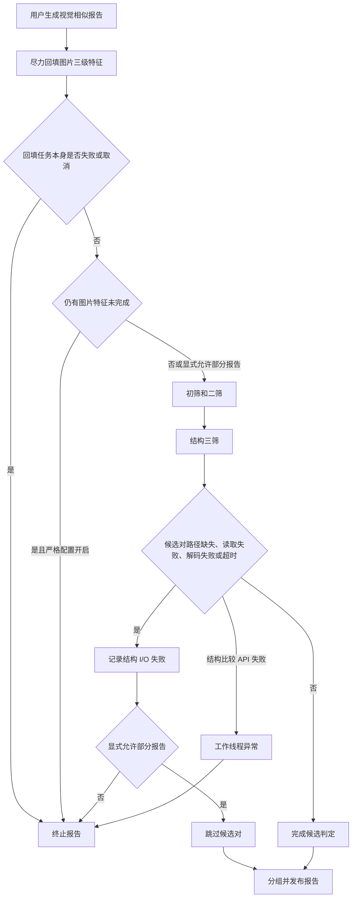
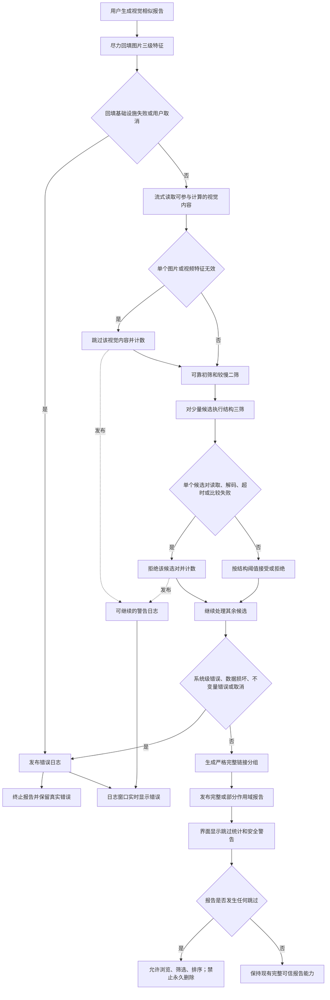

# 视觉报告跳过未完成或失败计算修改计划

> 日期：2026-07-18  
> 状态：已执行，代码与自动化验证完成  
> 适用项目：VideoSc_new  
> 关联既有计划：`2026-07-18-image-feature-completeness-gate-fix-plan.md`

## 1. 修改目标

视觉相似报告生成时，先尽力回填和计算视觉特征；如果仍有少量资源无法完成计算，或某个候选对在结构三筛阶段读取、解码、超时、比较失败，则只跳过受影响的资源或候选对并继续生成其余报告，不再因局部媒体问题中断整份报告。

本次修改同时保持以下安全边界：

1. 跳过只影响该资源参与视觉相似分组，不删除、不停用、不修改源文件及其数据库业务记录。
2. SHA-512 精确重复报告不受影响。
3. 只要报告生成过程中跳过过资源或候选对，该报告就标记为“部分作用域报告”，允许浏览、筛选和排序，但继续禁止永久删除。
4. MySQL、RocksDB、报告发布、工作数据损坏、内部不变量错误、内存不足、未处理线程异常和用户取消仍然终止任务，不能伪装成普通媒体跳过。
5. 不修改视觉三级相似算法、阈值、分桶规则和完整链接分组规则。
6. 增加可停靠实时日志窗口，集中显示扫描、视觉计算、MySQL 同步和报告生成过程中的信息、警告与错误。

## 2. 当前实现问题

当前代码已经具备部分跳过能力，但存在两道会把局部媒体问题升级为整份报告失败的门禁：

1. 图片特征回填结束后，如果仍有不完整图片，GUI 预检和 `GenerateSimilar` 内部的 `ShouldRejectIncompleteImageFeatureScope` 会按配置直接拒绝报告生成。
2. 结构三筛已经会对缺少路径、读取失败、解码失败和超时的候选对增加计数并返回，但所有任务结束后，只要存在结构 I/O 失败且 `allow_partial_reports=false`，又会把整份报告判为失败。
3. `CompareImageStructuresV1` 返回计算失败时会抛出异常，经工作线程池升级为整份报告失败，尚未按候选对隔离。
4. `partial_scope_confirmed` 当前表达“用户显式确认部分报告”，与本次“系统自动跳过并发布部分报告”的语义不一致。
5. 当前永久删除安全门只检查图片特征不完整数和延迟热门签名，没有检查结构三筛跳过或无效视频跳过，无法完整表达新策略下的报告可信边界。
6. 当前错误主要分散在页面状态文字和多个滚动日志文件中，没有统一的实时日志窗口，计算或报告运行时难以连续观察和筛选故障。

## 3. 修改前流程框图

## 4. 修改后目标流程框图

## 5. 失败分类与处理契约

| 场景 | 新行为 | 报告是否继续 | 是否计入部分作用域 |
|---|---|---:|---:|
| 回填后图片三级特征仍缺失、过期或损坏 | 跳过对应图片 SHA | 是 | 是 |
| 视频 dHash 无效 | 跳过对应视频 SHA | 是 | 是 |
| 结构三筛没有可读活动路径 | 拒绝当前候选对，记录结构 I/O 失败 | 是 | 是 |
| 结构三筛读取或解码失败 | 拒绝当前候选对，记录结构 I/O 失败 | 是 | 是 |
| 结构三筛读取超时 | 拒绝当前候选对，记录 I/O 失败和超时 | 是 | 是 |
| `CompareImageStructuresV1` 返回失败 | 释放比较结果，拒绝当前候选对，记录结构计算失败 | 是 | 是 |
| MySQL 查询或连接失败 | 保留原错误并终止 | 否 | 不适用 |
| RocksDB 读取、写入或报告发布失败 | 保留原错误并终止 | 否 | 不适用 |
| 候选键、证据或工作数据无法反序列化 | 按数据损坏终止 | 否 | 不适用 |
| 候选处理数与预期数不一致 | 按内部不变量错误终止 | 否 | 不适用 |
| 工作线程未处理异常或内存不足 | 终止并显示原错误 | 否 | 不适用 |
| 用户取消 | 按取消结束，不发布半成品 | 否 | 不适用 |

禁止使用覆盖整个三筛任务的宽泛 `catch (...)` 把程序错误吞成媒体跳过；只在能够明确关联到单个资源或单个候选对的返回路径上降级。

## 6. 计划修改内容

### 6.1 取消图片特征不完整对整份报告的阻断

修改：

- `DedupCore/dedup/DuplicateReportService.h`
- `DedupCore/dedup/DuplicateReportService.cpp`
- `VideoScGUI/VideoScApp.cpp`

计划：

1. 删除或停用 `ShouldRejectIncompleteImageFeatureScope` 的拒绝语义，避免 GUI 与生成器继续根据旧配置终止报告。
2. GUI 在 `ImageFeatureBackfillCoordinator` 操作失败或取消时仍终止；当 `succeeded=true, complete=false` 时改为记录警告并继续调用 `GenerateSimilar`。
3. `GenerateSimilar` 仍重新统计图片作用域，防止回填结束后数据变化；不完整图片交给现有视觉内容流式读取逻辑跳过并累计：
   - `skipped_invalid_visuals`；
   - `skipped_invalid_images`；
   - `skipped_invalid_videos`。
4. 保留回填的超时一次重试、备用路径枚举和失败分类能力；本次只改变报告生成的最终处置，不回退已经完成的诊断增强。

### 6.2 将结构三筛局部失败隔离到候选对

修改：

- `DedupCore/dedup/DuplicateReportService.h`
- `DedupCore/dedup/DuplicateReportService.cpp`

计划：

1. 删除“存在 `structuralIoFailures` 且未启用部分报告就整份失败”的末尾门禁。
2. 缺路径、读取失败、解码失败和超时继续执行当前的“增加 `verifiedPairs` 后返回”路径，确保候选处理总数守恒。
3. `CompareImageStructuresV1` 返回失败时：
   - 先调用释放函数，避免本地结果资源泄漏；
   - 增加新的 `structural_compute_failures` 计数；
   - 增加 `verifiedPairs`；
   - 拒绝当前候选对并返回，不向线程池抛出普通媒体计算异常。
4. 不改变 RocksDB 写边、候选反序列化、线程池异常和候选数不一致的失败语义；这些仍然是任务级错误。
5. `DuplicateReportResult` 增加结构计算失败计数，并继续保留现有结构 I/O 与超时计数。

### 6.3 统一“部分作用域报告”元数据语义

修改：

- `DedupCore/dedup/DuplicateReportService.h`
- `DedupCore/dedup/DuplicateReportService.cpp`
- `VideoScGUI/VideoScApp.cpp`

计划：

1. 将 C++ 字段 `partial_scope_confirmed` 改名为 `partial_scope_published`，语义改为“报告生成时有视觉内容或候选对被自动跳过”。
2. 保持 V4 元数据中该布尔值的二进制位置和编码不变；旧报告中的“用户确认部分作用域”天然属于“已发布部分作用域”，可直接兼容读取。
3. 新报告在以下任一条件成立时写入 `partial_scope_published=true`：
   - 图片特征不完整数大于零；
   - 跳过无效图片或视频；
   - 结构三筛 I/O 失败数大于零；
   - 结构三筛计算失败数大于零。
4. 元数据校验继续要求 `image_scope_total = image_features_complete + image_features_incomplete`；有不完整图片时必须带部分作用域标记。
5. 不新增 MySQL 表或字段，不提升 MySQL 业务版本；不改变 RocksDB 列族和键结构，也不提升相似报告 schema。若执行中发现位置编码无法安全复用，停止执行并重新提交需要升级 codec 的补充计划，不静默改变格式。

### 6.4 退役会造成旧配置继续阻断的开关

修改：

- `DedupCore/config/AppConfig.h`
- `DedupCore/config/JsonConfigStore.cpp`
- `VideoScGUI/VideoScApp.cpp`

计划：

1. `require_complete_features`、`allow_partial_reports` 不再参与报告能否生成的判断，确保用户已有的严格配置文件也不会继续阻断。
2. 为兼容旧配置和旧报告规则快照，暂时保留两个字段的 JSON 读取和元数据编解码，但标注为废弃配置。
3. 新默认值调整为自动部分报告语义：`require_complete_features=false`、`allow_partial_reports=true`。
4. 移除 GUI 中“要求图片特征完整”和“允许部分报告”两个可编辑复选框，改为只读说明：无法完成视觉计算的资源会被跳过并计入报告统计。
5. 不依赖修改默认值解决兼容问题；核心生成器必须无条件采用新策略，避免已有 JSON 中的旧值恢复严格阻断。

### 6.5 更新报告结果、界面提示和删除安全门

修改：

- `VideoScGUI/VideoScApp.cpp`
- `DedupCore/dedup/DuplicateReportService.cpp`

计划：

1. 当前生成完成消息显示：
   - 跳过的无效图片数；
   - 跳过的无效视频数；
   - 结构 I/O 失败候选对数；
   - 其中超时候选对数；
   - 结构计算失败候选对数。
2. 报告详情把旧文案“由用户确认按部分图片作用域生成”改为：

   `该报告自动跳过了无法完成特征或结构校验的资源；结果仅覆盖成功计算的视觉内容，不可用于永久删除。`

3. 永久删除可信门增加 `partial_scope_published == false` 条件。即使图片特征完整数为零缺失，只要视频或结构候选曾被跳过，也不能执行永久删除。
4. 不限制部分报告的浏览、筛选、排序、组选中和导出查看；只限制具有破坏性的永久删除操作。
5. 失败日志只记录真正导致报告任务终止的错误；局部媒体跳过写入成功消息或普通诊断统计，避免用户看到“报告成功”同时又出现整任务失败日志。

### 6.6 增加可停靠实时日志窗口

修改：

- `DedupCore/logging/RuntimeLogFeed.h`（新增）
- `DedupCore/logging/RuntimeLogFeed.cpp`（新增）
- `DedupCore/logging/ExecutionLogger.cpp`
- `DedupCore/logging/ScanErrorLogger.cpp`
- `DedupCore/logging/ApplicationErrorLogger.cpp`
- `DedupCore/dedup/DuplicateReportService.h`
- `DedupCore/dedup/DuplicateReportService.cpp`
- `VideoScGUI/VideoScApp.h`
- `VideoScGUI/VideoScApp.cpp`

#### 6.6.1 日志来源与统一模型

1. 新增进程内 `RuntimeLogFeed`，作为现有文件日志的有界实时镜像，不替代：
   - `execution.log`；
   - `execution-failures.log`；
   - `scan-errors.log`；
   - `application-errors.log`。
2. 统一实时条目至少包含：
   - UTC 时间和单调递增序号；
   - 级别：信息、警告、错误；
   - 任务类型和任务 ID；
   - 阶段与操作；
   - 状态码和系统错误；
   - 路径或候选内容标识；
   - 可读说明和同类重复次数。
3. `ExecutionLogger`、`ScanErrorLogger` 和 `ApplicationErrorLogger` 在保留原落盘行为的同时，将同一条已脱敏记录发布到实时源，避免 GUI 反向解析多种文本格式。
4. 报告生成器增加可选的诊断回调，只发布与单个视觉资源或候选对直接关联的警告/错误；调用方不提供回调时不改变核心行为。
5. 报告局部跳过使用“警告”级别，报告任务终止使用“错误”级别，正常阶段切换使用“信息”级别，防止把可继续问题显示成整任务失败。
6. 日志内容继续禁止 MySQL 密码、DPAPI 密文、TLS 私钥、完整配置 JSON 和内存内容；路径可以显示，用于定位故障媒体。

#### 6.6.2 并发、容量和性能

1. `RuntimeLogFeed` 使用线程安全有界队列，后台扫描、特征计算、MySQL 同步和报告工作线程可以并发发布。
2. 队列默认最多保留 4096 条；超限淘汰最旧记录并累计“已丢弃旧日志”数量，不允许长期运行无限增长。
3. 同一任务、阶段、操作和错误码的高频重复错误进行聚合，保留首条样本、最新时间和重复次数，避免损坏媒体批量刷屏。
4. GUI 按序号只获取上次渲染后的新增快照，不读取或锁住生产者内部容器，不在每帧扫描整个日志文件。
5. 实时源发布必须 `noexcept`；内存不足或实时源故障不能覆盖原业务结果，也不能阻塞报告。原有“永久删除前日志必须可写”的安全规则保持不变。
6. 文件落盘和实时显示互相独立：文件写入失败时，尽量向实时窗口发布“日志落盘失败”；实时显示失败时，文件日志仍按原规则写入。

#### 6.6.3 桌面日志窗口布局与操作

1. 新增 `RenderLogWindow()`，默认作为主 DockSpace 底部横向窗口，占初始可用高度约 22%，用户可以拖动、停靠、关闭和重新打开。
2. “视图”菜单增加“运行日志”；重置布局时恢复底部日志窗口和默认可见状态。
3. 顶部工具栏提供：
   - 信息/警告/错误级别筛选；
   - 全部、扫描、视觉计算、MySQL、报告、删除和应用异常任务筛选；
   - 关键字搜索；
   - 暂停刷新；
   - 自动滚动；
   - 清空当前视图；
   - 复制选中或当前筛选结果；
   - 打开日志目录。
4. 主体使用表格显示“时间、级别、任务/ID、阶段/操作、代码、路径/内容、说明”，长路径和说明支持悬停完整显示及复制。
5. 使用 `ImGuiListClipper` 只渲染可见行；日志很多时不逐行绘制整个列表。
6. 自动滚动仅在用户原本位于底部时跟随新日志；用户向上查看历史时不强制抢回滚动位置。
7. “清空当前视图”只移动本次 GUI 查看起点，不删除任何落盘日志，不影响审计和故障追踪。
8. 日志窗口关闭后仍保留有界实时记录；重新打开可查看本进程内尚未淘汰的历史。

#### 6.6.4 视觉报告日志内容

视觉报告至少发布以下过程记录：

1. 图片特征回填开始、完成、失败分类汇总。
2. 可靠初筛、二筛、结构三筛、分组和发布阶段切换。
3. 无效图片、无效视频、缺少可读路径、结构读取/解码失败、结构超时和结构比较失败。
4. 高频候选级问题按分类聚合，窗口展示样本和重复次数；报告完成时再输出完整汇总计数。
5. MySQL/RocksDB 错误、候选数据损坏、候选数不一致、线程异常、取消和报告发布失败。
6. 报告成功但存在跳过时输出黄色警告摘要；没有跳过时输出绿色或普通信息摘要。

### 6.7 保持性能优化路径

1. 回填仍在报告前执行，尽量提高参与率，不因新策略直接放弃可修复资源。
2. 不完整视觉内容在进入候选生成前跳过，不占用后续分桶、二筛和三筛计算。
3. 结构异常只丢弃当前候选对，不重新启动整轮报告，不增加无限重试。
4. 不新增一次全量媒体解码或全表扫描；复用现有完整性统计、流式读取和三筛计数。
5. 正常完整数据路径只增加少量布尔判断和原子计数，预期性能影响可忽略。

## 7. 测试计划

修改：

- `DedupTests/main.cpp`

新增或调整确定性测试：

1. 默认配置下存在不完整图片，报告继续生成并增加无效图片跳过计数。
2. 加载旧严格配置 `require_complete_features=true, allow_partial_reports=false` 后仍继续生成，证明旧 JSON 不会恢复阻断。
3. 无效视频 dHash 被跳过，报告成功并标记部分作用域。
4. 结构三筛缺少活动路径时，只拒绝当前候选对，报告成功并增加结构 I/O 失败数。
5. 结构读取或解码失败时，只拒绝当前候选对。
6. 结构读取超时时，同时增加结构 I/O 失败和超时计数。
7. 结构比较 API 返回失败时，结果资源被释放、候选处理数守恒、结构计算失败数增加、报告继续生成。
8. 多个候选中只有一个失败时，其余候选仍可形成相似边和最终分组。
9. MySQL、RocksDB、损坏候选数据、线程池异常、候选数不一致和取消仍按原契约终止。
10. 新报告元数据满足完整数守恒，任一局部跳过都会写入 `partial_scope_published=true`。
11. 旧 V4 元数据能够按原二进制布局读取，旧 `partial_scope_confirmed=true` 被解释为部分作用域。
12. 部分作用域报告可以加载和浏览，但永久删除安全门拒绝执行。
13. 完整报告没有跳过时仍可通过现有永久删除可信检查。
14. GUI 成功消息包含所有非零跳过分类，零值不产生冗余文本。
15. 多线程并发发布实时日志不会产生数据竞争，序号保持唯一且单调。
16. 实时日志超过 4096 条后淘汰最旧记录并正确显示丢弃计数，内存占用保持有界。
17. 同类高频错误能够聚合，任务、阶段、操作或错误码不同的记录不会错误合并。
18. 暂停刷新不会阻塞后台日志生产；恢复后只增量接收未淘汰记录。
19. 清空当前视图不删除 `execution*.log`、`scan-errors.log` 或 `application-errors.log`。

验证顺序：

1. 静态检查新旧字段引用、所有返回路径的计数守恒和资源释放。
2. 构建 `Debug|x64` 全解决方案。
3. 运行 Debug `DedupTests.exe`，要求实际登记测试全部通过。
4. 构建 `Release|x64` 全解决方案。
5. 运行 Release `DedupTests.exe`，要求实际登记测试全部通过。
6. 不把当前历史测试总数写死为验收条件。

日志窗口现场界面验收：

1. 默认布局底部显示日志窗口，并可通过“视图”菜单关闭、恢复和重新停靠。
2. 扫描计算失败、图片特征回填失败、结构三筛跳过和报告发布失败均能在对应级别下看到。
3. 级别、任务和关键字筛选组合后结果正确。
4. 大量日志下滚动和筛选保持流畅，用户查看历史时不会被自动拉回底部。
5. 复制、清空当前视图和打开日志目录行为符合桌面应用习惯。

## 8. 现场验收场景

### 场景 A：少量图片特征计算失败

- 回填阶段显示失败分类；
- 报告继续执行初筛、二筛、三筛；
- 失败图片不进入视觉分组；
- 其余图片和视频正常形成报告；
- 报告显示部分作用域警告并禁止永久删除。

### 场景 B：结构三筛单个候选读取超时

- 只拒绝该候选对；
- 其他候选继续计算；
- 报告成功发布；
- 完成消息显示结构 I/O 失败数和超时数；
- 不写整任务失败日志。

### 场景 C：结构比较函数返回失败

- 比较结果资源正确释放；
- 当前候选对记为结构计算失败并跳过；
- 工作线程池继续处理后续任务；
- 报告成功发布为部分作用域。

### 场景 D：数据库或报告发布失败

- 不执行局部跳过降级；
- 报告任务失败；
- UI 和执行失败日志保留底层错误；
- 不发布可能损坏的报告。

### 场景 E：没有任何失败

- 行为、算法结果和性能与当前完整路径一致；
- 报告不显示部分作用域警告；
- 永久删除可信检查维持现有能力。

## 9. 预计修改文件

| 文件 | 计划修改 |
|---|---|
| `DedupCore/dedup/DuplicateReportService.h` | 调整部分作用域字段语义，增加结构计算失败结果计数，移除完整性拒绝策略声明。 |
| `DedupCore/dedup/DuplicateReportService.cpp` | 移除两道局部媒体失败阻断，隔离结构比较失败，自动写部分作用域标记，补充成功统计。 |
| `DedupCore/config/AppConfig.h` | 调整新配置默认值并标注旧完整性开关为兼容字段。 |
| `DedupCore/config/JsonConfigStore.cpp` | 保留旧 JSON 兼容读取，但不再让旧值控制报告阻断。 |
| `DedupCore/logging/RuntimeLogFeed.h` | 新增结构化、有界、线程安全的进程内实时日志模型和读取接口。 |
| `DedupCore/logging/RuntimeLogFeed.cpp` | 实现发布、聚合、序号快照和容量淘汰，保证异常不影响业务线程。 |
| `DedupCore/logging/ExecutionLogger.cpp` | 把执行轨迹和失败记录同步镜像到实时日志源。 |
| `DedupCore/logging/ScanErrorLogger.cpp` | 把扫描读取错误镜像到实时日志源。 |
| `DedupCore/logging/ApplicationErrorLogger.cpp` | 把应用异常镜像到实时日志源，并避免递归记录。 |
| `VideoScGUI/VideoScApp.h` | 增加日志窗口渲染声明、可见状态、筛选状态和增量读取游标。 |
| `VideoScGUI/VideoScApp.cpp` | 回填不完整后继续生成，更新安全门，并实现底部可停靠日志窗口及默认布局。 |
| `DedupTests/main.cpp` | 更新旧拒绝测试并增加跳过、元数据兼容、删除安全和实时日志并发/容量回归测试。 |
| 本计划文档 | 执行后回填实际修改、构建、测试与现场待验收项。 |

## 10. 执行顺序

1. 先调整结果与元数据状态契约，保留 V4 二进制兼容。
2. 移除 GUI 回填后的完整性拒绝分支。
3. 移除生成器入口的不完整图片拒绝门禁。
4. 移除结构 I/O 失败的整任务拒绝门禁。
5. 将结构比较 API 失败改为候选对级跳过并补充计数。
6. 自动计算部分作用域标记并更新报告加载校验。
7. 更新永久删除安全门，确保任何部分报告都不可删除。
8. 退役旧配置开关并更新界面说明。
9. 实现有界实时日志源，并接入现有三类日志记录器。
10. 接入视觉报告诊断事件和跳过/失败汇总。
11. 增加底部可停靠日志窗口、筛选、复制、清空视图和打开目录功能。
12. 补充和调整测试。
13. 完成 Debug/Release 构建与两套测试。
14. 在本计划末尾回填真实执行结果；需要用户实际媒体和 MySQL 的场景明确标记为现场待验收。

## 11. 验收标准

1. 局部图片、视频或候选对计算未完成/失败，不再中断视觉报告整体流程。
2. 其余有效资源仍完成三级相似计算和分组。
3. 所有跳过均有分类计数或部分作用域标记，不静默丢失。
4. 数据库、报告发布、数据损坏、不变量和取消等任务级失败仍会中断。
5. 部分作用域报告可以正常打开、筛选、排序和浏览。
6. 部分作用域报告不能执行永久删除；完整报告的删除能力不受影响。
7. 不增加 MySQL 字段、业务表或版本迁移，不要求用户再次重建数据库。
8. 旧配置文件和旧 V4 报告可以兼容读取。
9. Debug/Release x64 构建成功，实际登记测试全部通过。
10. 日志窗口能够实时显示扫描、计算、MySQL 同步和报告生成中的警告与错误，并可按级别、任务和关键字筛选。
11. 日志高频写入时内存有界、界面流畅，日志窗口故障不会中断扫描或报告。

## 12. 实际执行结果

### 12.1 报告容错与安全边界

1. 已移除 GUI 与报告生成器中的图片特征完整性拒绝门禁。回填任务本身成功后，即使仍有少量图片无法完成视觉特征，也会继续生成报告。
2. 已把单个无效图片、无效视频、结构读取失败、解码失败、超时和结构比较 API 失败收敛为资源级或候选对级跳过，不再升级为整份报告失败。
3. 已增加结构计算失败统计，并在报告完成消息和运行日志中展示跳过分类。
4. 已将 V4 元数据中的原布尔位解释为 `partial_scope_published`，继续复用原序列化位置，没有提升报告格式版本；旧 V4 数据仍可读取。
5. 已把永久删除资格统一收敛到独立安全检查：只有完整 V4 三级视觉报告、没有图片特征缺失、没有部分作用域标记且没有延迟热门签名时才允许永久删除。
6. MySQL、RocksDB、报告序列化/发布、数据损坏、候选数量不变量、未处理工作线程异常和用户取消仍保持任务级失败。

### 12.2 实时日志窗口

1. 已新增线程安全、有界的进程内实时日志源，容量为 4096 条；相同高频错误会聚合并记录重复次数，避免无限占用内存。
2. 执行日志、扫描错误日志、应用异常日志和视觉报告阶段/诊断事件已接入实时日志源；实时日志异常不会反向中断扫描、同步或报告任务。
3. GUI 默认布局底部已增加可停靠“运行日志”窗口，并保留“视图”菜单开关和布局重置入口。
4. 日志窗口已提供级别、任务、关键字筛选，暂停刷新、自动滚动、复制、清空当前视图和打开持久化日志目录功能。

### 12.3 配置与数据库兼容性

1. `require_complete_features` 和 `allow_partial_reports` 保留 JSON 兼容读写，但已标记为兼容字段，不再控制报告是否因局部媒体失败而中断。
2. 本次没有增加或修改 MySQL 字段、业务表、MySQL 版本表、RocksDB Column Family 或数据库版本号。
3. 本次修改不要求删除或重建数据库，也不会再次触发 `image_pdq_hash` 一类缺字段迁移问题。

### 12.4 自动化验证结果

| 验证项 | 结果 |
|---|---|
| Debug x64 全解决方案构建 | 通过，0 警告、0 错误 |
| Debug `DedupTests` | 通过，50/50 |
| Release x64 全解决方案重建 | 通过，0 警告、0 错误 |
| Release `DedupTests` | 通过，50/50 |
| 旧拒绝接口/旧字段名静态扫描 | 通过，代码目录无残留引用 |

说明：首次 Release 增量构建出现 `LNK4020` PDB 缓存警告；执行全量重建后已消失。构建环境同时存在 `Path`/`PATH` 重复键时，MSBuild 启动会失败，验证命令已先规范化进程环境变量；该问题与本次代码修改无关。测试中的损坏 TIFF 解码输出是既有故障媒体夹具的预期诊断，对应测试已通过。

## 13. 现场待验收项

以下项目依赖真实 MySQL、真实故障媒体和人工 GUI 操作，本次自动化验证不宣称已完成：

1. 使用真实扫描数据制造少量图片特征失败，确认其余资源仍能完成三级视觉报告。
2. 使用读取失败、解码失败或超时媒体，确认运行日志窗口能实时显示分类警告且报告继续发布。
3. 打开部分作用域报告，确认浏览、筛选、排序正常，并确认永久删除入口被安全门禁止。
4. 人工检查底部日志窗口的默认尺寸、停靠、筛选、复制、暂停刷新和大批量日志滚动体验。
5. 模拟 MySQL 或报告发布失败，确认任务仍然终止并保留底层错误，不发布可能损坏的报告。
