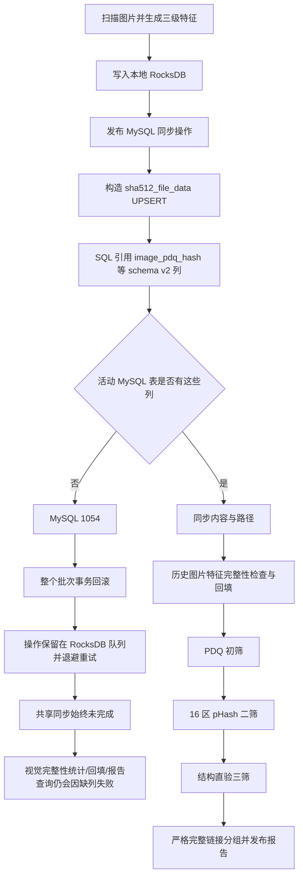
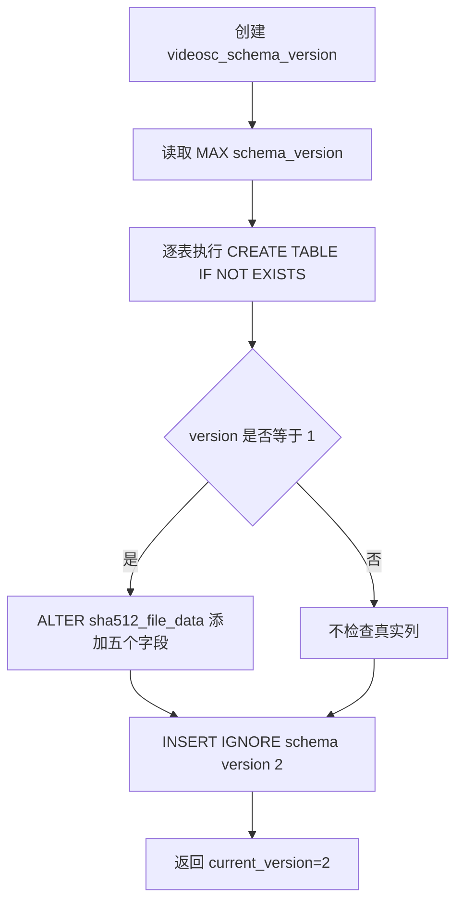

# 视觉三级相似与 MySQL 字段缺失根因文档

> 日期：2026-07-18  
> 状态：根因已确认，修复计划已执行；真实 MySQL 现场待用户验收  
> 现场错误：`Unknown column 'image_pdq_hash' in 'field list'`，MySQL 错误码 `1054`  
> 原始排查边界：根因阶段仅做只读检查；文末已追加修复执行结果

## 1. 结论

1. **当前现场的视觉三级相似链路不能跑通。** 扫描已经生成三级图片特征，但后台 MySQL 内容 UPSERT 在 `image_pdq_hash` 列处失败，整批事务回滚；视觉报告后续的完整性统计、历史回填和内容读取也都会查询该列，因此无法绕过。
2. **当前源码中新建的干净数据库并不缺少三级图片字段。** `sha512_file_data` 的建表 SQL 已包含 `image_pdq_hash` 等五个 schema v2 字段。
3. **界面的“初始化数据库表”不是“重建数据库”。** 它不执行 `DROP`、`TRUNCATE` 或重建表，只执行 `CREATE TABLE IF NOT EXISTS` 和特定版本迁移。已有旧表不会因再次点击按钮而按当前建表 SQL重建。
4. **根本缺陷是 schema 版本号与真实表结构之间没有一致性校验。** 初始化器只读取 `videosc_schema_version`，不查询 `information_schema.columns`；当版本记录为 2 但真实列缺失时，它会跳过迁移并报告“模式版本 2，无需重建”。
5. **还存在一个可稳定复现的错误升级分支。** 如果旧 `sha512_file_data` 已存在，但版本表不存在或为空，初始化器读到版本 0：`CREATE TABLE IF NOT EXISTS` 不会补列，代码又只在 `version == 1` 时执行 `ALTER TABLE`，随后直接写入版本 2，最终形成“版本号 2、物理列仍是旧结构”的漂移状态。
6. 修复 schema 后，失败的同步操作不会因为本次错误自动丢失：事务失败会回滚，RocksDB 同步队列会保存重试状态并按退避重放。但必须等待队列清空后再把视觉报告视为全量结果。
7. 三级算法的主数据契约本身是连通的：扫描生成 PDQ、PDQ 质量、16 区 pHash 和算法版本；同步、历史回填、完整性门禁和报告读取使用同一组字段。阻断点在数据库结构与运行前门禁，不是 Hash 字段名称在各模块间不一致。

### 1.1 关键源码证据

| 证据 | 源码位置 |
|---|---|
| 新建表 SQL 包含 `image_pdq_hash` | `DedupCore/persistence/MySqlSchema.cpp:35-62` |
| 只有读取版本 1 时才执行五列迁移 | `DedupCore/persistence/MySqlSchema.cpp:148-160` |
| 无论版本 0 还是 2，最后都尝试登记版本 2 | `DedupCore/persistence/MySqlSchema.cpp:161-165` |
| 内容 UPSERT 直接写入五个三级字段 | `DedupCore/persistence/MySqlSyncService.cpp:155-198` |
| 同步批次使用事务，失败执行回滚 | `DedupCore/persistence/MySqlClient.cpp:206-228` |
| 失败同步操作保存退避重试状态 | `DedupCore/persistence/MySqlSyncService.cpp:444-474` |
| 完整性统计和历史回填直接查询五个字段 | `DedupCore/persistence/MySqlReadRepository.cpp:419-509` |
| 视觉报告先回填，再进入三级报告生成 | `VideoScGUI/VideoScApp.cpp:1684-1713` |
| 当前 MySQL 测试只检查 SQL 文本 | `DedupTests/main.cpp:875-892` |

## 2. 现场失败链路



日志中的 `路径ID=0` 与该链路一致：失败的是 `UpsertShaFileData` 内容操作，它按 SHA 写内容表，本身没有路径 ID；不是“路径 0”导致的失败。

## 3. schema v2 必需字段

表：`sha512_file_data`

| 字段 | 当前源码类型 | 用途 |
|---|---|---|
| `image_pdq_hash` | `BINARY(32) NULL` | PDQ-256 一级初筛 |
| `image_pdq_quality` | `TINYINT UNSIGNED NULL` | 普通/低质量严格规则分流 |
| `image_zoned_phashes` | `BINARY(128) NULL` | 16 个 64 位分区 pHash 二筛 |
| `image_perceptual_algorithm_version` | `INT UNSIGNED NOT NULL DEFAULT 0` | PDQ/pHash 算法版本完整性门禁 |
| `image_structural_algorithm_version` | `INT UNSIGNED NOT NULL DEFAULT 0` | 结构直验算法版本完整性门禁 |

结构面本身不持久化为 MySQL 大字段；三筛按候选图片的可读路径重新解码并计算结构面。因此当前数据库新增字段就是上述五项，不缺少额外的 `image_structure_blob` 一类字段。

## 4. 当前数据库初始化逻辑为什么会漏修

### 4.1 实际初始化流程



### 4.2 可确认的错误分支

#### 分支 A：版本记录为 2，但真实表缺列

- `CREATE TABLE IF NOT EXISTS sha512_file_data (...)` 对已有表不做结构同步。
- `version == 1` 不成立，不执行 `ALTER TABLE`。
- 初始化结果仍返回版本 2。
- 后台同步首次引用 `image_pdq_hash` 时才报 1054。

#### 分支 B：旧内容表存在，但版本表不存在或为空

- 新建版本表后 `MAX(schema_version)` 得到 0。
- 旧 `sha512_file_data` 已存在，`CREATE TABLE IF NOT EXISTS` 不补列。
- 代码只对版本 1 迁移，版本 0 不执行 `ALTER TABLE`。
- 最后直接插入版本 2，制造持久化 schema 漂移。

#### 分支 C：初始化目标数据库与当前运行时同步目标不是同一个

这是需要现场核对的次要可能性，不是仅凭日志可确认的事实：

- “初始化数据库表”使用按钮点击时编辑器里的数据库配置快照。
- 已创建的 `MySqlSyncService` 使用运行时创建时冻结的数据库配置。
- 如果用户修改数据库名后未保存/未触发运行时重建，可能初始化新库，但后台同步仍连接旧库。
- 该分支同样会表现为“刚初始化过，后台同步仍提示旧库缺字段”。

## 5. 视觉三级相似主链检查

| 阶段 | 源码状态 | 当前现场结论 |
|---|---|---|
| 图片解码与特征生成 | 一次分析生成 dHash、PDQ、质量、16 区 pHash及算法版本 | 可执行 |
| RocksDB 本地内容保存 | 核心模型与编解码已包含全部三级字段 | 可执行 |
| 同步消息序列化 | `SyncOperation` 已包含全部三级字段 | 可执行 |
| MySQL 内容 UPSERT | SQL 字段和模型一致 | **被缺列阻断** |
| 历史图片完整性统计 | 直接查询五个 schema v2 字段 | **会被缺列阻断** |
| 历史图片回填 | 读取缺特征图片、计算后直接事务 UPSERT | **会被缺列阻断** |
| 视觉内容流式读取 | 查询 PDQ、质量、pHash及算法版本 | **会被缺列阻断** |
| PDQ 初筛 | 标准/低质量阈值和 dHash 回退已实现 | schema 正常后可执行 |
| 分区 pHash 二筛 | 16 区门禁已实现 | schema 正常后可执行 |
| 结构直验三筛 | 按路径重新解码并受线程/预算控制 | schema 正常后可执行 |
| 严格完整链接分组 | 最终成员两两满足已验证相似边 | schema 正常后可执行 |

因此答案是：**算法链已经接通，但当前数据库结构使链路在同步和报告入口处失败；不能把现状视为“视觉三级相似可跑通”。**

## 6. 另一个影响“全量跑通”的逻辑缺口

自动扫描链路只有在 `shared_sync_complete` 为 true 后才自动生成精确报告，再继续视觉报告；这条自动路径会等待同步队列清空。

但用户手动点击“生成视觉报告”时，`StartReportGeneration()` 只阻止扫描、报告、选择或删除任务冲突，没有检查：

- RocksDB 是否还有正式待同步操作；
- 后台 MySQL 同步最近是否失败；
- 当前 MySQL 是否已经覆盖全部本地扫描结果。

视觉报告自己的“完整性统计”只能统计 MySQL 当前已经存在的 active 图片，无法知道尚在 RocksDB 同步队列、从未写入 MySQL 的新内容。因此即使补齐字段，用户在同步队列未清空时手动生成报告，仍可能对旧的 MySQL 子集成功发布报告。

该问题不是本次 1054 的直接成因，但会影响“修好字段后是否能保证全量跑通”的答案，后续修改计划应一并处理。

## 7. 失败后的数据状态

1. `MySqlSyncExecutor` 使用事务执行内容和路径 SQL。
2. 任一语句失败会调用 `mysql_rollback()`，本批次不会留下半成功事务。
3. 同步服务不会确认失败操作，而是增加重试次数、保存下一次重试时间和原生错误码。
4. 修复 schema 后，保留在 RocksDB 中的操作可以继续同步，通常不需要为了这次 1054 重新扫描全部文件。
5. 但在确认队列清空前，不应生成或信任新的全量视觉相似报告。

## 8. 现有自动化测试为何没有发现

`TestSafeMySqlSchemaStatements()` 只把 `InitializationStatements()` 拼成文本并检查：

- 新建表 SQL 文本包含 `image_pdq_hash` 和 `image_zoned_phashes`；
- SQL 不包含 `DROP`、`TRUNCATE`、`DELETE`。

它没有启动真实 MySQL，也没有覆盖：

1. 全新数据库创建后核对真实列；
2. schema 1 → 2 实际迁移；
3. 版本 0 + 已有旧表；
4. 版本 2 + 缺列漂移；
5. 初始化后立即执行三级字段 UPSERT/SELECT；
6. 初始化目标与运行时同步目标一致性。

所以现有 `DedupTests` 全通过只能证明 SQL 文本存在，不能证明现场 MySQL 物理结构正确。

## 9. 只读现场核验 SQL

请在与 VideoSc 当前运行配置相同的 MySQL 连接上执行以下只读语句。

### 9.1 确认实际连接目标

```sql
SELECT DATABASE() AS active_database, VERSION() AS mysql_version;
```

### 9.2 查看应用记录的 schema 版本

```sql
SELECT schema_version, applied_at_utc
FROM videosc_schema_version
ORDER BY schema_version;
```

### 9.3 核对五个真实字段

```sql
SELECT COLUMN_NAME, COLUMN_TYPE, IS_NULLABLE, COLUMN_DEFAULT, ORDINAL_POSITION
FROM information_schema.COLUMNS
WHERE TABLE_SCHEMA = DATABASE()
  AND TABLE_NAME = 'sha512_file_data'
  AND COLUMN_NAME IN (
      'image_pdq_hash',
      'image_pdq_quality',
      'image_zoned_phashes',
      'image_perceptual_algorithm_version',
      'image_structural_algorithm_version'
  )
ORDER BY ORDINAL_POSITION;
```

正确结果必须返回 5 行。如果版本表显示 2，但这里少于 5 行，就直接证明“版本号与物理结构漂移”。

### 9.4 查看完整表结构

```sql
SHOW CREATE TABLE sha512_file_data;
```

## 10. 根因分级

### P0：已确认的直接阻断

活动数据库的 `sha512_file_data` 缺少 `image_pdq_hash`；同步事务失败，视觉回填和报告读取也无法执行。

### P1：已确认的代码根因

数据库初始化只信任版本号，未校验真实表结构；`version == 0` 的已有旧表和 `version == 2` 的漂移表都不会补列。

### P1：已确认的完整性风险

手动生成视觉报告没有等待 MySQL 同步队列清空，字段修复后仍可能对未同步完成的 MySQL 子集发布报告。

### P2：需现场数据确认的分支

数据库编辑配置与已创建运行时连接可能指向不同数据库。需要用配置界面显示的数据库名、同步日志连接目标和上述 `SELECT DATABASE()` 结果交叉确认。

## 11. 原始排查边界与确认项

- 本文没有执行数据库写操作，没有手工补列，也没有修改源码。
- 当前不建议直接清空 RocksDB 同步队列；失败操作仍可在 schema 修复后重试。
- 当前不建议仅再次点击“初始化数据库表”并假定问题已修复，因为版本 2 漂移状态会原样跳过。
- 请先确认本文根因是否与你的现场操作一致，尤其是：
  1. 你所谓“重建数据库”是否只是点击了“初始化数据库表”；
  2. `videosc_schema_version` 是否显示 2；
  3. 五个字段查询实际返回几行；
  4. 初始化与后台同步是否连接同一个数据库名。
- 根因确认后，再生成包含修改前/修改后流程图的中文修改计划，等待再次确认后执行。

## 12. 2026-07-18 修复执行回填

1. MySQL schema 已升级为 `3`，新增 `videosc_data_version`；初始化不会把空表登记为 `ready`。
2. `MySqlSchema::ValidateCurrentSchema()` 现在通过 `information_schema` 校验程序引用的全部表、列、数据类型、可空性、无符号属性和关键索引，不再只信任版本号。
3. 新增 RocksDB/MySQL 统一数据版本、`generation_id` 和 `rebuilding/ready` 状态机；缺失、较低、损坏或无法证明一致的数据进入受控全量重建，高版本拒绝运行且不清理。
4. 运行时在启动 MySQL 后台同步前完成连接、schema、数据版本和必要清理，避免先进入 1054 重试循环。
5. 全量扫描本地完成、staged/pending/全局队列归零、MySQL 可用且 schema 复核通过后，先提交双端 `ready`，再收尾扫描检查点。
6. 自动和手动报告共用数据版本、generation、连接、同步队列与 schema 门禁；半完成 MySQL 子集不能发布报告。
7. 视觉算法仍为 PDQ 初筛、16 区 pHash 二筛、结构直验三筛和严格 complete-link 分组，阈值与语义未在本次调整。
8. Debug/Release x64 均构建成功，两个配置的 `DedupTests` 均为 `48/48`。
9. 本轮没有连接用户真实 MySQL；现场 1054 是否消失、真实全量同步和三级报告仍需按计划的手工验收步骤确认。
